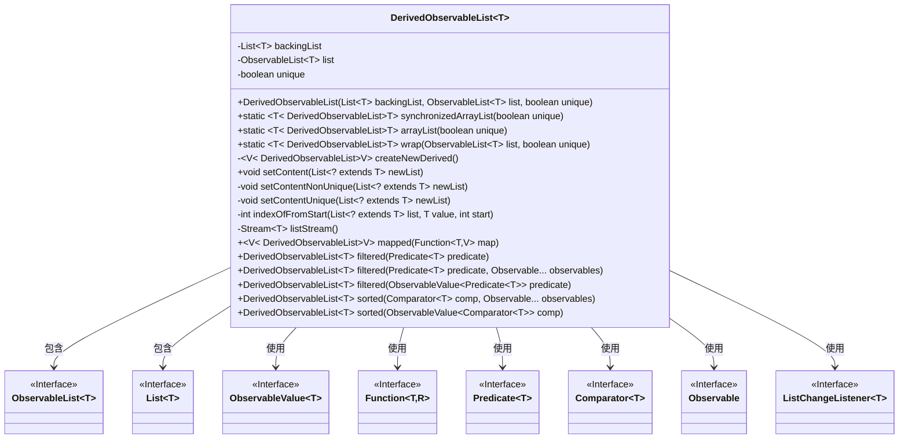
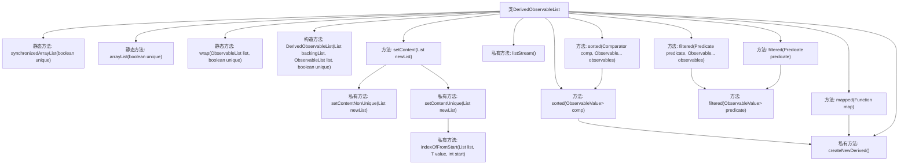
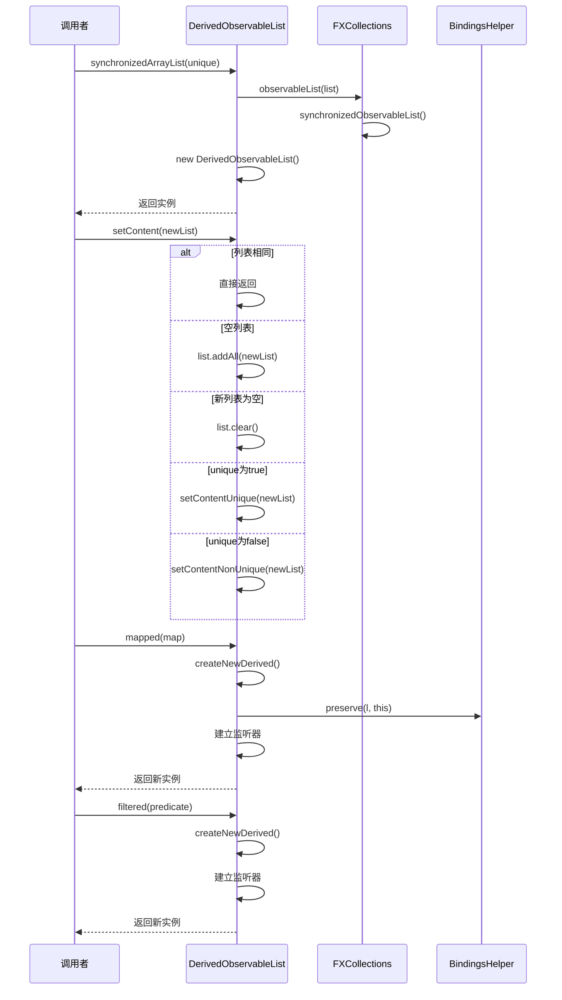

# 基础信息

|      |      |
|------|------|
| 名称 | DerivedObservableList |
| 编码语言 | .java |
| 代码路径 | xpipe/app/src/main/java/io/xpipe/app/util/DerivedObservableList.java |
| 包名 | io.xpipe.app.util |
| 依赖项 | ['javafx.beans.Observable', 'javafx.beans.binding.Bindings', 'javafx.beans.property.SimpleObjectProperty', 'javafx.beans.value.ObservableValue', 'javafx.collections.FXCollections', 'javafx.collections.ListChangeListener', 'javafx.collections.ObservableList', 'lombok.Getter', 'java.util', 'java.util.function.Function', 'java.util.function.Predicate', 'java.util.stream.Stream'] |
| 概述说明 | DerivedObservableList类提供线程安全、可映射、过滤和排序的列表操作。 |

# 说明

DerivedObservableList是一个泛型类，提供对ObservableList的封装和扩展功能。它支持创建同步或非同步的列表实例，并包含唯一性约束选项。核心功能包括：通过setContent方法智能更新列表内容，处理唯一和非唯一两种情况；提供mapped方法实现元素映射转换；filtered方法支持基于谓词的动态过滤；sorted方法实现可观察的排序功能。类内部维护原始列表和ObservableList，通过同步块保证线程安全，并利用HashSet优化集合操作性能。所有衍生操作都会自动响应原列表变化，保持数据一致性。

# 类列表 Class Summary

| 名称   | 类型  | 说明 |
|-------|------|-------------|
| DerivedObservableList | class | DerivedObservableList提供同步、映射、过滤和排序功能的可观察列表。 |

## 类 DerivedObservableList

|      |      |
|------|------|
| 访问范围 | @Getter;public |
| 类型 | class |
| 名称 | DerivedObservableList |
| 说明 | DerivedObservableList提供同步、映射、过滤和排序功能的可观察列表。 |

### UML类图

类图描述：
DerivedObservableList是一个泛型类，用于包装和管理可观察列表(ObservableList)，提供同步、映射、过滤和排序等功能。它包含核心数据结构backingList和list，通过unique标志控制元素唯一性。类图展示了它与多个JavaFX接口(ObservableList、ObservableValue等)的依赖关系，以及通过泛型参数实现的灵活数据处理能力。该类通过工厂方法创建实例，并提供了丰富的内容操作方法，能够响应列表变化和外部条件变更。

### 内部方法调用关系图

该流程图展示了DerivedObservableList类的核心结构和主要方法调用关系。类提供了三种静态工厂方法创建实例，核心功能包括列表内容设置(setContent)和三种数据转换操作(mapped/filtered/sorted)。时序图重点演示了同步列表创建、内容更新和映射转换的典型调用流程，展示了与FXCollections和BindingsHelper的交互过程。所有操作都考虑了线程安全性和数据一致性，特别是setContent方法通过双重检查机制处理不同更新场景。

### 字段列表 Field List

| 名称  | 类型  | 说明 |
|-------|-------|------|
| unique | boolean | 私有布尔变量unique |
| backingList | List<T> | 私有不可变列表backingList，存储类型T元素。 |
| list | ObservableList<T> | 私有不可变列表list，类型为ObservableList<T>。 |

### 方法列表 Method List

| 名称  | 类型  | 说明 |
|-------|-------|------|
| wrap | DerivedObservableList<T> | 静态方法wrap封装ObservableList为DerivedObservableList，可选去重。 |
| indexOfFromStart | int | 从指定位置开始查找列表中元素的索引，未找到返回-1。 |
| setContent | void | 同步更新列表，检查空或重复后调用唯一或非唯一处理。 |
| arrayList | DerivedObservableList<T> | 静态方法创建可观察列表，支持唯一性检查。 |
| listStream | Stream<T> | 私有方法listStream返回列表流，优先使用backingList。 |
| setContentUnique | void | 同步更新列表内容，处理新增、删除和重排序情况。 |
| filtered | DerivedObservableList<T> | 过滤列表，返回符合谓词条件的派生列表。 |
| mapped | DerivedObservableList<V> | 派生列表映射方法，缓存优化，监听原列表变化自动更新。 |
| createNewDerived | DerivedObservableList<V> | 创建派生可观察列表，根据原列表是否同步选择同步或普通列表类型，保留绑定关系。 |
| synchronizedArrayList | DerivedObservableList<T> | 静态方法创建同步可观察列表，支持唯一性检查。 |
| setContentNonUnique | void | 同步更新列表，仅增删单个元素或全量替换。 |
| filtered | DerivedObservableList<T> | 基于谓词和可观察对象过滤派生列表。 |
| filtered | DerivedObservableList<T> | 创建过滤后的派生列表，根据谓词动态更新内容。 |
| sorted | DerivedObservableList<T> | JavaFX方法：返回按比较器排序的可观察列表，依赖传入的observables触发更新。 |
| sorted | DerivedObservableList<T> | 创建派生列表，按比较器排序，监听列表和比较器变化自动更新。 |

