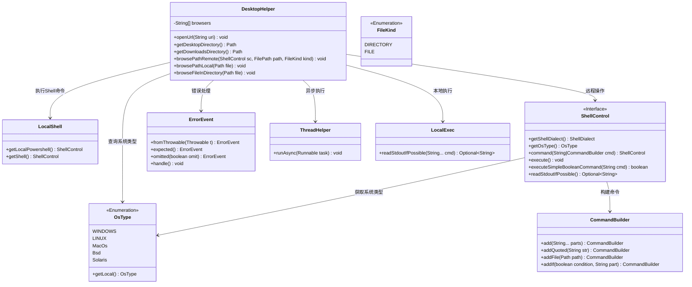
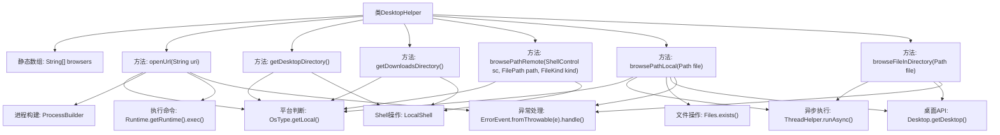

# 基础信息

|      |      |
|------|------|
| 名称 | DesktopHelper |
| 编码语言 | .java |
| 代码路径 | xpipe/app/src/main/java/io/xpipe/app/util/DesktopHelper.java |
| 包名 | io.xpipe.app.util |
| 依赖项 | ['io.xpipe.app.core.AppDistributionType', 'io.xpipe.app.issue.ErrorEvent', 'io.xpipe.core.process.CommandBuilder', 'io.xpipe.core.process.OsType', 'io.xpipe.core.process.ShellControl', 'io.xpipe.core.store.FileKind', 'io.xpipe.core.store.FilePath', 'java.awt', 'java.io.File', 'java.nio.file.Files', 'java.nio.file.Path'] |
| 概述说明 | 跨平台桌面工具类，支持打开URL、获取桌面/下载目录路径及浏览文件路径。 |

# 说明

DesktopHelper类提供跨平台桌面操作功能，包含以下核心能力：1.通过系统默认浏览器打开URL，支持Windows、Linux和MacOS的差异化实现；2.获取系统桌面和下载目录路径，针对不同操作系统调用相应命令；3.远程和本地浏览文件路径功能，支持Windows资源管理器、Linux文件管理器和MacOS Finder；4.提供异步方式浏览文件所在目录，自动处理不同系统的兼容性问题。所有操作均包含完善的错误处理机制，通过OsType判断当前系统类型执行对应逻辑。

# 类列表 Class Summary

| 名称   | 类型  | 说明 |
|-------|------|-------------|
| DesktopHelper | class | 跨平台桌面工具类，支持打开URL、获取桌面/下载目录路径及浏览文件路径，适配Windows、Linux和MacOS系统。 |

## 类 DesktopHelper

|      |      |
|------|------|
| 访问范围 | public |
| 类型 | class |
| 名称 | DesktopHelper |
| 说明 | 跨平台桌面工具类，支持打开URL、获取桌面/下载目录路径及浏览文件路径，适配Windows、Linux和MacOS系统。 |

### UML类图

类图描述：该图展示了DesktopHelper工具类的核心结构和关联关系，主要功能包括URL打开、桌面/下载目录获取、本地/远程路径浏览等跨平台操作。通过OsType枚举实现平台判断，依赖ShellControl接口执行命令，使用CommandBuilder构建复杂命令，结合ErrorEvent处理异常，ThreadHelper实现异步调用。整体设计体现了跨平台兼容性和分层抽象思想。

### 内部方法调用关系图

这段代码是DesktopHelper类，主要功能包括打开URL、获取桌面/下载目录路径、浏览本地/远程文件路径等跨平台操作。通过OsType判断操作系统类型，分别处理Windows/Linux/MacOS等不同平台的逻辑，使用ProcessBuilder/Runtime.exec执行系统命令，结合ShellControl进行远程操作，并采用异步线程和异常处理机制确保稳定性。核心流程包含平台判断、命令执行、文件操作和错误处理四个主要环节，通过静态方法提供统一的跨平台文件系统访问接口。

### 字段列表 Field List

| 名称  | 类型  | 说明 |
|-------|-------|------|
| browsers = {        "xdg-open", "google-chrome", "firefox", "opera", "konqueror", "mozilla", "gnome-open", "open"    } | String[] | 定义浏览器命令字符串数组，用于跨平台打开网页。 |

### 方法列表 Method List

| 名称  | 类型  | 说明 |
|-------|-------|------|
| getDownloadsDirectory | Path | 获取系统下载目录路径，支持Windows和Linux，默认返回用户主目录下的Downloads。 |
| openUrl | void | 跨平台打开URL方法：Windows用rundll32，Linux查找浏览器，其他系统用open命令。异常处理包含在内。 |
| browsePathRemote | void | 远程浏览文件路径方法，支持Windows、Linux、MacOS系统，按类型执行不同命令。 |
| getDesktopDirectory | Path | 获取桌面目录路径，支持Windows和Linux系统，默认返回用户主目录下的Desktop路径。 |
| browsePathLocal | void | 静态方法浏览本地路径，检查存在性后异步打开文件，支持Linux的xdg-open。 |
| browseFileInDirectory | void | 浏览文件目录方法：检查支持后异步打开，失败则用备用方案。 |

