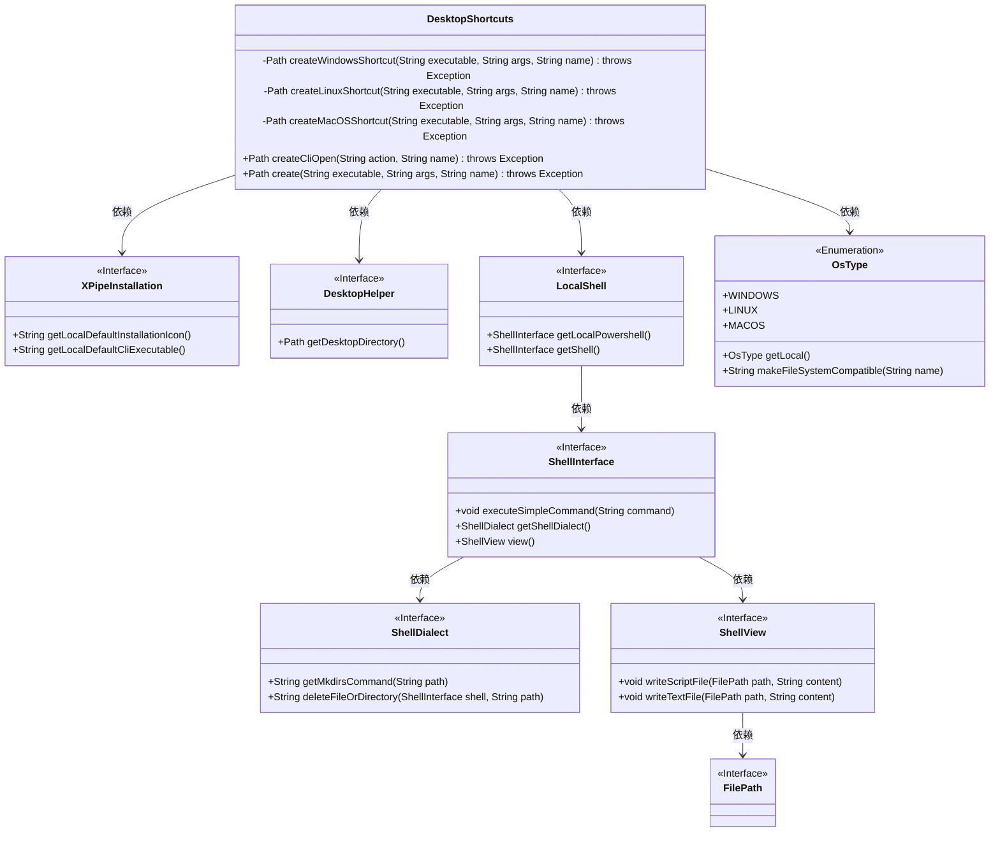
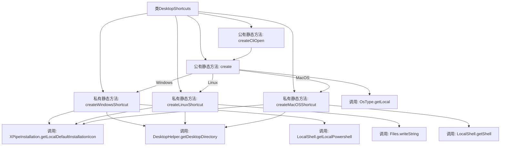

# 基础信息

|      |      |
|------|------|
| 名称 | DesktopShortcuts |
| 编码语言 | .java |
| 代码路径 | xpipe/app/src/main/java/io/xpipe/app/util/DesktopShortcuts.java |
| 包名 | io.xpipe.app.util |
| 依赖项 | ['io.xpipe.core.process.OsType', 'io.xpipe.core.store.FilePath', 'io.xpipe.core.util.XPipeInstallation', 'java.nio.file.Files', 'java.nio.file.Path'] |
| 概述说明 | 为不同操作系统创建桌面快捷方式：Windows用PowerShell生成.lnk，Linux写.desktop文件，MacOS构建.app包。 |

# 说明

DesktopShortcuts类提供了跨平台创建桌面快捷方式的功能。针对Windows系统，使用PowerShell脚本生成.lnk文件并设置图标、参数等属性。Linux系统生成.desktop文件，包含执行命令、图标等信息并设为可执行。MacOS系统创建.app包结构，包含可执行脚本、Info.plist配置文件和图标资源。通过create方法自动适配当前操作系统，调用对应平台实现。支持为CLI命令创建快捷方式，文件名会自动适配不同操作系统规范。

# 类列表 Class Summary

| 名称   | 类型  | 说明 |
|-------|------|-------------|
| DesktopShortcuts | class | 为不同系统创建桌面快捷方式：Windows用PowerShell脚本，Linux用.desktop文件，MacOS用.app包。 |

## 类 DesktopShortcuts

|      |      |
|------|------|
| 访问范围 | public |
| 类型 | class |
| 名称 | DesktopShortcuts |
| 说明 | 为不同系统创建桌面快捷方式：Windows用PowerShell脚本，Linux用.desktop文件，MacOS用.app包。 |

### UML类图

这段代码实现了一个跨平台的桌面快捷方式创建工具类DesktopShortcuts，它根据操作系统类型调用不同的私有方法创建Windows(.lnk)、Linux(.desktop)和macOS(.app)快捷方式。核心依赖XPipeInstallation获取图标和可执行文件路径，DesktopHelper获取桌面目录，LocalShell执行系统命令，OsType判断操作系统类型。类图展示了这些组件之间的依赖关系，体现了良好的分层设计和平台适配能力。

### 内部方法调用关系图

该流程图展示了DesktopShortcuts类的结构和方法调用关系。类包含5个主要方法，其中createWindowsShortcut、createLinuxShortcut和createMacOSShortcut分别处理不同操作系统的快捷方式创建逻辑。create方法作为入口点，根据操作系统类型调用对应的快捷方式创建方法。createCliOpen方法则专门处理命令行打开操作。各方法内部调用了XPipeInstallation、DesktopHelper、LocalShell等辅助类的方法来完成具体操作，体现了良好的分层设计和平台兼容性处理。

### 字段列表 Field List

| 名称  | 类型  | 说明 |
|-------|-------|------|

### 方法列表 Method List

| 名称  | 类型  | 说明 |
|-------|-------|------|
| createCliOpen | Path | 静态方法创建CLI路径，执行本地默认CLI命令并返回路径。 |
| createMacOSShortcut | Path | 创建MacOS应用快捷方式，包含图标、执行脚本和配置。 |
| createLinuxShortcut | Path | 创建Linux桌面快捷方式，包含名称、执行命令、图标，并设为可执行文件。 |
| createWindowsShortcut | Path | 创建Windows快捷方式方法：执行程序路径、参数、名称，生成.lnk文件并设置图标和窗口样式。 |
| create | Path | 根据操作系统创建快捷方式，支持Windows、Linux和MacOS。 |

