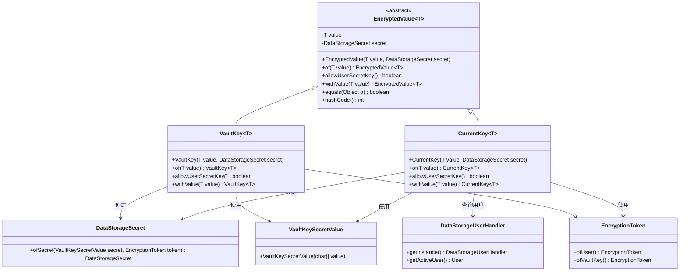
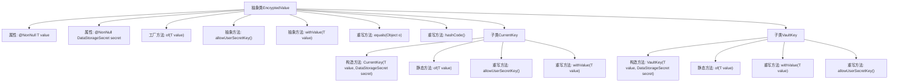
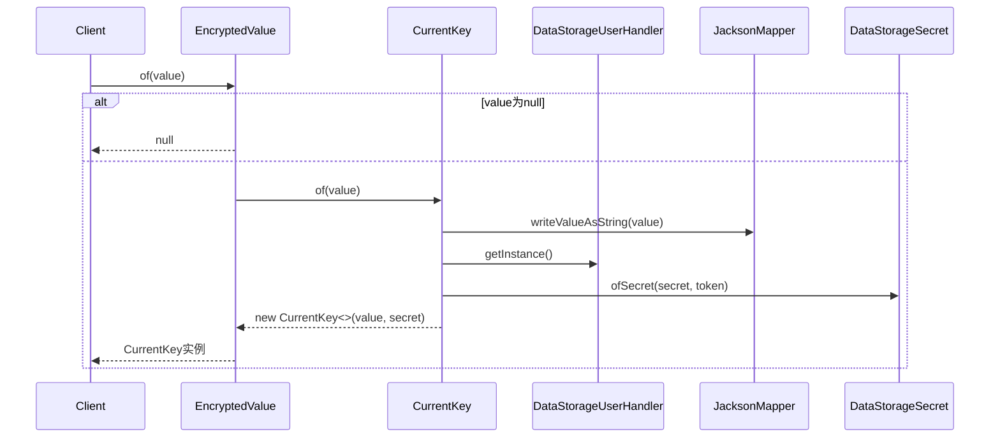

# 基础信息

|      |      |
|------|------|
| 名称 | EncryptedValue |
| 编码语言 | .java |
| 代码路径 | xpipe/app/src/main/java/io/xpipe/app/util/EncryptedValue.java |
| 包名 | io.xpipe.app.util |
| 依赖项 | ['io.xpipe.app.storage.DataStorageSecret', 'io.xpipe.app.storage.DataStorageUserHandler', 'io.xpipe.core.util.JacksonMapper', 'com.fasterxml.jackson.annotation.JsonSubTypes', 'com.fasterxml.jackson.annotation.JsonTypeInfo', 'com.fasterxml.jackson.annotation.JsonTypeName', None, 'java.util.Objects'] |
| 概述说明 | 抽象类EncryptedValue定义加密值处理，含CurrentKey和VaultKey子类，支持空值检查、密钥存储及值更新。 |

# 说明

该内容描述了一个抽象类EncryptedValue，用于处理加密数据存储。类包含两个子类CurrentKey和VaultKey，分别代表用户密钥和保险库密钥加密方式。主要功能包括：创建加密值实例、检查是否允许用户密钥、更新加密值、以及重写equals和hashCode方法。CurrentKey支持用户密钥，而VaultKey仅使用保险库密钥。两者都通过Jackson序列化处理值，并生成对应的加密秘密数据。

# 类列表 Class Summary

| 名称   | 类型  | 说明 |
|-------|------|-------------|
| EncryptedValue | class | 抽象类EncryptedValue定义加密值，含CurrentKey和VaultKey子类，支持空值检查、密钥管理和值更新。 |

## 类 EncryptedValue

|      |      |
|------|------|
| 访问范围 | @AllArgsConstructor;@Getter;@JsonTypeInfo(use = JsonTypeInfo.Id.NONE);@JsonSubTypes({;    @JsonSubTypes.Type(value = EncryptedValue.VaultKey.class),;    @JsonSubTypes.Type(value = EncryptedValue.CurrentKey.class),;});public abstract |
| 类型 | class |
| 名称 | EncryptedValue |
| 说明 | 抽象类EncryptedValue定义加密值，含CurrentKey和VaultKey子类，支持空值检查、密钥管理和值更新。 |

### UML类图

这段代码展示了一个加密值处理系统的类结构，核心是抽象类`EncryptedValue`及其两个具体实现`CurrentKey`和`VaultKey`。系统通过不同的密钥类型（用户密钥/保险库密钥）对数据进行加密存储，包含完整的对象序列化、密钥管理、值比较和更新功能。类间关系显示加密过程需要依赖密钥服务、用户处理器和JSON序列化组件，形成了一套完整的敏感数据加密解决方案。

### 内部方法调用关系图

该流程图展示了EncryptedValue抽象类及其两个子类CurrentKey和VaultKey的继承关系和核心方法。抽象类定义了加密值的基本结构和通用操作，两个子类分别实现了不同的加密策略。时序图则重点描述了通过工厂方法创建CurrentKey实例的过程，包括JSON序列化和密钥处理等关键步骤。整个设计实现了多态加密功能，支持空值处理和值比较等特性。

### 字段列表 Field List

| 名称  | 类型  | 说明 |
|-------|-------|------|
| value | T | 非空私有常量T类型value |
| secret | DataStorageSecret | 非空私有终态DataStorageSecret类型变量secret |

### 方法列表 Method List

| 名称  | 类型  | 说明 |
|-------|-------|------|
| of | EncryptedValue<T> | 创建加密值对象，若值为空返回空，否则用当前密钥加密。 |
| allowUserSecretKey | boolean | 抽象方法：检查是否允许用户密钥。 |
| withValue | EncryptedValue<T> | 抽象方法EncryptedValue<T>，用给定值更新加密值。 |
| equals | boolean | 

重写equals方法，检查对象类型并比较value值。 |
| hashCode | int | 重写hashCode方法，使用Objects.hashCode计算value的哈希值。 |

