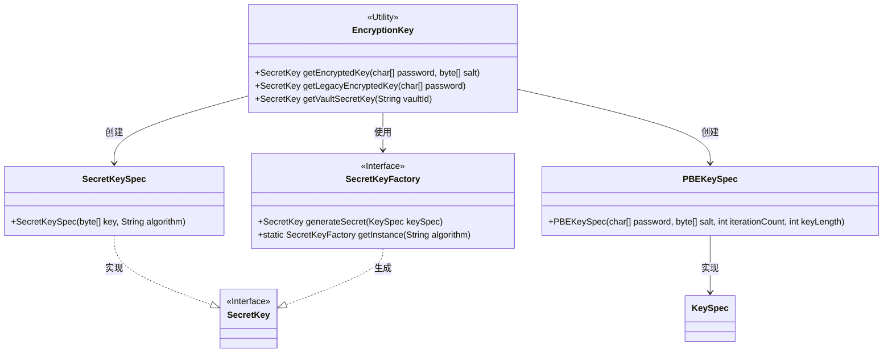
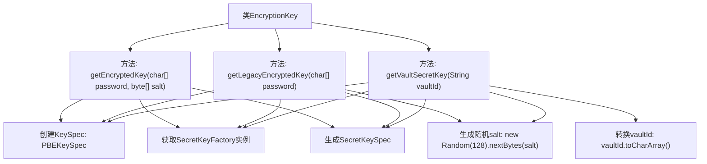

# 基础信息

|      |      |
|------|------|
| 名称 | EncryptionKey |
| 编码语言 | .java |
| 代码路径 | xpipe/app/src/main/java/io/xpipe/app/util/EncryptionKey.java |
| 包名 | io.xpipe.app.util |
| 依赖项 | ['lombok.SneakyThrows', 'java.security.spec.KeySpec', 'java.util.Random', 'javax.crypto.SecretKey', 'javax.crypto.SecretKeyFactory', 'javax.crypto.spec.PBEKeySpec', 'javax.crypto.spec.SecretKeySpec'] |
| 概述说明 | 加密密钥生成类，含三种方法：安全密钥生成、旧版密钥生成、保险库密钥生成，均基于PBKDF2算法。 |

# 说明

该代码定义了三个静态方法用于生成加密密钥。getEncryptedKey方法使用PBKDF2WithHmacSHA256算法，结合密码、盐值、60万次迭代和256位密钥长度生成AES密钥。getLegacyEncryptedKey方法采用旧参数：8192次迭代和128位密钥长度，自动生成16字节盐值。getVaultSecretKey方法与getLegacyEncryptedKey类似，但使用vaultId字符串作为密码来源。所有方法都通过SecretKeyFactory生成密钥，并最终封装为AES密钥返回。

# 类列表 Class Summary

| 名称   | 类型  | 说明 |
|-------|------|-------------|
| EncryptionKey | class | 加密密钥生成类，含三种方法：安全密钥生成、旧版密钥生成、保险库密钥生成。 |

## 类 EncryptionKey

|      |      |
|------|------|
| 访问范围 | public |
| 类型 | class |
| 名称 | EncryptionKey |
| 说明 | 加密密钥生成类，含三种方法：安全密钥生成、旧版密钥生成、保险库密钥生成。 |

### UML类图

该代码是一个加密密钥工具类，提供三种生成SecretKey的方法：标准加密密钥(getEncryptedKey)、遗留系统密钥(getLegacyEncryptedKey)和保险库密钥(getVaultSecretKey)。核心使用PBKDF2WithHmacSHA256算法，通过PBEKeySpec配置参数，最终由SecretKeyFactory生成AES密钥。类图中展示了与Java加密体系标准接口(SecretKey、SecretKeyFactory)的关系，以及工具类如何组合使用这些组件来生成加密密钥。所有方法都是静态的，表明这是一个不可实例化的工具类。

### 内部方法调用关系图

这段代码流程图展示了EncryptionKey类的三个核心方法，它们都遵循相似的密钥生成流程但参数处理方式不同。getEncryptedKey使用预定义的salt和更高强度的参数配置，而getLegacyEncryptedKey和getVaultSecretKey都使用随机生成的salt。所有方法最终都通过PBKDF2WithHmacSHA256算法生成AES密钥，体现了密钥派生函数的安全实现模式，其中迭代次数和密钥长度根据安全需求有所不同。

### 字段列表 Field List

| 名称  | 类型  | 说明 |
|-------|-------|------|

### 方法列表 Method List

| 名称  | 类型  | 说明 |
|-------|-------|------|
| getEncryptedKey | SecretKey | 使用PBKDF2算法生成AES密钥，迭代60万次，密钥长度256位。 |
| getLegacyEncryptedKey | SecretKey | 生成AES密钥，使用PBKDF2WithHmacSHA256算法，8192次迭代，16字节盐值。 |
| getVaultSecretKey | SecretKey | 生成AES密钥：PBKDF2WithHmacSHA256算法，8192次迭代，16字节盐。 |

