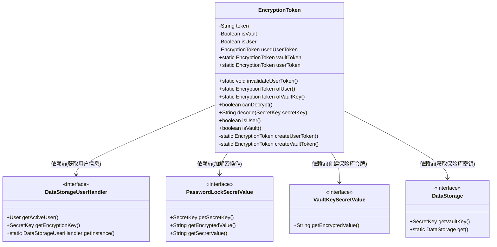
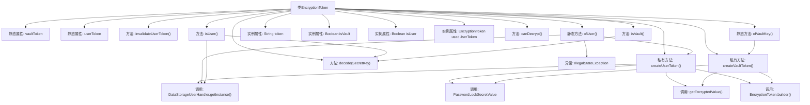

# 基础信息

|      |      |
|------|------|
| 名称 | EncryptionToken |
| 编码语言 | .java |
| 代码路径 | xpipe/app/src/main/java/io/xpipe/app/util/EncryptionToken.java |
| 包名 | io.xpipe.app.util |
| 依赖项 | ['io.xpipe.app.storage.DataStorage', 'io.xpipe.app.storage.DataStorageUserHandler', 'com.fasterxml.jackson.annotation.JsonIgnore', 'lombok.Builder', 'lombok.EqualsAndHashCode', 'lombok.ToString', 'lombok.extern.jackson.Jacksonized', 'javax.crypto.SecretKey'] |
| 概述说明 | 加密令牌类，含用户和保险库令牌管理，支持创建、验证和解密功能。 |

# 说明

EncryptionToken类用于管理用户和保险库的加密令牌。它包含静态方法创建和获取用户令牌及保险库令牌，支持令牌失效功能。类提供方法检查令牌类型（用户或保险库）和解密功能。用户令牌基于活跃用户生成，保险库令牌使用固定字符。类包含辅助方法判断令牌是否可解密，并通过SecretKey进行解码。令牌状态会被缓存以提高性能。

# 类列表 Class Summary

| 名称   | 类型  | 说明 |
|-------|------|-------------|
| EncryptionToken | class | 加密令牌类，管理用户和保险库令牌，支持创建、验证和解密功能。 |

## 类 EncryptionToken

|      |      |
|------|------|
| 访问范围 | @EqualsAndHashCode;@Builder;@Jacksonized;@ToString;public |
| 类型 | class |
| 名称 | EncryptionToken |
| 说明 | 加密令牌类，管理用户和保险库令牌，支持创建、验证和解密功能。 |

### UML类图

该类图展示了EncryptionToken类的核心结构和依赖关系。该类是一个单例模式的令牌管理类，包含用户令牌和保险库令牌两种静态实例，提供令牌创建、验证和加解密功能。通过四个接口依赖实现具体功能：DataStorageUserHandler处理用户数据，PasswordLockSecretValue处理密码加解密，VaultKeySecretValue生成保险库密钥，DataStorage提供保险库密钥访问。类中通过静态方法和私有构造器实现令牌的懒加载和缓存机制，并包含多种状态校验方法。

### 内部方法调用关系图

该流程图展示了EncryptionToken类的完整结构，包含静态属性、实例属性和方法调用关系。核心功能围绕token的创建（createUserToken/createVaultToken）、验证（isUser/isVault）和解码（decode）展开，通过静态方法ofUser/ofVaultKey提供单例访问。类使用建造者模式构造实例，并依赖DataStorageUserHandler和PasswordLockSecretValue进行用户认证和加密操作，同时处理了用户不存在时的异常情况。

### 字段列表 Field List

| 名称  | 类型  | 说明 |
|-------|-------|------|
| userToken | EncryptionToken | 私有静态加密令牌变量userToken |
| isUser | Boolean | 忽略JSON序列化的用户标识字段。 |
| token | String | 私有字符串类型变量token |
| usedUserToken | EncryptionToken | 忽略JSON序列化的用户加密令牌 |
| vaultToken | EncryptionToken | 私有静态加密令牌变量vaultToken |
| isVault | Boolean | 忽略JSON序列化的私有布尔类型isVault字段。 |

### 方法列表 Method List

| 名称  | 类型  | 说明 |
|-------|-------|------|
| decode | String | 解码方法：使用密钥解密令牌并返回秘密值。 |
| isUser | boolean | 检查用户是否有效：验证活跃用户及令牌，返回布尔值。 |
| createVaultToken | EncryptionToken | 创建加密令牌，使用VaultKeySecretValue生成加密值并构建令牌。 |
| createUserToken | EncryptionToken | 创建用户加密令牌，使用用户密钥加密并返回令牌。 |
| ofVaultKey | EncryptionToken | 静态方法创建或返回加密令牌，若空则新建。 |
| canDecrypt | boolean | 方法检查是否可解密：是保险库或用户时返回真。 |
| ofUser | EncryptionToken | 静态方法生成用户加密令牌，若无活跃用户则抛出异常。 |
| invalidateUserToken | void | 方法清空用户令牌。 |
| isVault | boolean | 检查是否为保险库，若未设定则解码密钥验证并返回结果。 |

