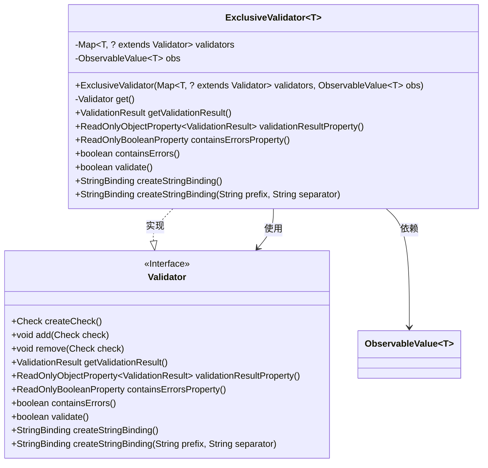
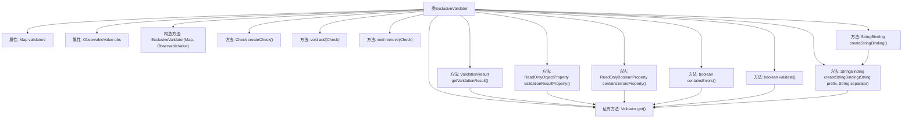

# 基础信息

|      |      |
|------|------|
| 名称 | ExclusiveValidator |
| 编码语言 | .java |
| 代码路径 | xpipe/app/src/main/java/io/xpipe/app/util/ExclusiveValidator.java |
| 包名 | io.xpipe.app.util |
| 依赖项 | ['javafx.beans.Observable', 'javafx.beans.binding.Bindings', 'javafx.beans.binding.StringBinding', 'javafx.beans.property.ReadOnlyBooleanProperty', 'javafx.beans.property.ReadOnlyObjectProperty', 'javafx.beans.value.ObservableValue', 'net.synedra.validatorfx.Check', 'net.synedra.validatorfx.ValidationResult', 'java.util.ArrayList', 'java.util.Map'] |
| 概述说明 | ExclusiveValidator根据输入值选择对应验证器并代理其方法。 |

# 说明

ExclusiveValidator是一个泛型类，实现了Validator接口，用于根据ObservableValue的值动态选择对应的验证器。它通过构造函数接收一个验证器映射和可观察值，核心逻辑是通过get方法获取当前值对应的验证器。类中大部分方法直接委托给选中的验证器处理，包括获取验证结果、错误检查、验证操作等。createStringBinding方法支持创建字符串绑定，可自定义前缀和分隔符。部分方法如createCheck、add、remove直接抛出未支持异常。整体设计实现了基于动态值的验证器代理模式。

# 类列表 Class Summary

| 名称   | 类型  | 说明 |
|-------|------|-------------|
| ExclusiveValidator | class | ExclusiveValidator根据输入值动态选择验证器并代理其方法。 |

## 类 ExclusiveValidator

|      |      |
|------|------|
| 访问范围 | public final |
| 类型 | class |
| 名称 | ExclusiveValidator |
| 说明 | ExclusiveValidator根据输入值动态选择验证器并代理其方法。 |

### UML类图

该代码展示了一个泛型类`ExclusiveValidator<T>`，它实现了`Validator`接口，用于根据`ObservableValue<T>`动态选择并委托给对应的验证器。类图清晰地呈现了接口实现关系、泛型参数`T`的使用，以及关键方法如`getValidationResult()`和`createStringBinding()`的委托逻辑。通过`validators`映射和`obs`观察值，实现了运行时验证器的动态切换。

### 内部方法调用关系图

该流程图展示了ExclusiveValidator类的完整结构，包含2个私有属性、1个构造方法和12个成员方法。核心逻辑是通过get()方法动态获取当前obs值对应的Validator实例，并将大部分验证操作委托给该实例执行。createStringBinding方法通过Bindings.createStringBinding创建动态字符串绑定，其值取决于当前选定验证器的状态和输入参数。所有方法调用最终都通过get()方法路由到具体的验证器实现，体现了委托设计模式。

### 字段列表 Field List

| 名称  | 类型  | 说明 |
|-------|-------|------|
| obs | ObservableValue<T> | 私有不可变观察值对象。 |
| validators | Map<T, ? extends Validator> | 私有映射，键为泛型T，值为Validator或其子类。 |

### 方法列表 Method List

| 名称  | 类型  | 说明 |
|-------|-------|------|
| get | Validator | 获取当前验证器实例 |
| containsErrorsProperty | ReadOnlyBooleanProperty | 重写方法，返回包含错误属性的布尔值。 |
| getValidationResult | ValidationResult | 重写getValidationResult方法，返回验证结果。 |
| remove | void | 重写remove方法，抛出不支持操作异常。 |
| validationResultProperty | ReadOnlyObjectProperty<ValidationResult> | 重写方法返回验证结果属性 |
| add | void | 重写add方法，抛出不支持操作异常。 |
| createCheck | Check | 重写方法createCheck，抛出未支持操作异常。 |
| containsErrors | boolean | 重写方法，检查是否存在错误并返回结果。 |
| validate | boolean | 重写validate方法，调用get().validate()返回结果。 |
| createStringBinding | StringBinding | 重写方法，返回带前缀和分隔符的字符串绑定。 |
| createStringBinding | StringBinding | 重写方法，创建字符串绑定，合并验证器和观察对象列表，返回新绑定结果。 |

