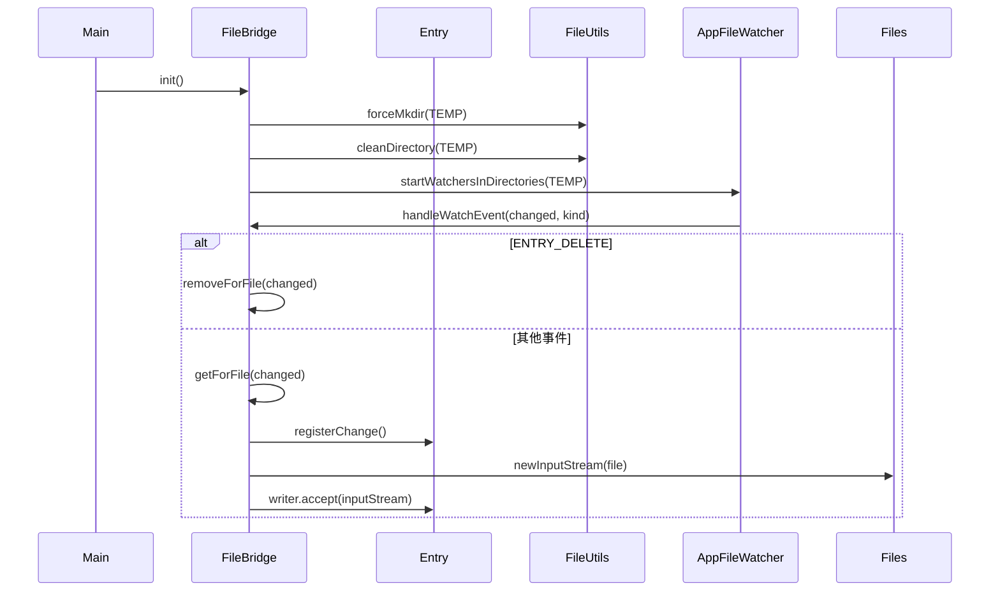

# 基础信息

|      |      |
|------|------|
| 名称 | FileBridge |
| 编码语言 | .java |
| 代码路径 | xpipe/app/src/main/java/io/xpipe/app/util/FileBridge.java |
| 包名 | io.xpipe.app.util |
| 依赖项 | ['io.xpipe.app.core.AppFileWatcher', 'io.xpipe.app.issue.ErrorEvent', 'io.xpipe.app.issue.TrackEvent', 'io.xpipe.app.prefs.AppPrefs', 'io.xpipe.core.process.OsType', 'io.xpipe.core.util.FailableFunction', 'io.xpipe.core.util.FailableSupplier', 'lombok.Getter', 'org.apache.commons.io.FileUtils', 'java.io.BufferedInputStream', 'java.io.IOException', 'java.io.InputStream', 'java.io.OutputStream', 'java.nio.file.Files', 'java.nio.file.Path', 'java.nio.file.StandardWatchEventKinds', 'java.nio.file.WatchEvent', 'java.time.Duration', 'java.time.Instant', 'java.util', 'java.util.function.BiConsumer', 'java.util.function.Consumer'] |
| 概述说明 | 文件桥接类，管理临时文件操作和事件处理。 |

# 说明

FileBridge类是一个单例模式实现的文件桥接工具，用于管理临时目录中的文件操作。它维护一个开放条目集合，处理文件创建、修改和删除事件。初始化时创建临时目录并启动文件监视器。提供静态方法获取实例、初始化、重置及事件记录。核心功能包括处理文件变更事件、同步移除或获取条目、打开IO流进行读写操作。Entry内部类封装文件元数据，记录最后修改时间和大小，通过registerChange方法检测文件变更。支持跨平台文件名兼容处理，特别针对Windows系统替换非法字符。异常处理通过ErrorEvent记录，文件操作使用Java NIO和Apache Commons IO工具库。

# 类列表 Class Summary

| 名称   | 类型  | 说明 |
|-------|------|-------------|
| FileBridge | class | FileBridge类管理临时文件操作，支持文件监控、修改检测和IO处理。 |


## 类 FileBridge

|      |      |
|------|------|
| 访问范围 | public |
| 类型 | class |
| 名称 | FileBridge |
| 说明 | FileBridge类管理临时文件操作，支持文件监控、修改检测和IO处理。 |


### UML类图

```mermaid
classDiagram
    class FileBridge {
        -Path TEMP
        -FileBridge INSTANCE
        -Set~Entry~ openEntries
        +get() FileBridge
        +init()
        +reset()
        -event(String msg) void
        -getFileSystemCompatibleName(String name) String
        -handleWatchEvent(Path changed, WatchEvent.Kind~Path~ kind) void
        -removeForFile(Path file) void
        -getForKey(Object node) Optional~Entry~
        -getForFile(Path file) Optional~Entry~
        +openIO(String keyName, Object key, BooleanScope scope, FailableSupplier~InputStream~ input, FailableFunction~Long, OutputStream, Exception~ output, Consumer~String~ consumer) void
    }

    class Entry {
        -Path file
        -Object key
        -String name
        -BooleanScope scope
        -BiConsumer~InputStream, Long~ writer
        -Instant lastModified
        -long lastSize
        +getLastModified() Instant
        +getSize() long
        +registerChange() boolean
    }

    class TrackEvent {
        +builder() Builder
    }

    class FileUtils {
        +forceMkdir(File file) void
        +cleanDirectory(File dir) void
    }

    class AppFileWatcher {
        +getInstance() AppFileWatcher
        +startWatchersInDirectories(List~Path~ dirs, BiConsumer~Path, WatchEvent.Kind~Path~~ callback) void
    }

    class ErrorEvent {
        +fromThrowable(Throwable t) ErrorEvent
        +handle() void
        +omit() ErrorEvent
    }

    FileBridge --> TrackEvent : <<use>> : 记录调试事件
    FileBridge --> FileUtils : <<use>> : 文件操作
    FileBridge --> AppFileWatcher : <<use>> : 文件监控
    FileBridge --> ErrorEvent : <<use>> : 错误处理
    FileBridge --> Entry : 包含
    FileBridge --> BooleanScope : <<use>> : 范围控制
    FileBridge --> FailableSupplier : <<use>> : 输入流提供
    FileBridge --> FailableFunction : <<use>> : 输出流处理
    FileBridge --> Consumer : <<use>> : 回调通知
    Entry --> Path : <<use>> : 文件路径
    Entry --> BiConsumer : <<use>> : 写入操作
```

这段代码实现了一个文件桥接器(FileBridge)，用于管理临时文件系统中的文件操作和监控。核心类FileBridge通过单例模式管理文件条目(Entry)，提供文件初始化、清理、监控和IO操作功能。Entry类封装了文件元数据和变更检测逻辑，通过最后修改时间和文件大小判断文件变更。系统依赖文件工具类(FileUtils)、文件监控器(AppFileWatcher)和错误处理机制(ErrorEvent)完成核心功能，支持跨平台文件名处理，并通过事件跟踪(TrackEvent)记录操作日志。整体设计采用同步机制保证线程安全，处理了文件锁竞争等边缘情况。


### 内部方法调用关系图

```mermaid
graph TD
    A["类FileBridge"]
    B["静态属性: Path TEMP"]
    C["静态属性: FileBridge INSTANCE"]
    D["属性: Set<Entry> openEntries"]
    E["静态方法: get()"]
    F["静态方法: event(String msg)"]
    G["静态方法: getFileSystemCompatibleName(String name)"]
    H["静态方法: init()"]
    I["静态方法: reset()"]
    J["私有方法: handleWatchEvent(Path changed, WatchEvent.Kind<Path> kind)"]
    K["私有方法: removeForFile(Path file)"]
    L["私有方法: getForKey(Object node)"]
    M["私有方法: getForFile(Path file)"]
    N["公开方法: openIO(...)"]
    O["嵌套类: Entry"]

    A --> B
    A --> C
    A --> D
    A --> E
    A --> F
    A --> G
    A --> H
    A --> I
    A --> J
    A --> K
    A --> L
    A --> M
    A --> N
    A --> O

    H --> J1["FileUtils.forceMkdir"]
    H --> J2["FileUtils.cleanDirectory"]
    H --> J3["AppFileWatcher.startWatchersInDirectories"]
    J --> J4["event('Editor entry file...')"]
    J --> J5["removeForFile"]
    J --> J6["getForFile"]
    J --> J7["ThreadHelper.sleep"]
    J --> J8["Files.exists"]
    J --> J9["Files.newInputStream"]
    J --> J10["FixedSizeInputStream"]
    J --> J11["e.writer.accept"]
    N --> N1["getForKey"]
    N --> N2["Files.newOutputStream"]
    N --> N3["input.get()"]
    N --> N4["Entry构造器"]
    N --> N5["openEntries.add"]
    O --> O1["属性: Path file"]
    O --> O2["方法: getLastModified()"]
    O --> O3["方法: registerChange()"]
```





这段代码实现了一个文件桥接系统，主要用于管理临时文件目录中的文件操作和监控。流程图展示了类结构和方法调用关系，包含静态初始化、文件监控事件处理和IO操作等核心功能。时序图则具体描述了从初始化到处理文件变化的完整流程，包括目录创建、清理、文件监控注册以及事件处理逻辑。该系统特别处理了Windows文件系统兼容性问题，并通过Entry类跟踪文件修改状态，确保可靠的文件变更检测。

### 字段列表 Field List

| 名称  | 类型  | 说明 |
|-------|-------|------|
| TEMP = ShellTemp.getLocalTempDataDirectory("bridge") | Path | 私有静态路径TEMP指向本地临时目录"bridge"。 |
| INSTANCE | FileBridge | 单例模式文件桥实例 |
| openEntries = new HashSet<>() | Set<Entry> | 私有集合存储开放条目。 |

### 方法列表 Method List

| 名称  | 类型  | 说明 |
|-------|-------|------|
| get | FileBridge | 静态方法返回单例实例。 |
| getFileSystemCompatibleName | String | 方法：根据操作系统替换文件名中的非法字符，非Windows系统直接返回原名称。 |
| event | void | 私有方法记录调试事件，构建TrackEvent并处理。 |
| reset | void | 静态方法reset()清空临时目录并置空实例。忽略IO异常。 |
| handleWatchEvent | void | 处理文件监视事件：删除时移除记录；存在时检查修改，超时未锁定则忽略；修改后更新内容并记录日志。 |
| init | void | 初始化文件桥接器，创建临时目录并清理旧文件，启动文件监视器处理变更事件。 |
| removeForFile | void | 私有同步方法，移除指定文件路径的条目。 |
| getForKey | Optional<Entry> | 私有同步方法，通过键查找条目，存在返回Optional包装，否则返回空。 |
| getForFile | Optional<Entry> | 同步方法获取文件对应条目，无则返回空并记录事件。 |
| openIO | void | 同步方法openIO处理IO操作，检查键存在则更新文件，否则创建新文件并注册。异常处理并通知消费者。 |


