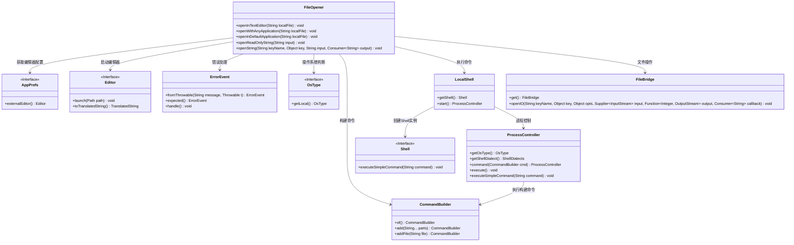

# 基础信息

|      |      |
|------|------|
| 名称 | FileOpener |
| 编码语言 | .java |
| 代码路径 | xpipe/app/src/main/java/io/xpipe/app/util/FileOpener.java |
| 包名 | io.xpipe.app.util |
| 依赖项 | ['io.xpipe.app.issue.ErrorEvent', 'io.xpipe.app.prefs.AppPrefs', 'io.xpipe.core.process.CommandBuilder', 'io.xpipe.core.process.OsType', 'io.xpipe.core.process.ShellDialects', 'java.io.ByteArrayInputStream', 'java.io.ByteArrayOutputStream', 'java.io.IOException', 'java.nio.charset.StandardCharsets', 'java.nio.file.Path', 'java.util.UUID', 'java.util.function.Consumer'] |
| 概述说明 | 文件操作类，提供文本编辑器打开、默认应用打开及字符串读写功能，支持多平台错误处理。 |

# 说明

该代码定义了一个文件操作工具类FileOpener，提供多种文件处理功能。包含五个核心方法：openInTextEditor使用预设编辑器打开本地文件，若失败则提示错误；openWithAnyApplication通过系统命令打开文件，目前仅支持Windows；openInDefaultApplication根据操作系统调用默认程序打开文件，支持Windows、Linux和MacOS；openReadOnlyString将字符串作为只读临时文件打开；openString允许编辑字符串内容并回传修改结果。所有方法均包含异常处理机制，通过ErrorEvent报告错误。

# 类列表 Class Summary

| 名称   | 类型  | 说明 |
|-------|------|-------------|
| FileOpener | class | FileOpener类提供文件操作功能：文本编辑器打开、默认应用打开、字符串读写处理。 |


## 类 FileOpener

|      |      |
|------|------|
| 访问范围 | public |
| 类型 | class |
| 名称 | FileOpener |
| 说明 | FileOpener类提供文件操作功能：文本编辑器打开、默认应用打开、字符串读写处理。 |


### UML类图



这段代码展示了一个多功能文件操作类`FileOpener`，提供静态方法处理文件打开、编辑和字符串操作。核心功能包括：通过外部编辑器打开文件、用系统默认程序打开文件、处理只读/可写字符串内容。类通过`AppPrefs`获取配置，依赖`Editor`接口启动编辑器，使用`CommandBuilder`构建系统命令，通过`LocalShell`执行跨平台操作，并利用`FileBridge`处理文件IO。错误处理统一通过`ErrorEvent`实现，支持Windows/Linux/MacOS多平台操作，体现了良好的分层设计和异常处理机制。


### 内部方法调用关系图

```mermaid
graph TD
    A["类FileOpener"]
    B["方法: openInTextEditor(String localFile)"]
    C["方法: openWithAnyApplication(String localFile)"]
    D["方法: openInDefaultApplication(String localFile)"]
    E["方法: openReadOnlyString(String input)"]
    F["方法: openString(String keyName, Object key, String input, Consumer<String> output)"]
    G["调用: AppPrefs.get().externalEditor().getValue()"]
    H["条件: editor == null"]
    I["调用: editor.launch(Path.of(localFile).toRealPath())"]
    J["异常处理: ErrorEvent.fromThrowable(...).expected().handle()"]
    K["分支: OsType.getLocal()"]
    L["Windows: CommandBuilder.of().add(...)"]
    M["Linux/Mac: throw UnsupportedOperationException"]
    N["调用: LocalShell.getShell().executeSimpleCommand(cmd)"]
    O["异常处理: ErrorEvent.fromThrowable(...).handle()"]
    P["调用: LocalShell.getShell().start()"]
    Q["条件: pc.getOsType().equals(OsType.WINDOWS)"]
    R["PowerShell: pc.command(CommandBuilder.of().add(...)).execute()"]
    S["其他Shell: pc.executeSimpleCommand('start \"\" \"' + localFile + '\"')"]
    T["Linux: pc.executeSimpleCommand('xdg-open \"' + localFile + '\"')"]
    U["Mac: pc.executeSimpleCommand('open \"' + localFile + '\"')"]
    V["调用: FileBridge.get().openIO(...)"]
    W["输入处理: input == null → input = ''"]
    X["生成UUID: UUID.randomUUID()"]
    Y["调用: new ByteArrayInputStream(s.getBytes(StandardCharsets.UTF_8))"]
    Z["回调: openInTextEditor(v)"]

    A --> B
    A --> C
    A --> D
    A --> E
    A --> F
    B --> G
    B --> H
    H -->|否| I
    I --> J
    C --> K
    K -->|Windows| L
    L --> N
    K -->|Linux/Mac| M
    C --> O
    D --> P
    D --> Q
    Q -->|是| R
    Q -->|否| S
    P -->|Linux| T
    P -->|Mac| U
    D --> O
    E --> W
    E --> X
    E --> V
    V --> Y
    V --> Z
    F --> W
    F --> V
```

流程图描述：该流程图展示了FileOpener类的5个核心方法逻辑。openInTextEditor通过AppPrefs获取编辑器并启动；openWithAnyApplication按操作系统类型执行不同命令；openInDefaultApplication使用本地Shell打开文件；openReadOnlyString和openString通过FileBridge处理字符串输入/输出。所有方法均包含异常处理，并针对不同操作系统和场景进行分支处理。

### 字段列表 Field List

| 名称  | 类型  | 说明 |
|-------|-------|------|

### 方法列表 Method List

| 名称  | 类型  | 说明 |
|-------|-------|------|
| openInDefaultApplication | void | 根据系统类型调用默认程序打开本地文件，处理异常。 |
| openString | void | 打开字符串IO流，处理输入输出，默认空输入，使用UTF-8编码，支持文本编辑器操作。 |
| openReadOnlyString | void | 静态方法openReadOnlyString处理字符串输入，为空时设默认值，生成UUID并打开文本编辑器。 |
| openWithAnyApplication | void | 静态方法根据系统类型调用不同程序打开本地文件，仅Windows支持。 |
| openInTextEditor | void | 静态方法通过外部编辑器打开文件，失败时提示更换编辑器设置。 |


