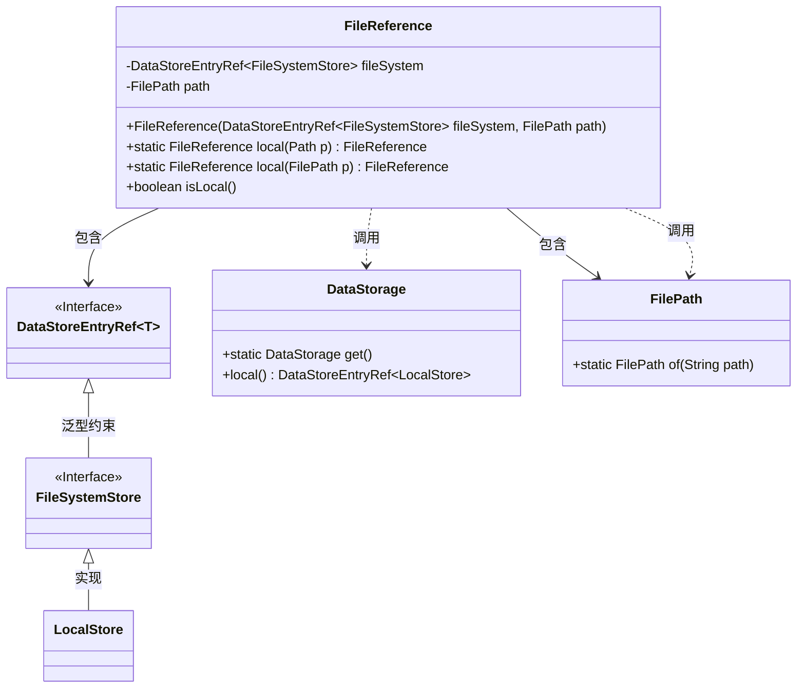
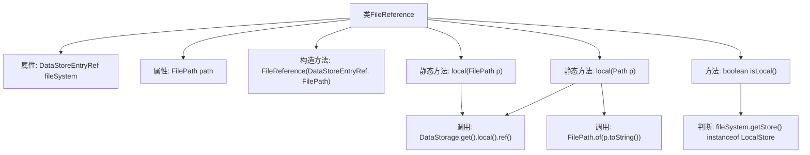

# 基础信息

|      |      |
|------|------|
| 名称 | FileReference |
| 编码语言 | .java |
| 代码路径 | xpipe/app/src/main/java/io/xpipe/app/util/FileReference.java |
| 包名 | io.xpipe.app.util |
| 依赖项 | ['io.xpipe.app.ext.LocalStore', 'io.xpipe.app.storage.DataStorage', 'io.xpipe.app.storage.DataStoreEntryRef', 'io.xpipe.core.store.FilePath', 'io.xpipe.core.store.FileSystemStore', 'lombok.Value', 'lombok.experimental.SuperBuilder', 'lombok.extern.jackson.Jacksonized', 'java.nio.file.Path'] |
| 概述说明 | 文件引用类，包含文件系统和路径，支持本地文件操作。 |

# 说明

FileReference类是一个使用@SuperBuilder、@Jacksonized和@Value注解的不可变类，用于表示文件引用。它包含两个主要字段：fileSystem（DataStoreEntryRef类型，泛型限定为FileSystemStore的子类）和path（FilePath类型）。构造函数接受这两个参数。提供了两个静态工厂方法local，分别接受Path和FilePath参数，用于创建指向本地存储的文件引用。isLocal方法用于检查文件引用是否指向本地存储（LocalStore实例）。

# 类列表 Class Summary

| 名称   | 类型  | 说明 |
|-------|------|-------------|
| FileReference | class | FileReference类定义文件引用，包含文件系统和路径，支持本地文件操作。 |

## 类 FileReference

|      |      |
|------|------|
| 访问范围 | @SuperBuilder;@Jacksonized;@Value;public |
| 类型 | class |
| 名称 | FileReference |
| 说明 | FileReference类定义文件引用，包含文件系统和路径，支持本地文件操作。 |

### UML类图

这段代码定义了一个不可变的FileReference类，用于表示文件系统引用。它包含两个核心字段：fileSystem（泛型化的数据存储引用）和path（文件路径）。类提供了两个静态工厂方法local()来创建本地文件引用，以及一个isLocal()方法检查是否为本地存储。通过Lombok的@Value和@SuperBuilder注解实现了不可变性和建造者模式，@Jacksonized支持Jackson反序列化。类与DataStorage、FilePath等辅助类协作，构成了一个完整的文件引用系统。

### 内部方法调用关系图

这段代码定义了一个不可变的FileReference类，用于封装文件系统引用和路径信息。类通过@Value注解实现不可变性，提供两种静态工厂方法local()来创建本地文件引用，并通过isLocal()方法检查存储类型是否为LocalStore。流程图展示了类结构、方法调用关系及类型判断逻辑，其中DataStorage和FilePath为关键依赖组件。

### 字段列表 Field List

| 名称  | 类型  | 说明 |
|-------|-------|------|
| fileSystem | DataStoreEntryRef<? extends FileSystemStore> | 文件系统存储引用 |
| path | FilePath | 文件路径对象 |

### 方法列表 Method List

| 名称  | 类型  | 说明 |
|-------|-------|------|
| isLocal | boolean | 检查文件系统是否为本地存储。 |
| local | FileReference | 静态方法创建本地文件引用 |
| local | FileReference | 静态方法创建本地文件引用，基于路径生成存储引用。 |

