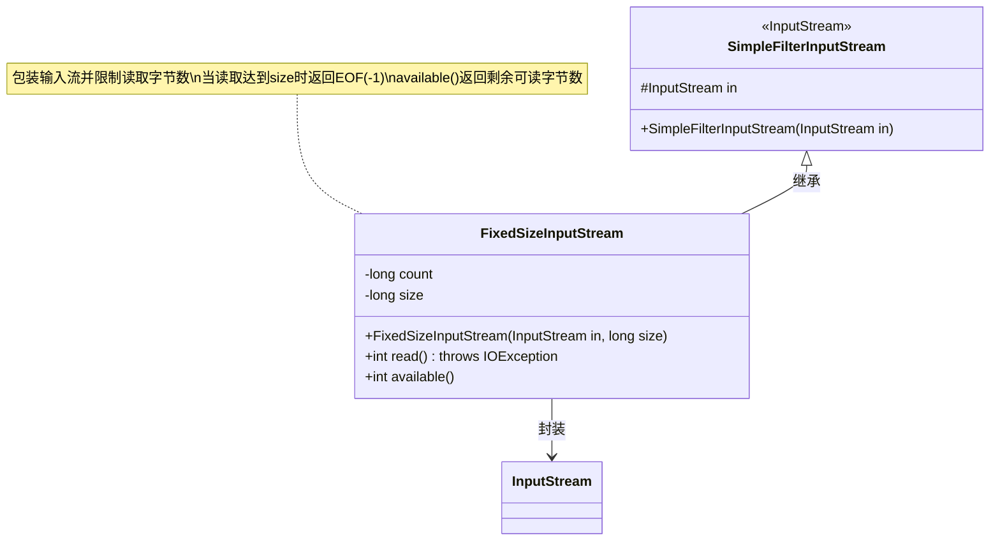
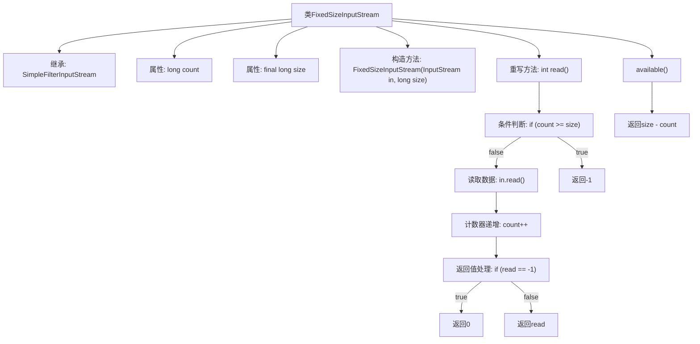

# 基础信息

|      |      |
|------|------|
| 名称 | FixedSizeInputStream |
| 编码语言 | .java |
| 代码路径 | xpipe/app/src/main/java/io/xpipe/app/util/FixedSizeInputStream.java |
| 包名 | io.xpipe.app.util |
| 依赖项 | ['java.io.IOException', 'java.io.InputStream'] |
| 概述说明 | 固定大小输入流，限制读取字节数，超限返回-1。 |

# 说明

FixedSizeInputStream是一个继承自SimpleFilterInputStream的类，用于限制输入流读取的字节数。它包含两个成员变量：count记录已读取字节数，size表示最大允许读取的字节数。构造函数接收输入流和最大字节数参数。read方法在达到最大字节数时返回-1，否则读取并递增计数，遇到-1时返回0。available方法返回剩余可读字节数。

# 类列表 Class Summary

| 名称   | 类型  | 说明 |
|-------|------|-------------|
| FixedSizeInputStream | class | 固定大小输入流，限制读取字节数，达到上限返回-1。 |

## 类 FixedSizeInputStream

|      |      |
|------|------|
| 访问范围 | public |
| 类型 | class |
| 名称 | FixedSizeInputStream |
| 说明 | 固定大小输入流，限制读取字节数，达到上限返回-1。 |

### UML类图

这段代码展示了一个FixedSizeInputStream类，它继承自SimpleFilterInputStream并实现了固定大小的输入流功能。该类通过维护count计数器来跟踪已读取字节数，当达到预设的size限制时返回EOF。重写的available()方法准确反映剩余可读字节数，而read()方法在遇到底层流EOF时会返回0而非-1以继续读取。这种设计常用于需要精确控制读取量的场景，如网络协议实现或文件分块处理。

### 内部方法调用关系图

该流程图展示了FixedSizeInputStream类的结构和核心逻辑。这个类通过继承SimpleFilterInputStream实现固定大小的输入流控制，主要包含两个关键方法：read()方法在每次读取时检查是否超过预设大小，并处理底层流的EOF情况；available()方法动态计算剩余可读字节数。流程图清晰呈现了读取过程中的条件分支和状态维护机制，特别突出了计数器递增和边界值(-1/0)的处理逻辑。

### 字段列表 Field List

| 名称  | 类型  | 说明 |
|-------|-------|------|
| size | long | 私有长整型变量size |
| count | long | 私有长整型计数变量 |

### 方法列表 Method List

| 名称  | 类型  | 说明 |
|-------|-------|------|
| available | int | 重写available方法，返回剩余可读字节数。 |
| read | int | 覆盖read方法，读取字节并计数，达到大小返回-1，否则返回读取值或0。 |

