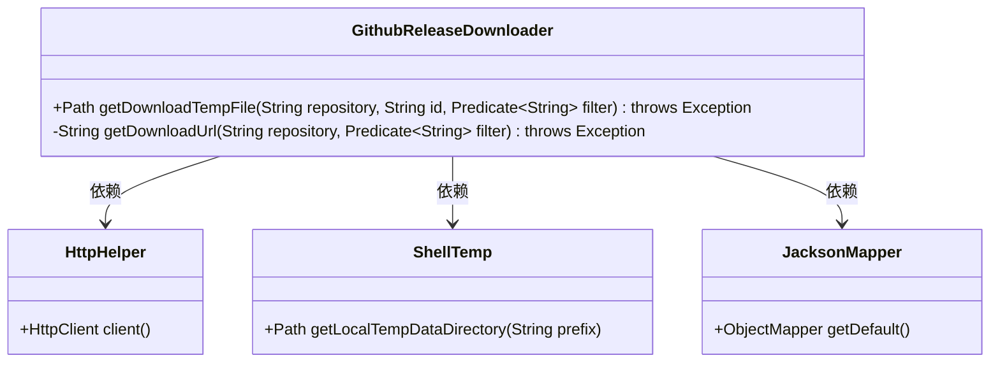
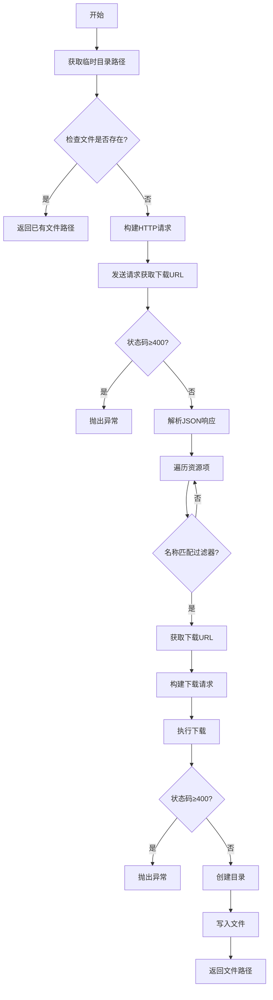
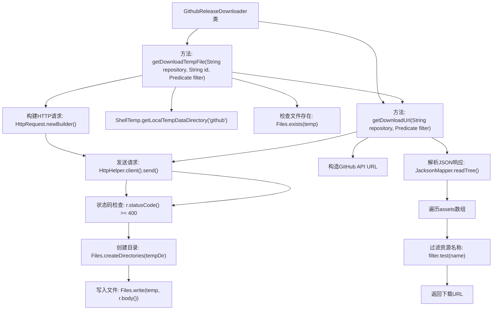

# 基础信息

|      |      |
|------|------|
| 名称 | GithubReleaseDownloader |
| 编码语言 | .java |
| 代码路径 | xpipe/app/src/main/java/io/xpipe/app/util/GithubReleaseDownloader.java |
| 包名 | io.xpipe.app.util |
| 依赖项 | ['io.xpipe.core.util.JacksonMapper', 'java.io.IOException', 'java.net.URI', 'java.net.http.HttpRequest', 'java.net.http.HttpResponse', 'java.nio.charset.StandardCharsets', 'java.nio.file.Files', 'java.nio.file.Path', 'java.util.function.Predicate'] |
| 概述说明 | GitHub发布下载器类，含获取临时文件和下载链接方法。 |

# 说明

该代码定义了一个GithubReleaseDownloader类，用于从GitHub仓库下载发布文件。主要功能包括：通过getDownloadTempFile方法下载文件到临时目录，若文件已存在则直接返回路径；通过getDownloadUrl方法获取下载链接，首先请求GitHub API获取仓库发布信息，然后根据过滤条件筛选匹配的资产并返回其下载URL。过程中处理HTTP请求异常和文件操作异常，确保下载流程的可靠性。

# 类列表 Class Summary

| 名称   | 类型  | 说明 |
|-------|------|-------------|
| GithubReleaseDownloader | class | Java类GithubReleaseDownloader：从GitHub下载发布文件，支持过滤和缓存。 |

## 类 GithubReleaseDownloader

|      |      |
|------|------|
| 访问范围 | public |
| 类型 | class |
| 名称 | GithubReleaseDownloader |
| 说明 | Java类GithubReleaseDownloader：从GitHub下载发布文件，支持过滤和缓存。 |

### UML类图

这段代码实现了一个GitHub发布资源下载器，主要包含两个核心方法：获取下载URL和下载文件到临时目录。类图展示了它与HttpHelper、ShellTemp和JacksonMapper三个辅助类的依赖关系。流程图详细描述了从检查缓存文件到最终下载完成的完整过程，包括异常处理、JSON解析和文件操作等关键步骤。该设计具有良好的模块化，通过Predicate接口实现灵活的下载过滤功能，同时考虑了临时文件管理和HTTP错误处理等边界情况。

### 内部方法调用关系图

该流程图展示了GithubReleaseDownloader类的核心逻辑流程。主方法getDownloadTempFile首先检查本地缓存文件是否存在，不存在则调用getDownloadUrl方法获取下载URL。getDownloadUrl通过GitHub API获取版本信息，解析JSON后筛选匹配的资源，返回下载链接。主方法随后通过HTTP下载资源并保存到临时目录。整个过程包含异常处理、文件操作和网络请求，实现了GitHub资源下载的完整流程。

### 字段列表 Field List

| 名称  | 类型  | 说明 |
|-------|-------|------|

### 方法列表 Method List

| 名称  | 类型  | 说明 |
|-------|-------|------|
| getDownloadUrl | String | 从GitHub仓库获取符合过滤条件的下载链接，失败时抛出异常。 |
| getDownloadTempFile | Path | 静态方法获取下载临时文件，检查存在则返回，否则下载并保存到临时目录后返回路径。 |

