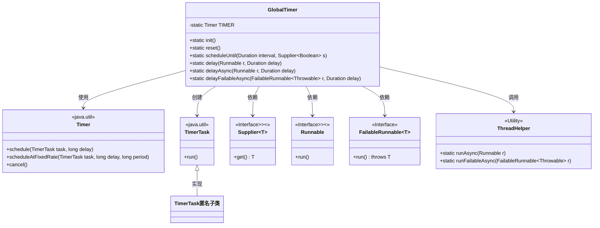
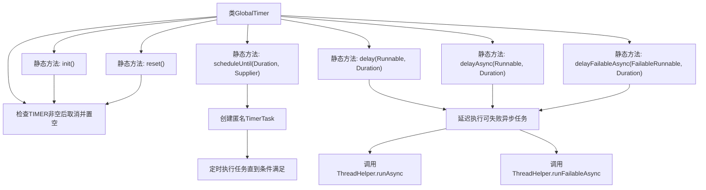

# 基础信息

|      |      |
|------|------|
| 名称 | GlobalTimer |
| 编码语言 | .java |
| 代码路径 | xpipe/app/src/main/java/io/xpipe/app/util/GlobalTimer.java |
| 包名 | io.xpipe.app.util |
| 依赖项 | ['io.xpipe.core.util.FailableRunnable', 'java.time.Duration', 'java.util.Timer', 'java.util.TimerTask', 'java.util.function.Supplier'] |
| 概述说明 | 全局定时器类，提供初始化、重置、定时任务调度及异步延迟执行功能。 |

# 说明

GlobalTimer类是一个全局定时器工具，提供静态方法管理定时任务。主要功能包括：初始化定时器init()和重置reset()方法；scheduleUntil()按固定间隔执行任务直到条件满足；delay()延迟执行单次任务；delayAsync()异步延迟执行任务；delayFailableAsync()支持异常处理的异步延迟执行。所有方法基于Java Timer实现，支持毫秒级延迟设置。

# 类列表 Class Summary

| 名称   | 类型  | 说明 |
|-------|------|-------------|
| GlobalTimer | class | 全局定时器类，提供初始化、重置、定时任务调度及延迟执行功能。 |

## 类 GlobalTimer

|      |      |
|------|------|
| 访问范围 | public |
| 类型 | class |
| 名称 | GlobalTimer |
| 说明 | 全局定时器类，提供初始化、重置、定时任务调度及延迟执行功能。 |

### UML类图

该代码展示了一个全局定时器工具类GlobalTimer，它封装了Java标准库Timer的功能，提供了初始化、重置、周期性任务调度和延迟执行等方法。类图中包含核心类GlobalTimer及其依赖的Timer、TimerTask等JDK类，以及自定义接口FailableRunnable和工具类ThreadHelper。GlobalTimer通过静态方法提供多种定时任务执行方式，包括同步执行、异步执行和可容错的异步执行，体现了对定时任务管理的封装和扩展能力。

### 内部方法调用关系图

这段代码展示了一个全局定时器工具类，采用单例模式管理Timer实例。核心功能包括初始化/重置定时器、周期性任务调度（支持条件终止）、三种延迟任务执行方式（同步/异步/可失败异步）。所有方法均为静态方法，通过内部创建匿名TimerTask实现具体逻辑，并依赖ThreadHelper处理异步执行。流程图清晰呈现了类结构、方法调用关系和任务调度路径，特别突出了不同延迟任务类型的执行方式差异。

### 字段列表 Field List

| 名称  | 类型  | 说明 |
|-------|-------|------|
| TIMER | Timer | 私有静态计时器变量 |

### 方法列表 Method List

| 名称  | 类型  | 说明 |
|-------|-------|------|
| init | void | 初始化全局定时器TIMER。 |
| delayAsync | void | 异步延迟执行Runnable任务，使用Timer调度。 |
| delayFailableAsync | void | 延迟执行可失败异步任务，指定延迟时间后运行。 |
| reset | void | 静态方法reset()：若TIMER非空则取消并置空。 |
| delay | void | 静态方法延迟执行Runnable任务，延迟时间由Duration参数指定。 |
| scheduleUntil | void | 定时执行任务直到条件满足，间隔由参数指定。 |

