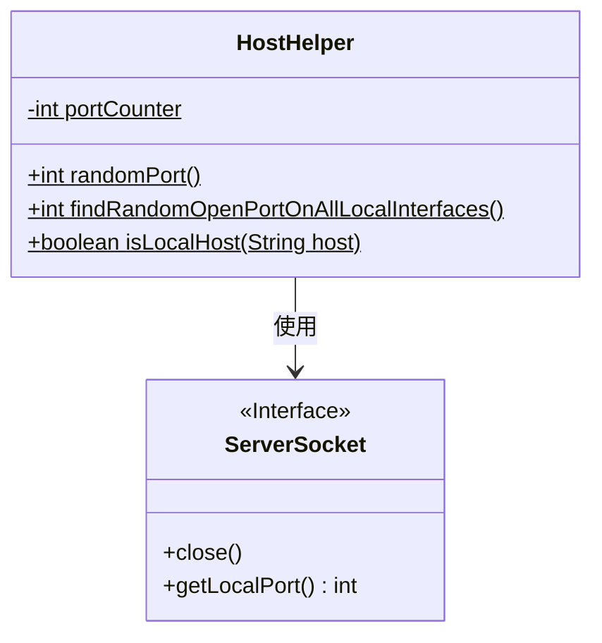
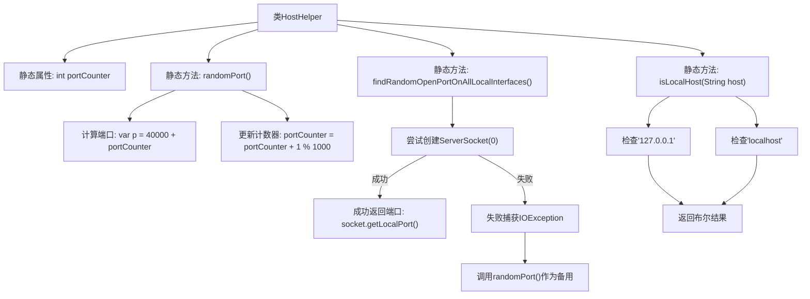

# 基础信息

|      |      |
|------|------|
| 名称 | HostHelper |
| 编码语言 | .java |
| 代码路径 | xpipe/app/src/main/java/io/xpipe/app/util/HostHelper.java |
| 包名 | io.xpipe.app.util |
| 依赖项 | ['java.io.IOException', 'java.net.ServerSocket', 'java.util.Locale'] |
| 概述说明 | HostHelper类提供随机端口生成、本地端口查找和本地主机判断功能。 |

# 说明

HostHelper类提供三个静态方法用于主机和端口操作。randomPort方法从40000开始按顺序生成端口号，循环范围在1000以内。findRandomOpenPortOnAllLocalInterfaces方法尝试获取随机可用端口，失败时回退到randomPort。isLocalHost方法检查输入主机名是否为本地地址，支持127.0.0.1和localhost两种形式。所有方法均为工具类设计，不依赖实例状态。

# 类列表 Class Summary

| 名称   | 类型  | 说明 |
|-------|------|-------------|
| HostHelper | class | HostHelper类提供随机端口生成、本地端口查找及本地主机判断功能。 |

## 类 HostHelper

|      |      |
|------|------|
| 访问范围 | public |
| 类型 | class |
| 名称 | HostHelper |
| 说明 | HostHelper类提供随机端口生成、本地端口查找及本地主机判断功能。 |

### UML类图

这段代码展示了一个`HostHelper`工具类，主要用于处理主机和端口相关的操作。该类包含三个静态方法：`randomPort()`生成基于计数器的端口号，`findRandomOpenPortOnAllLocalInterfaces()`尝试获取随机可用端口（失败时回退到`randomPort`），以及`isLocalHost()`判断主机地址是否为本地地址。类图中显示了`HostHelper`与`ServerSocket`接口的依赖关系，后者用于端口检测功能。所有方法均为静态，`portCounter`也是静态私有成员，符合工具类的设计模式。

### 内部方法调用关系图

该流程图描述了HostHelper类的完整结构，包含静态端口计数器和三个核心方法。randomPort()通过计数器生成40000-40999范围的端口；findRandomOpenPortOnAllLocalInterfaces()优先获取系统分配的随机开放端口，失败时回退到randomPort()；isLocalHost()通过比对'127.0.0.1'和'localhost'验证本地主机。异常处理流程和字符串比较逻辑均被清晰展示，箭头准确反映了方法调用关系和条件分支。

### 字段列表 Field List

| 名称  | 类型  | 说明 |
|-------|-------|------|
| portCounter = 0 | int | 私有静态整型计数器portCounter初始化为0。 |

### 方法列表 Method List

| 名称  | 类型  | 说明 |
|-------|-------|------|
| randomPort | int | 生成随机端口，从40000开始递增，循环范围1000。 |
| findRandomOpenPortOnAllLocalInterfaces | int | 获取本地随机可用端口，失败时返回随机端口。 |
| isLocalHost | boolean | 检查主机是否为本地地址127.0.0.1或localhost。 |

