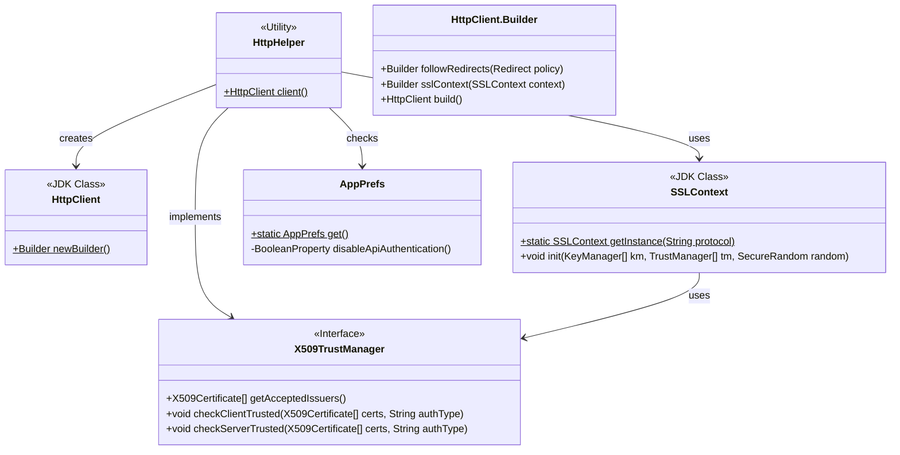
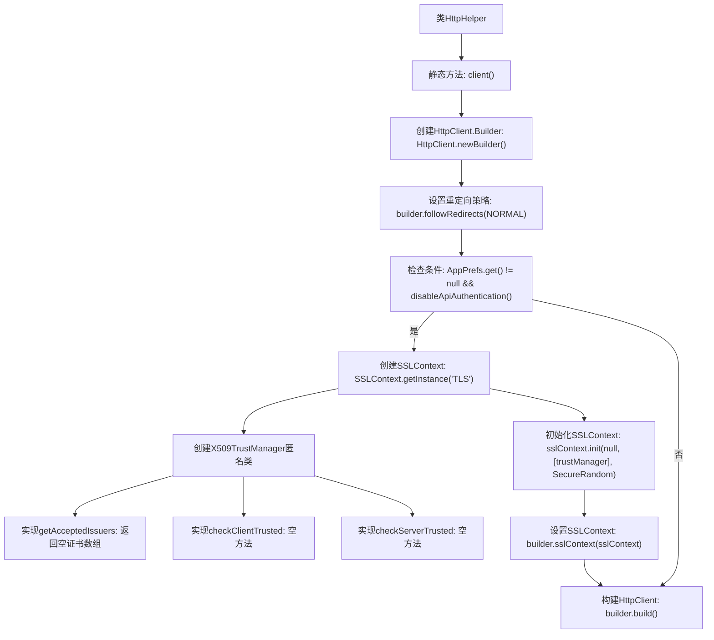

# 基础信息

|      |      |
|------|------|
| 名称 | HttpHelper |
| 编码语言 | .java |
| 代码路径 | xpipe/app/src/main/java/io/xpipe/app/util/HttpHelper.java |
| 包名 | io.xpipe.app.util |
| 依赖项 | ['io.xpipe.app.prefs.AppPrefs', 'lombok.SneakyThrows', 'java.net.http.HttpClient', 'java.security.SecureRandom', 'java.security.cert.X509Certificate', 'javax.net.ssl.SSLContext', 'javax.net.ssl.TrustManager', 'javax.net.ssl.X509TrustManager'] |
| 概述说明 | 创建HTTP客户端，可选禁用SSL认证。 |

# 说明

该代码定义了一个名为HttpHelper的工具类，包含一个静态方法client()用于创建HttpClient实例。方法首先构建基础客户端配置，默认启用常规重定向。当应用偏好设置存在且禁用API认证时，会创建自定义TLS SSLContext，其中包含一个信任所有证书的X509TrustManager实现（不验证客户端/服务端证书）。最后返回配置好的HttpClient实例。整个过程处理了SSL证书验证的绕过场景。

# 类列表 Class Summary

| 名称   | 类型  | 说明 |
|-------|------|-------------|
| HttpHelper | class | 创建HTTP客户端，可选禁用SSL认证。 |

## 类 HttpHelper

|      |      |
|------|------|
| 访问范围 | public |
| 类型 | class |
| 名称 | HttpHelper |
| 说明 | 创建HTTP客户端，可选禁用SSL认证。 |

### UML类图

这段代码展示了一个HTTP工具类HttpHelper，它负责创建配置了特定安全策略的HttpClient实例。当应用偏好设置禁用API认证时，会创建一个跳过证书验证的SSLContext，使用匿名内部类实现X509TrustManager接口来绕过安全验证。类图清晰地呈现了HttpHelper与JDK内置类（HttpClient、SSLContext）、接口（X509TrustManager）和应用配置类（AppPrefs）之间的交互关系，体现了对不安全连接的特殊处理逻辑。

### 内部方法调用关系图

该流程图展示了HttpHelper类中client()方法的完整执行流程。方法首先创建HttpClient构建器并设置重定向策略，然后根据应用偏好设置决定是否禁用API认证。若禁用则创建自定义SSLContext和信任管理器（实现空校验逻辑），最终构建并返回HttpClient实例。流程清晰体现了条件分支和SSL安全配置的关键步骤，共包含13个节点和12条执行路径。

### 字段列表 Field List

| 名称  | 类型  | 说明 |
|-------|-------|------|

### 方法列表 Method List

| 名称  | 类型  | 说明 |
|-------|-------|------|
| client | HttpClient | 创建HTTP客户端，可选禁用SSL认证。 |

