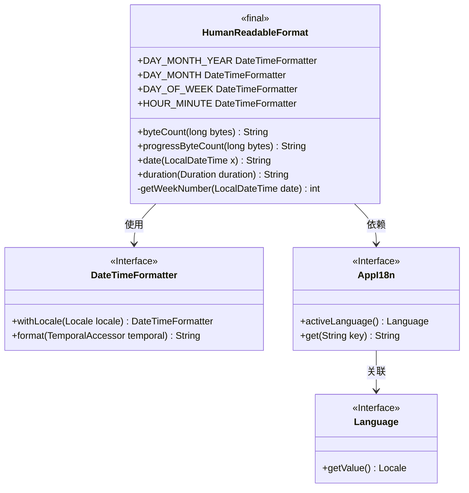
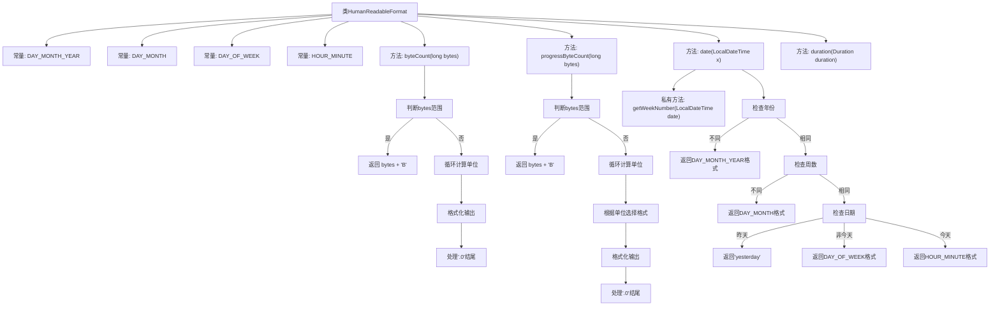

# 基础信息

|      |      |
|------|------|
| 名称 | HumanReadableFormat |
| 编码语言 | .java |
| 代码路径 | xpipe/app/src/main/java/io/xpipe/app/util/HumanReadableFormat.java |
| 包名 | io.xpipe.app.util |
| 依赖项 | ['io.xpipe.app.core.AppI18n', 'java.text.CharacterIterator', 'java.text.StringCharacterIterator', 'java.time.Duration', 'java.time.LocalDateTime', 'java.time.ZoneId', 'java.time.format.DateTimeFormatter', 'java.time.temporal.WeekFields', 'java.util.Objects'] |
| 概述说明 | HumanReadableFormat类提供日期、字节大小和持续时间的格式化方法。 |

# 说明

HumanReadableFormat类提供日期时间格式化、字节数转换和时长显示功能。定义4种日期格式模式：年月日、月日、星期、时分。byteCount方法将字节数转换为易读格式（如1.5 kB），progressByteCount类似但提供更高精度。date方法根据与当前时间的差异返回不同格式的日期字符串，自动判断是否同年、同周或同日。duration方法将Duration对象转换为易读的时长字符串（如3h 30m 15s）。所有日期格式均支持本地化设置。

# 类列表 Class Summary

| 名称   | 类型  | 说明 |
|-------|------|-------------|
| HumanReadableFormat | class | HumanReadableFormat类提供日期、字节大小、时长等数据的可读格式化方法。 |

## 类 HumanReadableFormat

|      |      |
|------|------|
| 访问范围 | public final |
| 类型 | class |
| 名称 | HumanReadableFormat |
| 说明 | HumanReadableFormat类提供日期、字节大小、时长等数据的可读格式化方法。 |

### UML类图

该代码是一个工具类，用于格式化字节大小、日期时间和持续时间。主要功能包括：将字节转换为易读格式（如KB/MB）、根据时间差智能显示日期（如"昨天"、"3月5日"）、格式化持续时间（如"2h 30m"）。类通过DateTimeFormatter处理日期格式，依赖AppI18n实现国际化支持，包含私有方法计算周数。所有方法均为静态，类被声明为final不可继承。

### 内部方法调用关系图

该流程图展示了HumanReadableFormat类的结构和主要方法逻辑。类包含4个日期格式常量和4个核心方法：byteCount()和progressByteCount()用于格式化字节大小，date()根据时间差返回不同精度的日期字符串，duration()处理时间间隔显示。date()方法通过多级时间判断（年/周/日）决定输出格式，体现了精细的时间显示策略。所有方法都考虑了国际化和边界情况处理，如字节单位的循环计算和日期格式的本地化适配。

### 字段列表 Field List

| 名称  | 类型  | 说明 |
|-------|-------|------|
| HOUR_MINUTE = DateTimeFormatter.ofPattern("HH:mm") | DateTimeFormatter | 定义时间格式HH:mm的静态常量。 |
| DAY_MONTH_YEAR = DateTimeFormatter.ofPattern("d LLL yyyy") | DateTimeFormatter | 定义日期格式"d LLL yyyy"的静态常量。 |
| DAY_OF_WEEK = DateTimeFormatter.ofPattern("EEE") | DateTimeFormatter | 定义静态常量DAY_OF_WEEK，使用EEE模式格式化星期几。 |
| DAY_MONTH = DateTimeFormatter.ofPattern("d LLL") | DateTimeFormatter | 定义日期格式为"日 月"的常量格式化器。 |

### 方法列表 Method List

| 名称  | 类型  | 说明 |
|-------|-------|------|
| getWeekNumber | int | 获取日期所在年份的周数，基于当前语言区域设置。 |
| date | String | 根据日期时间返回格式化字符串，按年、周、日分级显示不同格式。 |
| progressByteCount | String | 将字节数转换为易读格式，如KB、MB等，保留1或3位小数。 |
| byteCount | String | 将字节数转换为易读格式，如KB、MB等，保留一位小数，末尾.0则省略。 |
| duration | String | Java方法：将Duration格式化为易读字符串，去除前缀和毫秒，添加空格分隔单位。 |

