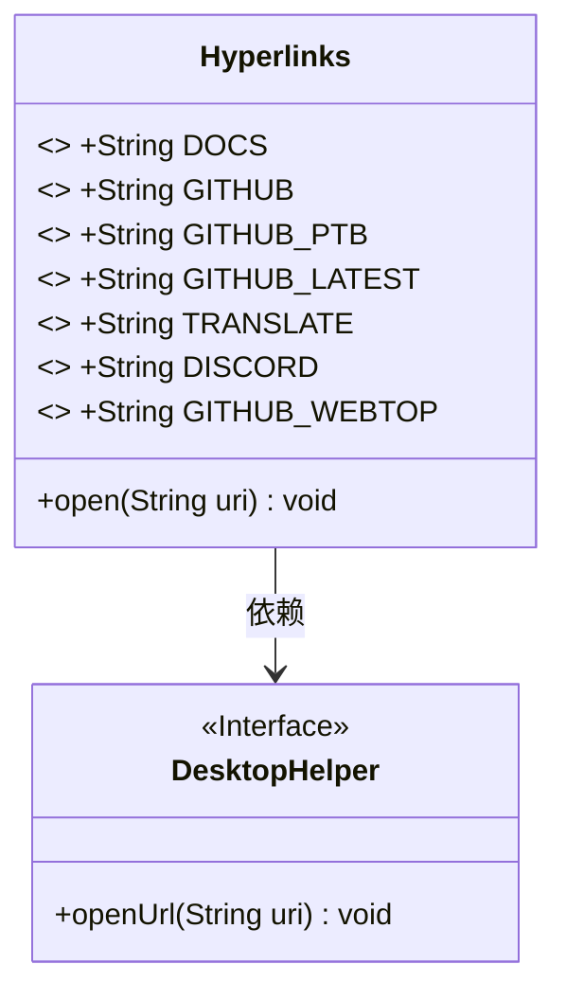
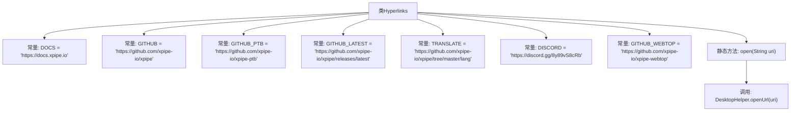

# 基础信息

|      |      |
|------|------|
| 名称 | Hyperlinks |
| 编码语言 | .java |
| 代码路径 | xpipe/app/src/main/java/io/xpipe/app/util/Hyperlinks.java |
| 包名 | io.xpipe.app.util |
| 依赖项 | [] |
| 概述说明 | Hyperlinks类包含XPipe项目文档、GitHub、翻译、Discord等链接及打开方法。 |

# 说明

该代码定义了一个名为Hyperlinks的公共类，包含多个静态字符串常量，分别存储不同功能的URL链接。这些链接包括官方文档、GitHub主仓库、测试版仓库、最新版本发布页、翻译页面、Discord社区以及Webtop项目仓库。此外，该类提供了一个静态方法open，用于通过DesktopHelper工具打开指定URI链接。所有链接均指向xpipe-io相关资源。

# 类列表 Class Summary

| 名称   | 类型  | 说明 |
|-------|------|-------------|
| Hyperlinks | class | Hyperlinks类包含XPipe的文档、GitHub、翻译、Discord等链接及打开方法。 |

## 类 Hyperlinks

|      |      |
|------|------|
| 访问范围 | public |
| 类型 | class |
| 名称 | Hyperlinks |
| 说明 | Hyperlinks类包含XPipe的文档、GitHub、翻译、Discord等链接及打开方法。 |

### UML类图

该图展示了一个包含静态常量和方法的Hyperlinks工具类，它依赖于DesktopHelper接口来打开URL链接。Hyperlinks类定义了多个公开静态常量字符串，这些字符串存储了不同服务的URL地址，并提供了一个open方法用于通过DesktopHelper接口打开这些链接。这种设计模式常用于集中管理应用程序的外部链接资源。

### 内部方法调用关系图

该流程图展示了Hyperlinks类的结构，包含7个公开静态常量字符串（存储不同功能的URL链接）和1个静态方法open。open方法通过调用DesktopHelper.openUrl实现URL打开功能。所有常量均为项目相关资源链接（文档、代码库、翻译、社区等），设计模式采用工具类形式，通过集中管理URL提升可维护性。流程图清晰呈现了类成员与方法的从属关系，未涉及复杂逻辑分支。

### 字段列表 Field List

| 名称  | 类型  | 说明 |
|-------|-------|------|
| GITHUB = "https://github.com/xpipe-io/xpipe" | String | 公开静态常量字符串GITHUB，值为xpipe项目的GitHub链接。 |
| DOCS = "https://docs.xpipe.io" | String | XPipe文档链接常量 |
| GITHUB_PTB = "https://github.com/xpipe-io/xpipe-ptb" | String | GitHub PTB仓库地址：https://github.com/xpipe-io/xpipe-ptb |
| GITHUB_LATEST = "https://github.com/xpipe-io/xpipe/releases/latest" | String | GitHub最新发布页链接 |
| TRANSLATE = "https://github.com/xpipe-io/xpipe/tree/master/lang" | String | GitHub上XPipe项目的多语言翻译文件路径。 |
| DISCORD = "https://discord.gg/8y89vS8cRb" | String | 公开静态常量DISCORD存储Discord链接。 |
| GITHUB_WEBTOP = "https://github.com/xpipe-io/xpipe-webtop" | String | GitHub仓库链接：xpipe-io/xpipe-webtop |

### 方法列表 Method List

| 名称  | 类型  | 说明 |
|-------|-------|------|
| open | void | 静态方法open调用DesktopHelper打开指定URI链接。 |

