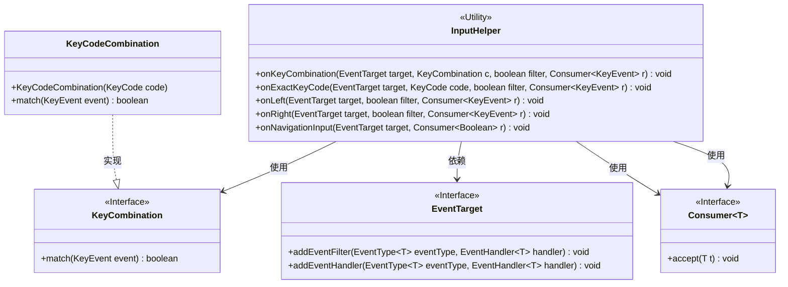
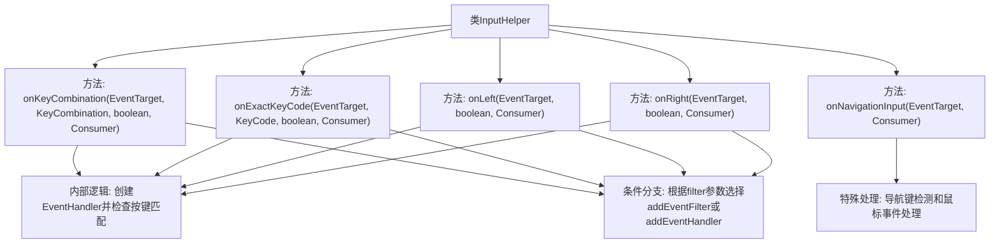

# 基础信息

|      |      |
|------|------|
| 名称 | InputHelper |
| 编码语言 | .java |
| 代码路径 | xpipe/app/src/main/java/io/xpipe/app/util/InputHelper.java |
| 包名 | io.xpipe.app.util |
| 依赖项 | ['javafx.event.EventHandler', 'javafx.event.EventTarget', 'javafx.scene.input', 'java.util.List', 'java.util.function.Consumer'] |
| 概述说明 | InputHelper类提供键盘事件处理功能，支持组合键、方向键及导航键监听。 |

# 说明

该代码定义了一个名为InputHelper的工具类，提供静态方法处理键盘输入事件。主要功能包括：onKeyCombination方法监听特定组合键事件；onExactKeyCode方法监听指定按键事件；onLeft和onRight方法分别监听左右方向键及小键盘对应按键；onNavigationInput方法监听导航键（空格、回车、Shift、Tab等）和鼠标按下事件。所有方法都支持选择使用事件过滤器或事件处理器，并通过Consumer回调处理匹配事件。

# 类列表 Class Summary

| 名称   | 类型  | 说明 |
|-------|------|-------------|
| InputHelper | class | InputHelper类提供键盘事件处理功能，支持组合键、方向键及导航键监听。 |

## 类 InputHelper

|      |      |
|------|------|
| 访问范围 | public |
| 类型 | class |
| 名称 | InputHelper |
| 说明 | InputHelper类提供键盘事件处理功能，支持组合键、方向键及导航键监听。 |

### UML类图

这段类图展示了InputHelper工具类与相关接口的交互关系。InputHelper提供了5个静态方法用于处理键盘和鼠标事件，其中onKeyCombination和onExactKeyCode方法依赖KeyCombination接口检测按键组合，onLeft/onRight方法使用预定义的KeyCodeCombination实现类。所有方法都通过EventTarget接口注册事件处理器，并使用Consumer接口回调处理结果。KeyCodeCombination实现了KeyCombination接口的匹配逻辑，整个设计体现了事件处理的灵活性和可扩展性。

### 内部方法调用关系图

这段代码展示了一个处理键盘和鼠标输入的辅助类，包含5个核心方法。所有键盘处理方法都遵循相同模式：创建事件处理器检查按键匹配，然后根据filter参数决定使用事件过滤器(addEventFilter)或事件处理器(addEventHandler)。onNavigationInput方法特殊处理导航键和鼠标点击，通过Consumer回调返回布尔结果。流程图清晰展示了类结构和方法间的调用关系，突出了事件处理的核心逻辑和条件分支。

### 字段列表 Field List

| 名称  | 类型  | 说明 |
|-------|-------|------|

### 方法列表 Method List

| 名称  | 类型  | 说明 |
|-------|-------|------|
| onRight | void | 定义方法处理右方向键事件，支持过滤或处理模式。 |
| onKeyCombination | void | 为指定目标注册按键组合事件处理器，匹配时执行回调。 |
| onExactKeyCode | void | 注册按键事件处理器，匹配指定键码后执行回调。 |
| onNavigationInput | void | 静态方法监听目标控件的键盘导航和鼠标点击事件，触发回调返回匹配结果。 |
| onLeft | void | 定义左键事件处理，支持过滤或监听，触发回调。 |

