# 基础信息

|      |      |
|------|------|
| 名称 | JfxHelper |
| 编码语言 | .java |
| 代码路径 | xpipe/app/src/main/java/io/xpipe/app/util/JfxHelper.java |
| 包名 | io.xpipe.app.util |
| 依赖项 | ['io.xpipe.app.comp.base.PrettyImageHelper', 'io.xpipe.app.core.AppFontSizes', 'javafx.beans.value.ObservableValue', 'javafx.geometry.Pos', 'javafx.scene.control.Label', 'javafx.scene.layout.HBox', 'javafx.scene.layout.Region', 'javafx.scene.layout.VBox', 'atlantafx.base.controls.Spacer'] |
| 概述说明 | 创建带名称和描述的UI组件，可选图片。 |

# 说明

该代码定义了一个名为JfxHelper的类，其中包含一个静态方法createNamedEntry，用于创建带有名称和描述的UI组件。方法接收两个可观察字符串值（名称和描述）和一个图像路径作为参数。首先创建两个标签分别绑定名称和描述，并设置字体大小。然后将它们放入垂直布局中。如果图像路径为空，则直接返回文本布局；否则创建固定大小的方形图像，并与文本组合成水平布局。最终返回包含图像和文本的水平布局组件。

# 类列表 Class Summary

| 名称   | 类型  | 说明 |
|-------|------|-------------|
| JfxHelper | class | 创建带名称和描述的UI组件，可选配图像。 |

## 类 JfxHelper

|      |      |
|------|------|
| 访问范围 | public |
| 类型 | class |
| 名称 | JfxHelper |
| 说明 | 创建带名称和描述的UI组件，可选配图像。 |

### UML类图

该代码展示了一个JavaFX工具类JfxHelper，主要功能是创建带有名称、描述和可选图片的UI组件。通过组合Label、VBox、HBox等基础控件，实现了动态绑定的文本显示和灵活布局。当image参数非空时会添加图片区域，使用PrettyImageHelper处理图片尺寸。整个设计体现了响应式UI编程思想，通过属性绑定实现数据与视图的自动同步。

### 内部方法调用关系图

```mermaid
graph TD
    A["方法: createNamedEntry"]
    B["创建Label header并绑定nameString"]
    C["设置header字体为AppFontSizes.xl"]
    D["创建Label desc并绑定descString"]
    E["设置desc字体为AppFontSizes.xs"]
    F["创建VBox text包含header和desc"]
    G["设置text对齐方式为CENTER_LEFT"]
    H{"image是否为null?"}
    I["返回text"]
    J["设置graphic尺寸为40"]
    K["调用PrettyImageHelper.ofFixedSizeSquare创建graphic"]
    L["创建HBox hbox包含graphic和text"]
    M["设置hbox对齐方式为CENTER_LEFT"]
    N["设置hbox填充高度为true"]
    O["设置hbox间距为10"]
    P["返回hbox"]

    A --> B
    B --> C
    A --> D
    D --> E
    A --> F
    F --> G
    A --> H
    H --是--> I
    H --否--> J
    J --> K
    K --> L
    L --> M
    M --> N
    N --> O
    O --> P
```

这段代码流程图描述了JfxHelper类中createNamedEntry方法的执行流程。该方法根据输入参数创建并配置UI组件，首先创建两个Label分别绑定名称和描述，然后根据image参数是否存在决定返回纯文本布局还是图文混合布局。当image存在时，会创建固定大小的图像区域并与文本组合成水平布局，最终返回配置好的UI组件。整个过程体现了条件分支和UI组件组合的逻辑。

### 字段列表 Field List

| 名称  | 类型  | 说明 |
|-------|-------|------|

### 方法列表 Method List

| 名称  | 类型  | 说明 |
|-------|-------|------|
| createNamedEntry | Region | 创建带名称和描述的UI区域，可选图片。 |

