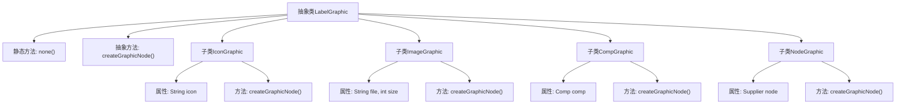

# 基础信息

|      |      |
|------|------|
| 名称 | LabelGraphic |
| 编码语言 | .java |
| 代码路径 | xpipe/app/src/main/java/io/xpipe/app/util/LabelGraphic.java |
| 包名 | io.xpipe.app.util |
| 依赖项 | ['io.xpipe.app.comp.Comp', 'io.xpipe.app.comp.base.PrettyImageHelper', 'javafx.scene.Node', 'lombok.EqualsAndHashCode', 'lombok.Value', 'org.kordamp.ikonli.javafx.FontIcon', 'java.util.function.Supplier'] |
| 概述说明 | 抽象类LabelGraphic定义图形标签，包含无图形、图标、图片、组件和节点五种实现。 |

# 说明

这是一个抽象类LabelGraphic，用于创建图形节点。它包含一个静态方法none()返回空节点，以及抽象方法createGraphicNode()。有四个子类：IconGraphic使用字体图标创建节点，ImageGraphic通过图片文件生成固定尺寸节点，CompGraphic利用Comp组件生成节点，NodeGraphic通过Supplier动态获取节点。所有子类生成的节点都添加了graphic样式类。

# 类列表 Class Summary

| 名称   | 类型  | 说明 |
|-------|------|-------------|
| LabelGraphic | class | 抽象类LabelGraphic定义图形标签，包含无图形、图标、图片、组件和节点五种实现。 |


## 类 LabelGraphic

|      |      |
|------|------|
| 访问范围 | public abstract |
| 类型 | class |
| 名称 | LabelGraphic |
| 说明 | 抽象类LabelGraphic定义图形标签，包含无图形、图标、图片、组件和节点五种实现。 |


### UML类图

```mermaid
classDiagram
    class LabelGraphic {
        <<abstract>>
        +LabelGraphic()
        +none() LabelGraphic
        +createGraphicNode() Node
    }

    class IconGraphic {
        -String icon
        +createGraphicNode() Node
    }

    class ImageGraphic {
        -String file
        -int size
        +createGraphicNode() Node
    }

    class CompGraphic {
        -Comp~?~ comp
        +createGraphicNode() Node
    }

    class NodeGraphic {
        -Supplier~Node~ node
        +createGraphicNode() Node
    }

    LabelGraphic <|-- IconGraphic
    LabelGraphic <|-- ImageGraphic
    LabelGraphic <|-- CompGraphic
    LabelGraphic <|-- NodeGraphic

    // CompGraphic 使用泛型组件 Comp~?~
    // NodeGraphic 使用 Supplier 动态生成节点
    // 所有子类都实现了 createGraphicNode() 方法
```

该类图展示了一个抽象类 LabelGraphic 及其四个具体实现子类。LabelGraphic 定义了创建图形节点的核心抽象方法，子类分别实现了基于图标、图片、组件和动态节点的不同创建方式。IconGraphic 使用字体图标，ImageGraphic 处理固定尺寸图片，CompGraphic 包装泛型组件，NodeGraphic 通过 Supplier 动态生成节点。所有子类都遵循统一的图形创建接口，并在生成的节点上添加"graphic"样式类。


### 内部方法调用关系图



该流程图展示了LabelGraphic抽象类及其四个具体子类的结构关系。LabelGraphic定义了核心抽象方法createGraphicNode()和静态工厂方法none()，四个子类IconGraphic、ImageGraphic、CompGraphic和NodeGraphic分别实现了不同的图形创建逻辑。每个子类通过特有的属性（如icon、file/size、comp、node）和重写的createGraphicNode()方法，实现了多样化的图形节点生成能力，同时都遵循统一的父类接口规范。这种设计模式支持灵活扩展不同类型的图形渲染方式。

### 字段列表 Field List

| 名称  | 类型  | 说明 |
|-------|-------|------|

### 方法列表 Method List

| 名称  | 类型  | 说明 |
|-------|-------|------|
| none | LabelGraphic | 静态方法返回空标签图形节点。 |
| createGraphicNode | Node | 创建图形节点抽象方法。 |


