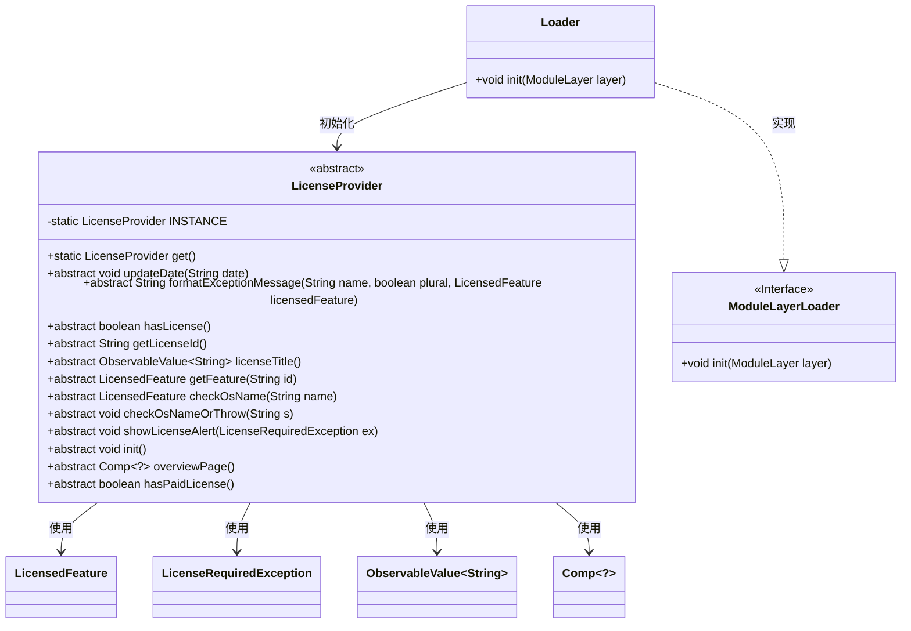
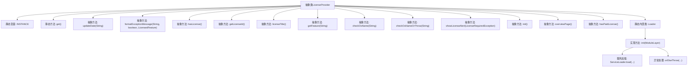

# 基础信息

|      |      |
|------|------|
| 名称 | LicenseProvider |
| 编码语言 | .java |
| 代码路径 | xpipe/app/src/main/java/io/xpipe/app/util/LicenseProvider.java |
| 包名 | io.xpipe.app.util |
| 依赖项 | ['io.xpipe.app.comp.Comp', 'io.xpipe.app.ext.ExtensionException', 'io.xpipe.core.util.ModuleLayerLoader', 'javafx.beans.value.ObservableValue', 'java.util.ServiceLoader'] |
| 概述说明 | 抽象类LicenseProvider提供许可证管理功能，包括获取实例、更新日期、检查许可证状态、获取特征及初始化等。 |

# 说明

这是一个抽象类LicenseProvider，用于管理软件许可证相关功能。它采用单例模式，通过静态方法get()获取唯一实例。主要功能包括：更新日期、格式化异常消息、检查许可证状态、获取许可证ID、管理许可证标题、处理功能特性、验证操作系统名称等。类中包含静态内部类Loader，负责初始化模块层并通过ServiceLoader加载LicenseProvider实现，若未找到则抛出异常。该类还提供了许可证概览页面和付费许可证状态检查功能。

# 类列表 Class Summary

| 名称   | 类型  | 说明 |
|-------|------|-------------|
| LicenseProvider | class | 抽象类LicenseProvider提供许可证管理功能，包括获取实例、更新日期、检查许可证状态、获取特征及初始化等操作。 |

## 类 LicenseProvider

|      |      |
|------|------|
| 访问范围 | public abstract |
| 类型 | class |
| 名称 | LicenseProvider |
| 说明 | 抽象类LicenseProvider提供许可证管理功能，包括获取实例、更新日期、检查许可证状态、获取特征及初始化等操作。 |

### UML类图

这段代码描述了一个抽象类LicenseProvider及其静态内部类Loader的类图结构。LicenseProvider作为许可证管理的核心抽象类，提供了12个抽象方法用于许可证验证、异常处理和界面展示等功能，并通过单例模式维护静态实例。Loader类实现了ModuleLayerLoader接口，负责通过Java模块系统初始化LicenseProvider实例。图中清晰展示了类之间的依赖关系（如使用LicensedFeature等类）和实现关系（Loader实现接口），体现了模块化加载和许可证管理的设计模式。

### 内部方法调用关系图

该流程图展示了LicenseProvider抽象类的完整结构，包含13个核心抽象方法和1个静态内部类Loader。静态变量INSTANCE通过Loader类的init方法初始化，该方法使用Java模块层的ServiceLoader机制加载LicenseProvider实现实例。流程特别突出了服务加载和异常处理路径，体现了许可证提供者的核心功能，包括许可证验证、异常格式化、OS检查等功能模块的抽象定义。静态内部类Loader实现了ModuleLayerLoader接口，负责在模块层初始化时加载具体的LicenseProvider服务实现。

### 字段列表 Field List

| 名称  | 类型  | 说明 |
|-------|-------|------|
| INSTANCE = null | LicenseProvider | 私有静态LicenseProvider实例，初始为null。 |

### 方法列表 Method List

| 名称  | 类型  | 说明 |
|-------|-------|------|
| hasPaidLicense | boolean | 检查是否拥有付费许可证。 |
| checkOsName | LicensedFeature | 检查操作系统名称的抽象方法，返回授权功能。 |
| licenseTitle | ObservableValue<String> | 公开抽象方法返回可观察字符串值licenseTitle。 |
| overviewPage | Comp<?> | 抽象方法返回泛型Comp对象，用于概览页。 |
| showLicenseAlert | void | 显示许可证异常提示 |
| init | void | 抽象初始化方法 |
| hasLicense | boolean | 抽象方法：检查是否有许可证。 |
| get | LicenseProvider | 获取LicenseProvider单例实例。 |
| checkOsNameOrThrow | void | 抽象方法：检查操作系统名称，参数为字符串s。 |
| updateDate | void | 抽象方法：更新日期，参数为字符串日期。 |
| formatExceptionMessage | String | 抽象方法：格式化异常消息，参数为名称、复数和许可特性。 |
| getLicenseId | String | 获取许可证ID的抽象方法。 |
| getFeature | LicensedFeature | 获取指定ID的授权功能。 |

