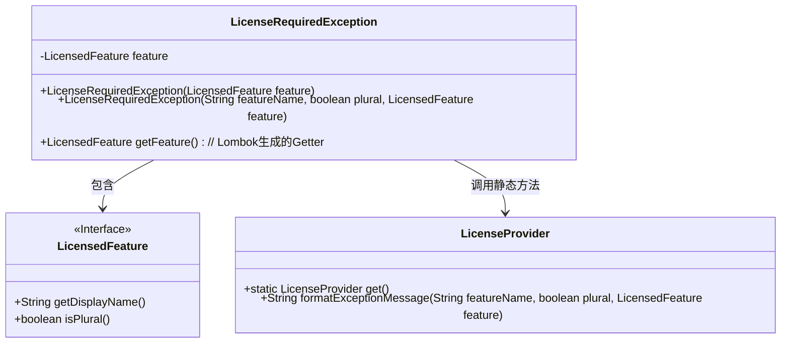
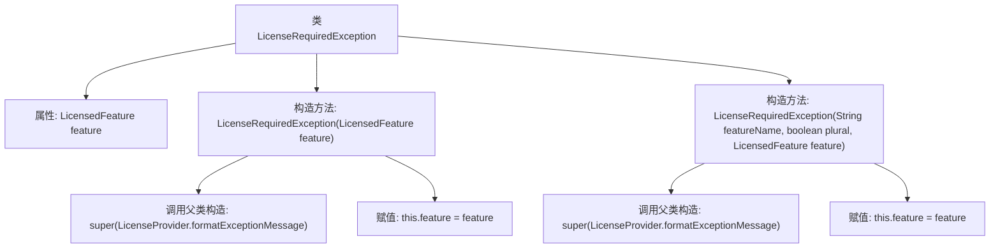

# 基础信息

|      |      |
|------|------|
| 名称 | LicenseRequiredException |
| 编码语言 | .java |
| 代码路径 | xpipe/app/src/main/java/io/xpipe/app/util/LicenseRequiredException.java |
| 包名 | io.xpipe.app.util |
| 依赖项 | ['lombok.Getter'] |
| 概述说明 | 自定义异常类，检查许可证功能是否授权。 |

# 说明

这是一个名为LicenseRequiredException的自定义运行时异常类，用于处理需要许可证的功能异常情况。该类继承自RuntimeException，包含一个LicensedFeature类型的私有最终字段feature。提供了两个构造函数：第一个构造函数接收LicensedFeature参数，通过LicenseProvider格式化异常消息；第二个构造函数额外接收featureName和plural参数，同样使用LicenseProvider格式化消息。两个构造函数都将传入的feature赋值给类字段。异常消息通过LicenseProvider的formatExceptionMessage方法生成，涉及功能显示名称、复数形式标识和功能本身。

# 类列表 Class Summary

| 名称   | 类型  | 说明 |
|-------|------|-------------|
| LicenseRequiredException | class | 自定义异常类，需许可证时抛出，包含许可特性信息。 |

## 类 LicenseRequiredException

|      |      |
|------|------|
| 访问范围 | @Getter;public |
| 类型 | class |
| 名称 | LicenseRequiredException |
| 说明 | 自定义异常类，需许可证时抛出，包含许可特性信息。 |

### UML类图

这段代码展示了一个自定义运行时异常`LicenseRequiredException`，用于处理许可证缺失场景。类图显示该异常通过`LicensedFeature`接口获取功能名称和复数标识，并依赖`LicenseProvider`的静态方法格式化错误消息。Lombok注解自动生成`getFeature()`方法，整体设计体现了清晰的职责分离和异常信息封装机制。

### 内部方法调用关系图

该流程图描述了LicenseRequiredException类的结构，这是一个继承自RuntimeException的自定义异常类。类中包含两个构造函数，均通过LicenseProvider格式化异常消息并调用父类构造函数，同时初始化LicensedFeature类型的私有字段feature。第一个构造函数直接使用feature对象属性生成消息，第二个构造函数允许手动指定特征名称和复数标志。流程清晰展示了属性声明、构造逻辑和父类方法调用的层级关系。

### 字段列表 Field List

| 名称  | 类型  | 说明 |
|-------|-------|------|
| feature | LicensedFeature | 私有常量LicensedFeature类型变量feature |

### 方法列表 Method List

| 名称  | 类型  | 说明 |
|-------|-------|------|

