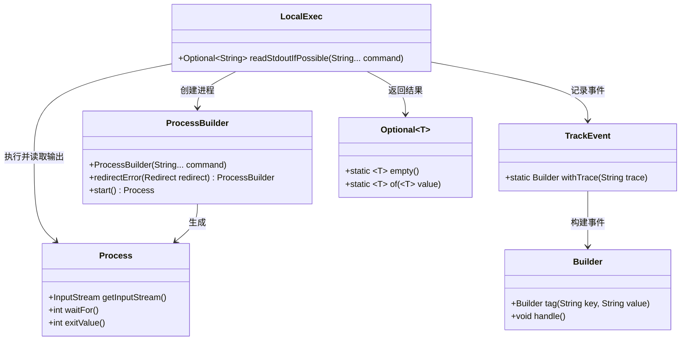
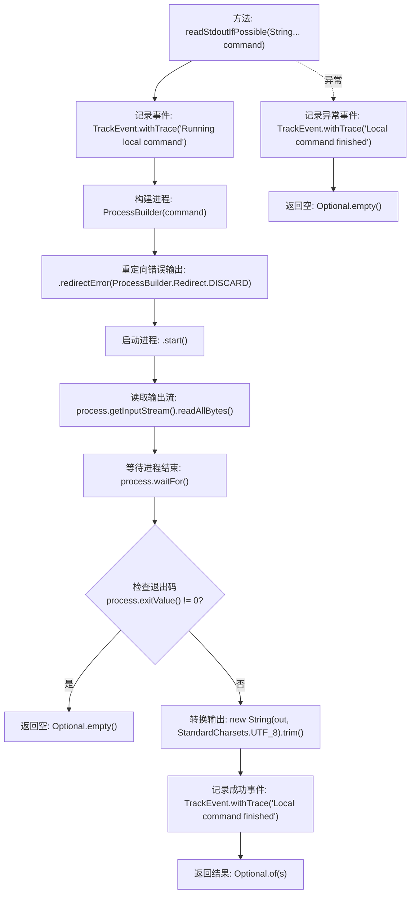

# 基础信息

|      |      |
|------|------|
| 名称 | LocalExec |
| 编码语言 | .java |
| 代码路径 | xpipe/app/src/main/java/io/xpipe/app/util/LocalExec.java |
| 包名 | io.xpipe.app.util |
| 依赖项 | ['io.xpipe.app.issue.TrackEvent', 'java.nio.charset.StandardCharsets', 'java.util.Optional'] |
| 概述说明 | 执行本地命令并返回标准输出，失败返回空。 |

# 说明

该代码定义了一个名为LocalExec的类，包含一个静态方法readStdoutIfPossible，用于执行本地命令并返回标准输出。方法接收命令参数数组，启动新进程执行命令，丢弃错误输出。若进程成功执行（退出值为0），则读取并返回UTF-8格式的标准输出字符串；否则返回空Optional。执行过程通过TrackEvent记录命令、输出或异常信息。异常时返回空Optional并记录错误。

# 类列表 Class Summary

| 名称   | 类型  | 说明 |
|-------|------|-------------|
| LocalExec | class | 执行本地命令并返回标准输出，成功返回结果，失败返回空。记录执行过程及结果。 |

## 类 LocalExec

|      |      |
|------|------|
| 访问范围 | public |
| 类型 | class |
| 名称 | LocalExec |
| 说明 | 执行本地命令并返回标准输出，成功返回结果，失败返回空。记录执行过程及结果。 |

### UML类图

类图描述：
该图展示了LocalExec类的核心结构和依赖关系，主要功能是通过ProcessBuilder执行本地命令并捕获输出。LocalExec依赖于ProcessBuilder创建子进程，通过Process对象获取输入流和退出状态，使用TrackEvent记录执行过程的事件日志，最终返回Optional<String>类型的结果。整个过程包含异常处理和事件跟踪机制，体现了健壮的命令执行流程。

### 内部方法调用关系图

这段代码流程图展示了LocalExec类中readStdoutIfPossible方法的完整执行逻辑。该方法通过ProcessBuilder执行外部命令并捕获输出，包含正常流程和异常处理分支。首先记录命令开始事件，然后构建并启动进程，读取进程输出流并等待结束。根据退出码决定返回结果或空值，成功时记录输出内容，异常时记录错误信息。整个过程实现了命令执行的监控和结果封装，适用于需要安全调用本地命令的场景。

### 字段列表 Field List

| 名称  | 类型  | 说明 |
|-------|-------|------|

### 方法列表 Method List

| 名称  | 类型  | 说明 |
|-------|-------|------|
| readStdoutIfPossible | Optional<String> | 执行命令并返回标准输出，失败返回空。 |

