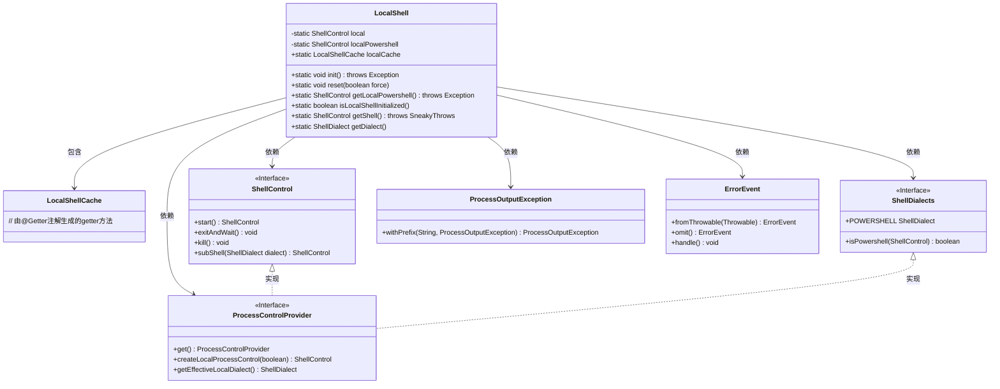
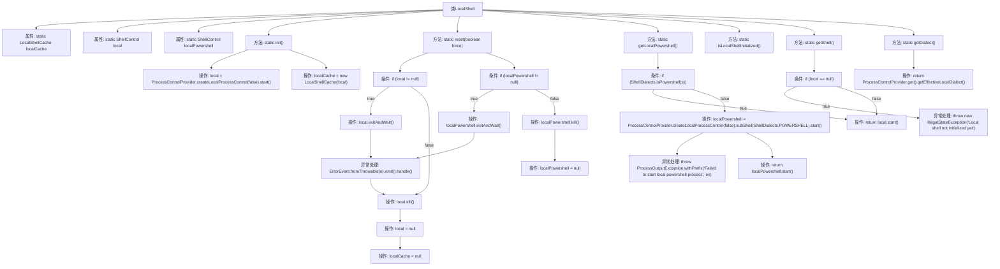

# 基础信息

|      |      |
|------|------|
| 名称 | LocalShell |
| 编码语言 | .java |
| 代码路径 | xpipe/app/src/main/java/io/xpipe/app/util/LocalShell.java |
| 包名 | io.xpipe.app.util |
| 依赖项 | ['io.xpipe.app.ext.ProcessControlProvider', 'io.xpipe.app.issue.ErrorEvent', 'io.xpipe.core.process.ProcessOutputException', 'io.xpipe.core.process.ShellControl', 'io.xpipe.core.process.ShellDialect', 'io.xpipe.core.process.ShellDialects', 'lombok.Getter', 'lombok.SneakyThrows'] |
| 概述说明 | 本地Shell管理类，含初始化、重置、获取Shell及PowerShell功能，支持缓存和异常处理。 |

# 说明

LocalShell类管理本地Shell进程和缓存，提供初始化、重置、获取Shell控制对象等功能。包含静态方法init初始化本地Shell，reset强制或优雅终止进程，getLocalPowershell获取PowerShell实例，isLocalShellInitialized检查初始化状态，getShell获取当前Shell控制对象，getDialect获取当前Shell方言。通过LocalShellCache缓存数据，处理异常时记录错误事件。支持强制终止或等待进程正常退出，确保资源释放。

# 类列表 Class Summary

| 名称   | 类型  | 说明 |
|-------|------|-------------|
| LocalShell | class | 本地Shell管理类，含初始化和重置功能，支持PowerShell子进程控制。 |

## 类 LocalShell

|      |      |
|------|------|
| 访问范围 | public |
| 类型 | class |
| 名称 | LocalShell |
| 说明 | 本地Shell管理类，含初始化和重置功能，支持PowerShell子进程控制。 |

### UML类图

这段代码描述了一个本地Shell管理类LocalShell，它负责初始化、重置和获取本地Shell进程控制实例。类图展示了LocalShell与多个接口和类的交互关系，包括ShellControl接口（定义Shell操作）、ProcessControlProvider接口（创建Shell实例）、ShellDialects接口（判断Shell类型）等。LocalShell通过静态方法管理Shell生命周期，支持普通Shell和PowerShell两种模式，并包含异常处理和缓存机制。整个设计体现了对Shell进程的细粒度控制和类型安全处理。

### 内部方法调用关系图

这段代码流程图展示了LocalShell类的完整控制流程，包含初始化、重置、获取Shell实例等核心操作。类通过静态方法管理本地Shell进程和PowerShell进程的生命周期，采用异常处理机制保证进程终止的可靠性。流程图清晰呈现了条件分支、异常捕获和资源清理的复杂逻辑，特别是reset()方法中根据force参数选择不同终止策略的决策过程，以及getLocalPowershell()方法中Shell类型检查的流程控制。

### 字段列表 Field List

| 名称  | 类型  | 说明 |
|-------|-------|------|
| localPowershell | ShellControl | 私有静态ShellControl实例localPowershell |
| localCache | LocalShellCache | 私有静态本地缓存变量声明。 |
| local | ShellControl | 私有静态ShellControl变量local |

### 方法列表 Method List

| 名称  | 类型  | 说明 |
|-------|-------|------|
| init | void | 初始化本地进程控制和缓存 |
| getDialect | ShellDialect | 获取当前有效的本地Shell方言。 |
| getShell | ShellControl | 获取Shell实例，未初始化时抛出异常。 |
| isLocalShellInitialized | boolean | 检查本地Shell是否初始化 |
| getLocalPowershell | ShellControl | 获取本地PowerShell实例，不存在则创建并启动。 |
| reset | void | 静态方法reset根据force参数决定强制或安全终止local和localPowershell进程并清空缓存。 |

