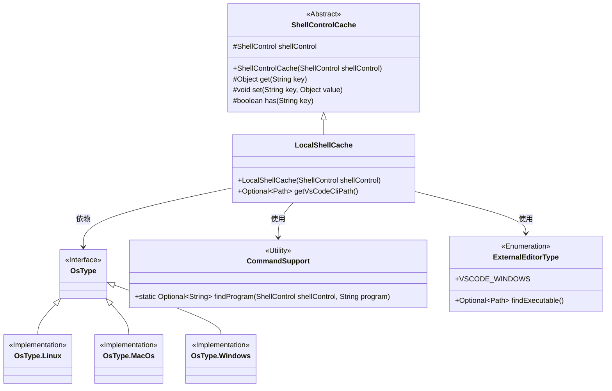
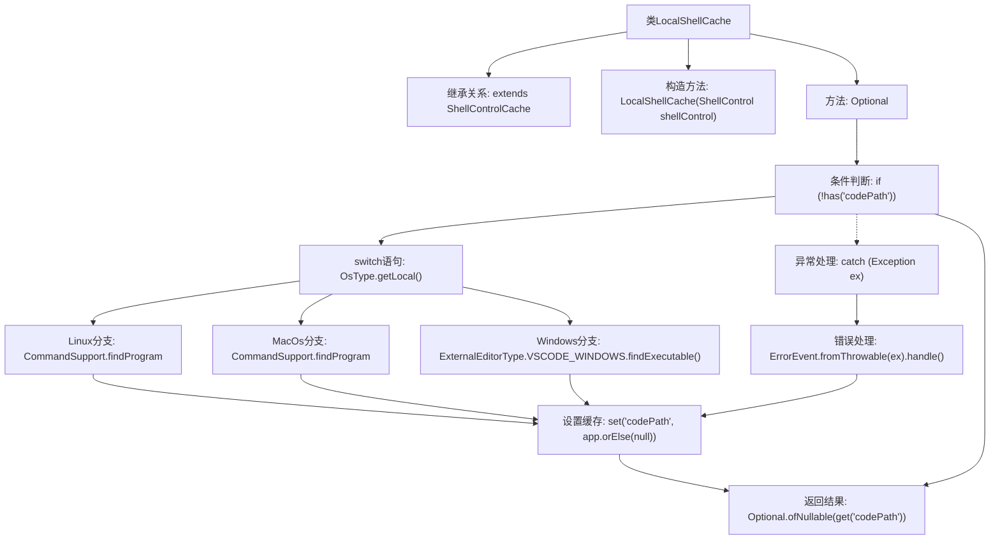

# 基础信息

|      |      |
|------|------|
| 名称 | LocalShellCache |
| 编码语言 | .java |
| 代码路径 | xpipe/app/src/main/java/io/xpipe/app/util/LocalShellCache.java |
| 包名 | io.xpipe.app.util |
| 依赖项 | ['io.xpipe.app.issue.ErrorEvent', 'io.xpipe.app.prefs.ExternalEditorType', 'io.xpipe.core.process.OsType', 'io.xpipe.core.process.ShellControl', 'java.nio.file.Path', 'java.util.Optional'] |
| 概述说明 | LocalShellCache类继承ShellControlCache，提供获取VS Code CLI路径的方法，支持不同操作系统。 |

# 说明

LocalShellCache类继承自ShellControlCache，用于管理本地Shell缓存。其核心方法getVsCodeCliPath用于获取VS Code CLI路径。该方法首先检查缓存中是否存在codePath键，若不存在则根据操作系统类型查找VS Code可执行文件路径：Linux和MacOs系统通过CommandSupport.findProgram查找code程序并转换为本地路径，Windows系统则通过ExternalEditorType.VSCODE_WINDOWS直接查找可执行文件。查找结果存入缓存，异常时记录错误并缓存null值。最终返回缓存的codePath值，封装为Optional对象。

# 类列表 Class Summary

| 名称   | 类型  | 说明 |
|-------|------|-------------|
| LocalShellCache | class | LocalShellCache类继承ShellControlCache，提供获取VS Code CLI路径的方法，支持Linux、MacOS和Windows系统。 |

## 类 LocalShellCache

|      |      |
|------|------|
| 访问范围 | public |
| 类型 | class |
| 名称 | LocalShellCache |
| 说明 | LocalShellCache类继承ShellControlCache，提供获取VS Code CLI路径的方法，支持Linux、MacOS和Windows系统。 |

### UML类图

这段代码展示了一个本地Shell缓存系统，主要用于跨平台获取VS Code CLI路径。核心类LocalShellCache继承自ShellControlCache，通过CommandSupport工具类查找程序路径，并针对Linux/MacOS/Windows不同操作系统使用不同策略。代码采用Optional处理空值，并通过异常处理机制记录错误。类图清晰地展示了继承关系、工具类依赖和操作系统类型的多态设计，体现了良好的跨平台兼容性和错误处理能力。

### 内部方法调用关系图

该流程图描述了LocalShellCache类获取VS Code CLI路径的逻辑流程。首先检查缓存是否存在，若不存在则根据操作系统类型调用不同方法查找程序路径（Linux/Mac使用CommandSupport，Windows使用专用方法），将结果存入缓存并处理可能异常，最后返回缓存值。流程包含条件分支、异常处理和跨平台适配逻辑，体现了健壮性设计。

### 字段列表 Field List

| 名称  | 类型  | 说明 |
|-------|-------|------|

### 方法列表 Method List

| 名称  | 类型  | 说明 |
|-------|-------|------|
| getVsCodeCliPath | Optional<Path> | 获取VS Code CLI路径，支持Linux/Mac/Windows系统，异常处理并缓存结果。 |

