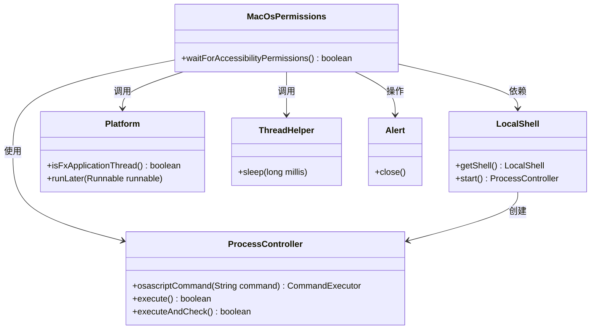
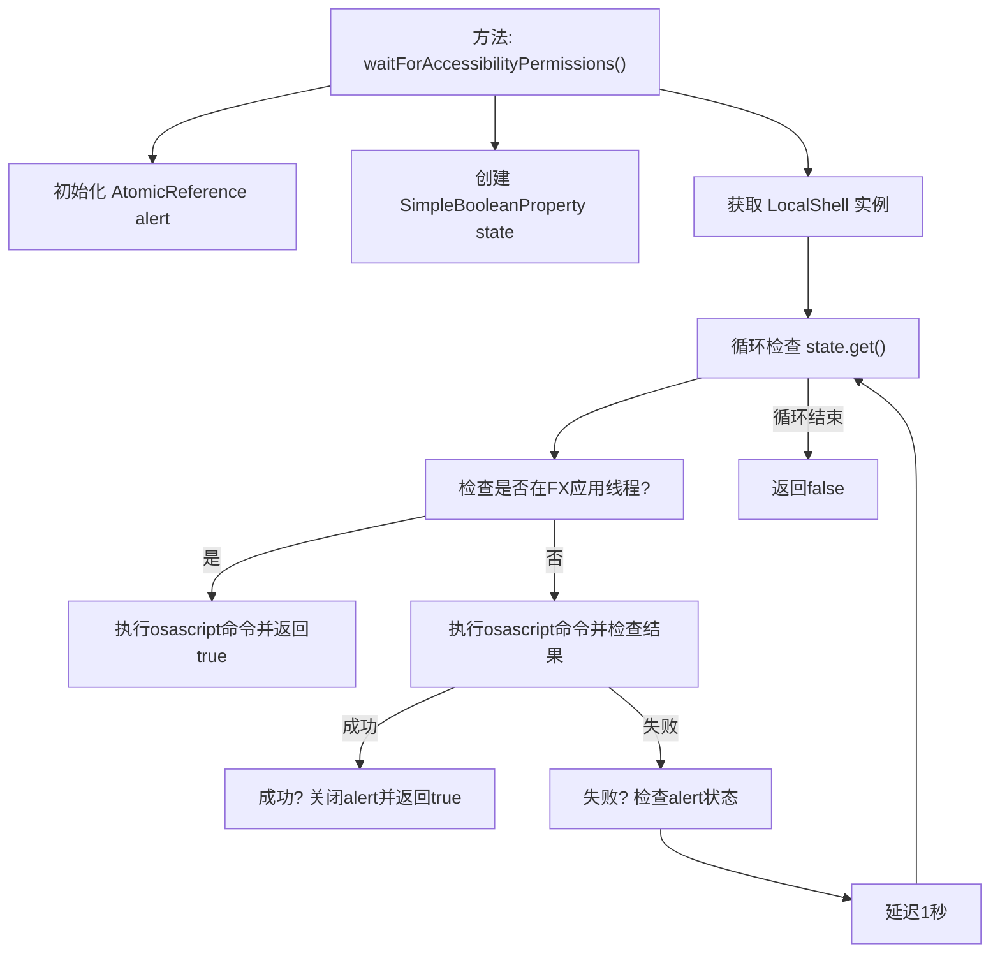

# 基础信息

|      |      |
|------|------|
| 名称 | MacOsPermissions |
| 编码语言 | .java |
| 代码路径 | xpipe/app/src/main/java/io/xpipe/app/util/MacOsPermissions.java |
| 包名 | io.xpipe.app.util |
| 依赖项 | ['javafx.application.Platform', 'javafx.beans.property.SimpleBooleanProperty', 'javafx.scene.control.Alert', 'java.util.concurrent.atomic.AtomicReference'] |
| 概述说明 | 检查MacOS权限，等待辅助功能授权，模拟按键测试权限状态。 |

# 说明

该代码定义了一个MacOsPermissions类，包含waitForAccessibilityPermissions方法，用于检测并等待用户授予MacOS辅助功能权限。方法通过执行系统事件模拟按键操作来检测权限状态，若在非JavaFX线程则直接返回成功，否则循环检测权限状态。检测失败时会显示权限申请弹窗提示用户，并每隔1秒重试。方法最终返回权限获取结果。

# 类列表 Class Summary

| 名称   | 类型  | 说明 |
|-------|------|-------------|
| MacOsPermissions | class | 检查MacOS辅助功能权限，模拟按键测试权限状态，成功返回真否则循环检测。 |

## 类 MacOsPermissions

|      |      |
|------|------|
| 访问范围 | public |
| 类型 | class |
| 名称 | MacOsPermissions |
| 说明 | 检查MacOS辅助功能权限，模拟按键测试权限状态，成功返回真否则循环检测。 |

### UML类图

这段代码描述了一个MacOS权限检查工具类`MacOsPermissions`，其核心方法`waitForAccessibilityPermissions()`通过执行AppleScript命令来检测系统辅助功能权限状态。该方法使用`LocalShell`启动命令行进程，通过`ProcessController`执行脚本命令，并利用`Platform`类处理JavaFX线程调度，同时借助`ThreadHelper`进行延时等待。当检测到权限未授权时，会触发弹窗提示（代码中注释部分），整个过程涉及多线程协作和系统级命令交互。

### 内部方法调用关系图

这段代码流程图展示了MacOsPermissions类中waitForAccessibilityPermissions方法的完整执行逻辑。方法首先初始化必要的变量和shell环境，然后进入循环检查权限状态。在FX应用线程中会直接执行命令并返回，否则会尝试执行系统事件命令并检查结果。成功时关闭提示框并返回，失败时处理提示框状态并等待重试。整个过程体现了对macOS辅助功能权限的异步检测机制，特别注意了UI线程和非UI线程的不同处理方式。

### 字段列表 Field List

| 名称  | 类型  | 说明 |
|-------|-------|------|

### 方法列表 Method List

| 名称  | 类型  | 说明 |
|-------|-------|------|
| waitForAccessibilityPermissions | boolean | 检查系统辅助功能权限，通过模拟按键确认权限状态，成功返回true，失败显示提示并重试。 |

