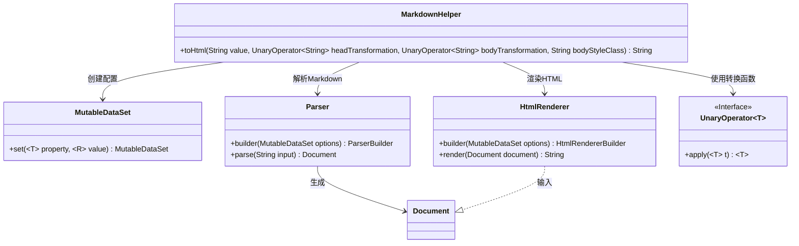
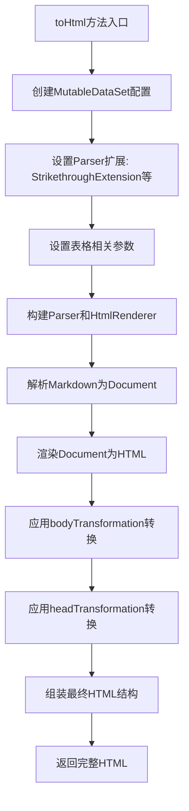

# 基础信息

|      |      |
|------|------|
| 名称 | MarkdownHelper |
| 编码语言 | .java |
| 代码路径 | xpipe/app/src/main/java/io/xpipe/app/util/MarkdownHelper.java |
| 包名 | io.xpipe.app.util |
| 依赖项 | ['com.vladsch.flexmark.ext.anchorlink.AnchorLinkExtension', 'com.vladsch.flexmark.ext.definition.DefinitionExtension', 'com.vladsch.flexmark.ext.footnotes.FootnoteExtension', 'com.vladsch.flexmark.ext.gfm.strikethrough.StrikethroughExtension', 'com.vladsch.flexmark.ext.gfm.tasklist.TaskListExtension', 'com.vladsch.flexmark.ext.tables.TablesExtension', 'com.vladsch.flexmark.ext.toc.TocExtension', 'com.vladsch.flexmark.ext.yaml.front.matter.YamlFrontMatterExtension', 'com.vladsch.flexmark.html.HtmlRenderer', 'com.vladsch.flexmark.parser.Parser', 'com.vladsch.flexmark.util.ast.Document', 'com.vladsch.flexmark.util.data.MutableDataSet', 'java.util.Arrays', 'java.util.function.UnaryOperator'] |
| 概述说明 | Java类MarkdownHelper将Markdown转HTML，支持扩展和自定义样式。 |

# 说明

该代码定义了一个MarkdownHelper类，包含一个静态方法toHtml，用于将Markdown文本转换为HTML。方法接收原始文本、头部和内容转换函数及样式类参数。通过配置解析器和渲染器选项，支持多种Markdown扩展功能，如删除线、任务列表、表格等。最终生成包含转换后内容和指定样式的完整HTML文档。

# 类列表 Class Summary

| 名称   | 类型  | 说明 |
|-------|------|-------------|
| MarkdownHelper | class | Java类将Markdown转HTML，支持扩展和自定义样式。 |

## 类 MarkdownHelper

|      |      |
|------|------|
| 访问范围 | public |
| 类型 | class |
| 名称 | MarkdownHelper |
| 说明 | Java类将Markdown转HTML，支持扩展和自定义样式。 |

### UML类图

这段代码展示了一个Markdown转HTML的工具类，核心是通过Flexmark-java库实现Markdown解析和HTML渲染。类图显示MarkdownHelper依赖MutableDataSet进行配置管理，使用Parser将文本解析为Document对象，再通过HtmlRenderer转换为HTML。关键特性包括：支持多种Markdown扩展（表格、脚注等），允许通过UnaryOperator接口自定义头部和内容转换，并可添加CSS类名到body标签。整个流程体现了配置→解析→渲染→后处理的完整转换链条。

### 内部方法调用关系图

这段代码流程图展示了MarkdownHelper类的toHtml方法处理流程。方法首先配置Markdown解析选项，包括各种扩展功能和表格设置，然后构建解析器和渲染器。接着将输入文本解析为文档对象并渲染为HTML，再应用传入的内容转换函数，最后组装完整的HTML文档结构返回。整个过程实现了Markdown到HTML的完整转换流程，支持自定义头部和内容转换。

### 字段列表 Field List

| 名称  | 类型  | 说明 |
|-------|-------|------|

### 方法列表 Method List

| 名称  | 类型  | 说明 |
|-------|-------|------|
| toHtml | String | 将Markdown转换为HTML，支持多种扩展，可自定义头部和正文样式。 |

