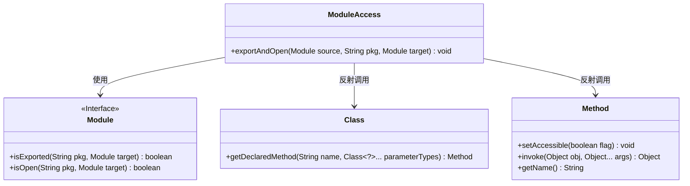
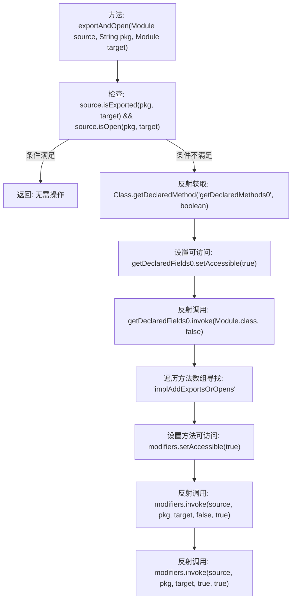

# 基础信息

|      |      |
|------|------|
| 名称 | ModuleAccess |
| 编码语言 | .java |
| 代码路径 | xpipe/app/src/main/java/io/xpipe/app/util/ModuleAccess.java |
| 包名 | io.xpipe.app.util |
| 依赖项 | ['lombok.SneakyThrows', 'java.lang.reflect.Field', 'java.lang.reflect.Method'] |
| 概述说明 | ModuleAccess类通过反射动态导出和开放模块包访问权限。 |

# 说明

该代码定义了一个名为ModuleAccess的类，包含一个静态方法exportAndOpen。该方法用于检查和修改模块的导出与开放状态。首先检查指定包是否已对目标模块导出和开放，若已满足则直接返回。否则通过反射获取Module类的私有方法implAddExportsOrOpens，设置可访问后调用该方法两次，分别将包对目标模块设置为导出和开放状态。整个过程涉及反射操作，可能抛出异常。

# 类列表 Class Summary

| 名称   | 类型  | 说明 |
|-------|------|-------------|
| ModuleAccess | class | ModuleAccess类提供exportAndOpen方法，通过反射动态导出和开放模块包访问权限。 |

## 类 ModuleAccess

|      |      |
|------|------|
| 访问范围 | public |
| 类型 | class |
| 名称 | ModuleAccess |
| 说明 | ModuleAccess类提供exportAndOpen方法，通过反射动态导出和开放模块包访问权限。 |

### UML类图

这段代码展示了一个`ModuleAccess`工具类，通过反射机制动态修改模块的导出和开放权限。核心逻辑是：检查源模块是否已对目标模块导出/开放指定包，若未满足则通过反射调用`Module`类的隐藏方法`implAddExportsOrOpens`强制修改访问权限。该实现涉及`Module`接口、`Class`反射类和`Method`反射方法，通过多层反射调用突破模块系统限制，属于底层访问控制操作。流程图将展示权限检查、反射方法获取和权限修改三个关键阶段。

### 内部方法调用关系图

这段流程图描述了ModuleAccess类中exportAndOpen方法的执行逻辑。该方法首先检查指定模块的包是否已对目标模块开放导出，若未开放则通过反射机制获取Module类的私有方法implAddExportsOrOpens，分两次调用该方法实现包的强制导出和开放操作。流程展示了从条件判断到反射调用的完整路径，包括异常方法访问权限设置等关键步骤，体现了Java模块系统底层操作的实现方式。

### 字段列表 Field List

| 名称  | 类型  | 说明 |
|-------|-------|------|

### 方法列表 Method List

| 名称  | 类型  | 说明 |
|-------|-------|------|
| exportAndOpen | void | Java方法：检查模块导出与开放状态，通过反射调用`implAddExportsOrOpens`强制修改。 |

