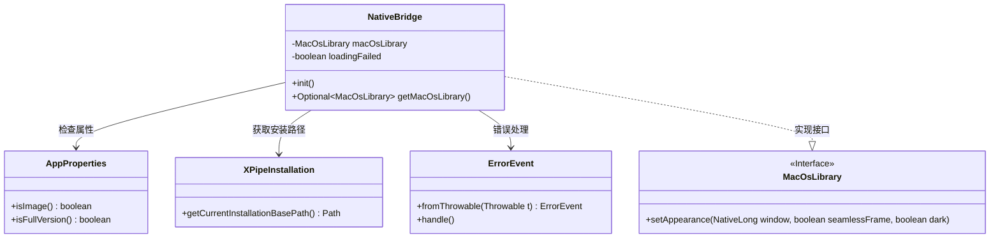
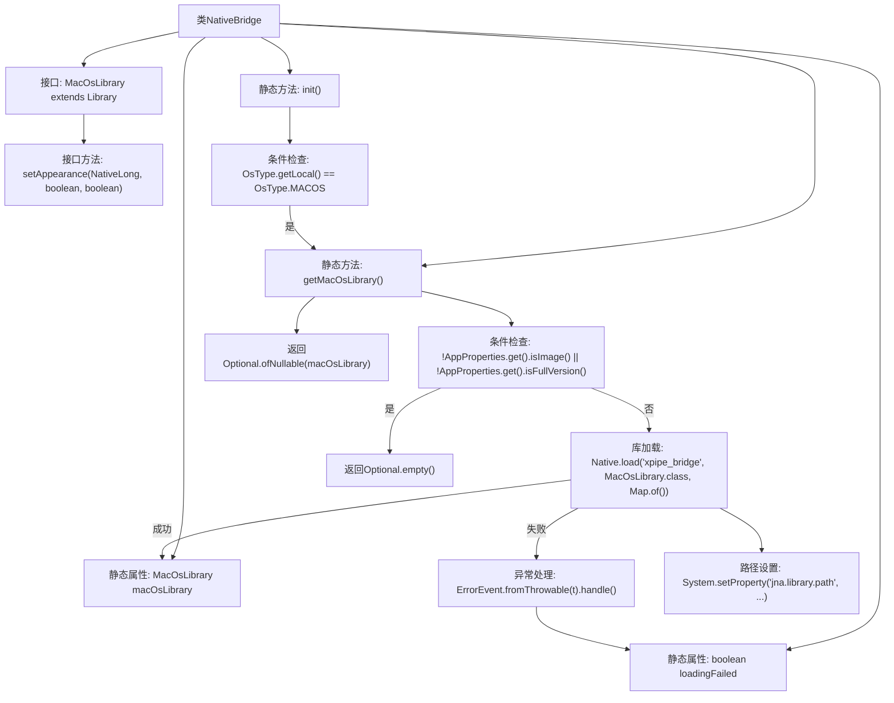

# 基础信息

|      |      |
|------|------|
| 名称 | NativeBridge |
| 编码语言 | .java |
| 代码路径 | xpipe/app/src/main/java/io/xpipe/app/util/NativeBridge.java |
| 包名 | io.xpipe.app.util |
| 依赖项 | ['io.xpipe.app.core.AppProperties', 'io.xpipe.app.issue.ErrorEvent', 'io.xpipe.core.process.OsType', 'io.xpipe.core.util.XPipeInstallation', 'com.sun.jna.Library', 'com.sun.jna.Native', 'com.sun.jna.NativeLong', 'java.util.Map', 'java.util.Optional'] |
| 概述说明 | NativeBridge类初始化MacOS库，检查条件后加载xpipe_bridge库，提供外观设置接口。 |

# 说明

NativeBridge类用于管理MacOS本地库交互。它包含静态方法init和getMacOsLibrary，前者在MacOS系统下预加载库，后者检查应用属性后加载xpipe_bridge库。加载过程设置JNA库路径，处理失败情况并记录错误。MacOsLibrary接口定义setAppearance方法，控制窗口外观。类维护macOsLibrary实例和loadingFailed状态标志。

# 类列表 Class Summary

| 名称   | 类型  | 说明 |
|-------|------|-------------|
| NativeBridge | class | NativeBridge类初始化MacOS库，提供获取库方法，包含外观设置接口。 |

## 类 NativeBridge

|      |      |
|------|------|
| 访问范围 | public |
| 类型 | class |
| 名称 | NativeBridge |
| 说明 | NativeBridge类初始化MacOS库，提供获取库方法，包含外观设置接口。 |

### UML类图

这段代码展示了一个跨平台原生库桥接器设计，核心是NativeBridge类通过JNA（Java Native Access）动态加载macOS原生库。类图清晰地呈现了以下关系：NativeBridge依赖AppProperties进行功能验证，依赖XPipeInstallation获取库路径，并通过ErrorEvent处理异常。关键接口MacOsLibrary定义了原生方法setAppearance，由NativeBridge在满足条件时延迟加载。整个设计实现了平台检测、条件验证、异常处理和动态库加载的完整流程，体现了稳健的跨平台调用机制。

### 内部方法调用关系图

流程图描述了NativeBridge类的核心逻辑，主要展示macOS库的延迟加载机制。当运行环境为macOS时，init()方法会触发getMacOsLibrary()调用，该方法首先验证应用属性条件，然后通过JNA加载动态库xpipe_bridge，期间处理路径配置和异常情况。整个过程采用Optional包装返回结果，并通过静态标志位避免重复加载失败。接口MacOsLibrary定义了原生方法setAppearance用于外观控制，体现了跨平台调用的设计模式。

### 字段列表 Field List

| 名称  | 类型  | 说明 |
|-------|-------|------|
| macOsLibrary | MacOsLibrary | 私有静态MacOS库变量 |
| loadingFailed | boolean | 私有静态布尔变量，标记加载是否失败。 |

### 方法列表 Method List

| 名称  | 类型  | 说明 |
|-------|-------|------|
| init | void | 静态方法init预加载库，MacOS时获取本地库。 |
| getMacOsLibrary | Optional<MacOsLibrary> | 获取MacOS库，条件不满足返回空；加载失败标记并处理错误；成功返回库实例。 |

