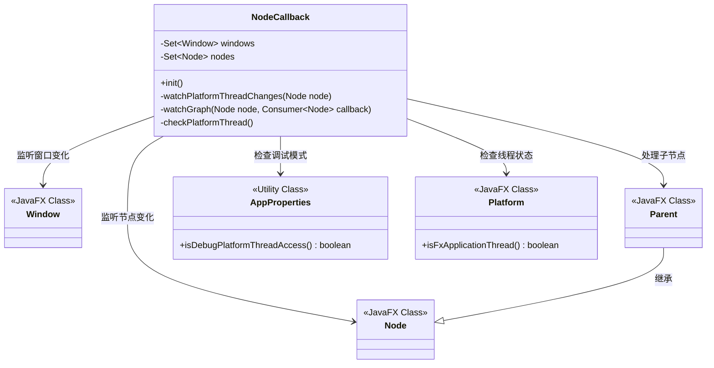
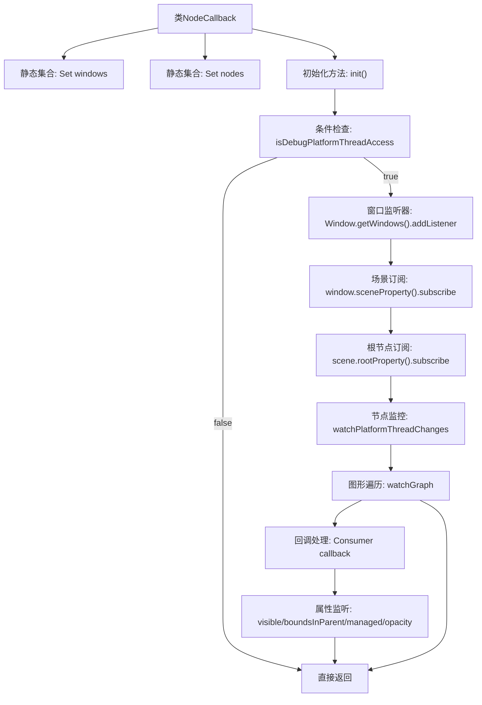

# 基础信息

|      |      |
|------|------|
| 名称 | NodeCallback |
| 编码语言 | .java |
| 代码路径 | xpipe/app/src/main/java/io/xpipe/app/util/NodeCallback.java |
| 包名 | io.xpipe.app.util |
| 依赖项 | ['io.xpipe.app.core.AppProperties', 'javafx.application.Platform', 'javafx.collections.ListChangeListener', 'javafx.scene.Node', 'javafx.scene.Parent', 'javafx.stage.Window', 'java.util.HashSet', 'java.util.Set', 'java.util.function.Consumer'] |
| 概述说明 | 监控JavaFX节点线程访问，确保UI操作在主线程执行。 |

# 说明

该代码定义了一个NodeCallback类，用于监控JavaFX平台线程的访问合规性。主要功能包括：初始化时检查调试模式，监听窗口和场景变化，跟踪节点树结构变化，并通过多个属性监听器检测非FX线程操作。当检测到非FX线程访问时，会抛出IllegalStateException异常。核心机制是通过递归遍历节点树，为每个节点添加可见性、边界、管理等属性监听，确保所有UI操作都在正确的FX应用线程执行。

# 类列表 Class Summary

| 名称   | 类型  | 说明 |
|-------|------|-------------|
| NodeCallback | class | 监听窗口和节点变化，确保线程安全。 |

## 类 NodeCallback

|      |      |
|------|------|
| 访问范围 | public |
| 类型 | class |
| 名称 | NodeCallback |
| 说明 | 监听窗口和节点变化，确保线程安全。 |

### UML类图

这段代码实现了一个JavaFX的线程安全检查机制，主要用于监控UI组件在非JavaFX应用线程中的非法修改。NodeCallback类通过静态方法维护了两个集合(windows和nodes)来跟踪所有窗口和节点，当检测到窗口或节点属性变化时，会通过checkPlatformThread()方法验证当前线程是否为JavaFX应用线程。该机制通过递归遍历节点树(watchGraph)和监听各种属性变化来实现全面的线程安全监控，特别适用于调试阶段检测跨线程UI操作问题。

### 内部方法调用关系图

这段代码流程图展示了NodeCallback类监控JavaFX节点线程安全的核心逻辑。初始化时检查调试标志，随后建立四级监听链：窗口集合监听→场景变化订阅→根节点订阅→节点监控。通过watchGraph方法递归遍历节点树，对每个节点注册多种属性监听器，最终通过checkPlatformThread确保所有UI操作都在JavaFX应用线程执行。整个流程实现了从顶层窗口到底层节点的全链路线程安全监控机制。

### 字段列表 Field List

| 名称  | 类型  | 说明 |
|-------|-------|------|
| nodes = new HashSet<>() | Set<Node> | 私有静态节点集合 |
| windows = new HashSet<>() | Set<Window> | 私有静态窗口集合 |

### 方法列表 Method List

| 名称  | 类型  | 说明 |
|-------|-------|------|
| watchPlatformThreadChanges | void | 监控节点属性变化，确保在主线程执行检查。 |
| init | void | 检查调试模式下窗口线程访问，监控场景根节点线程变化。 |
| watchGraph | void | 递归监听节点变化并触发回调。 |
| checkPlatformThread | void | 检查是否在JavaFX应用线程，否则抛出异常。 |

