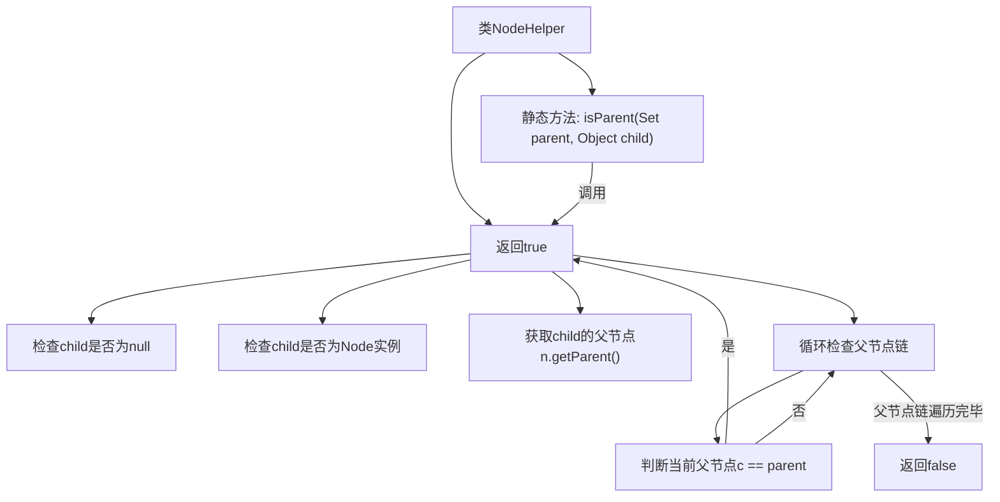

# 基础信息

|      |      |
|------|------|
| 名称 | NodeHelper |
| 编码语言 | .java |
| 代码路径 | xpipe/app/src/main/java/io/xpipe/app/util/NodeHelper.java |
| 包名 | io.xpipe.app.util |
| 依赖项 | ['javafx.scene.Node', 'java.util.Set'] |
| 概述说明 | 检查节点是否为父节点，支持单节点和集合。 |

# 说明

这是一个名为NodeHelper的Java工具类，包含两个静态方法用于检查节点间的父子关系。第一个方法isParent接收一个父节点集合和一个子对象，通过流式处理检查集合中是否存在任一节点是给定子对象的父节点。第二个方法isParent接收单个父节点和子对象，首先检查子对象是否为Node实例，然后通过循环向上遍历父节点链，判断是否存在与给定父节点相同的节点。两个方法都对空值进行了安全处理，子对象为null时直接返回false。

# 类列表 Class Summary

| 名称   | 类型  | 说明 |
|-------|------|-------------|
| NodeHelper | class | 检查节点父子关系的工具类，含集合和单个节点两种方法。 |


## 类 NodeHelper

|      |      |
|------|------|
| 访问范围 | public |
| 类型 | class |
| 名称 | NodeHelper |
| 说明 | 检查节点父子关系的工具类，含集合和单个节点两种方法。 |


### UML类图

```mermaid
classDiagram
    class NodeHelper {
        <<(S,#FF7700) Singleton>>
        +isParent(Set~Node~ parent, Object child) boolean
        +isParent(Node parent, Object child) boolean
    }

    class Node {
        <<Interface>>
        +getParent() Node
    }

    NodeHelper --> Node : 依赖
    // NodeHelper通过参数和返回值与Node接口交互
    // isParent方法实现递归检查父子关系链
```

这段代码展示了NodeHelper工具类，提供两种isParent方法用于判断节点间的父子关系。类图包含一个单例模式的NodeHelper类和一个Node接口，其中Node接口定义了获取父节点的getParent方法。核心逻辑是通过递归遍历父节点链，检查目标节点是否存在于当前节点的祖先链中。第一个方法处理集合输入，第二个方法处理单个节点输入，两者都考虑了空值和类型安全的边界情况。


### 内部方法调用关系图



这段代码展示了NodeHelper类的两个静态方法，用于检查节点间的父子关系。流程图清晰地描述了方法调用链和逻辑判断流程：首先检查子节点有效性，然后通过递归遍历父节点链来判断是否存在亲子关系。核心逻辑是通过while循环向上遍历父节点，直到找到匹配或到达根节点，体现了对空值、类型安全和循环终止条件的完整处理。

### 字段列表 Field List

| 名称  | 类型  | 说明 |
|-------|-------|------|

### 方法列表 Method List

| 名称  | 类型  | 说明 |
|-------|-------|------|
| isParent | boolean | 检查parent集合中是否有节点是child的父节点。 |
| isParent | boolean | 检查节点是否为父节点，递归遍历父节点链。 |


