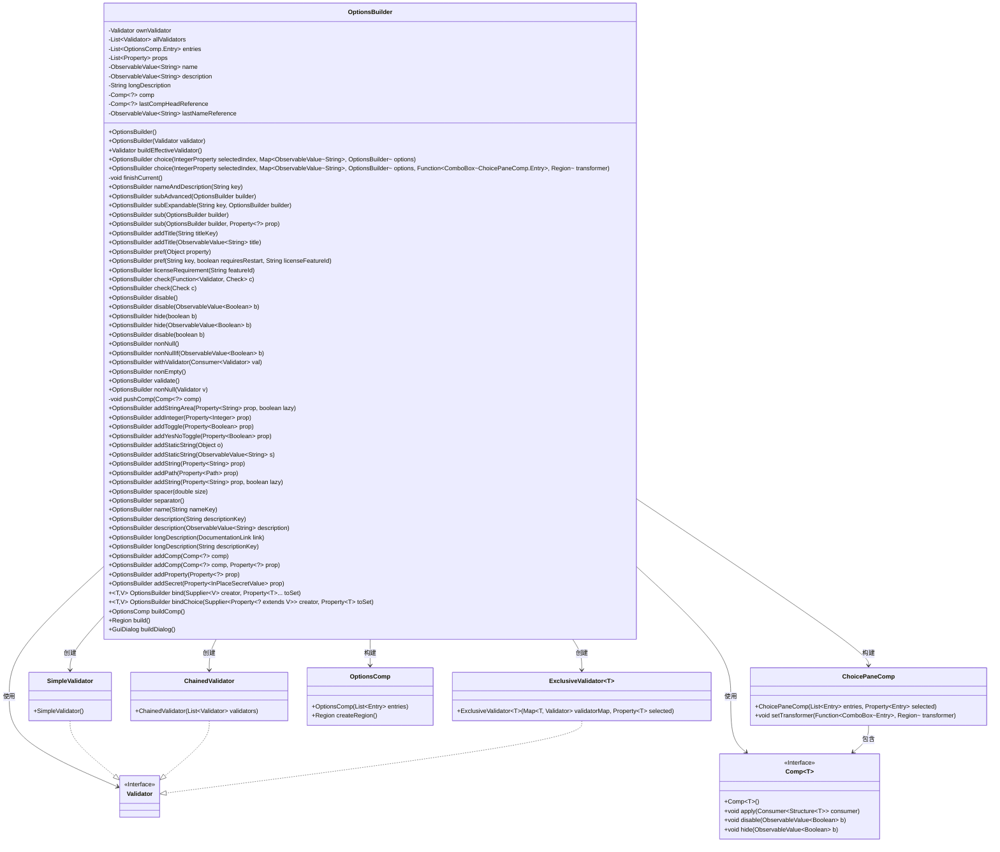
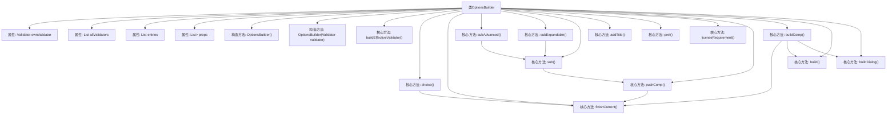

# 基础信息

|      |      |
|------|------|
| 名称 | OptionsBuilder |
| 编码语言 | .java |
| 代码路径 | xpipe/app/src/main/java/io/xpipe/app/util/OptionsBuilder.java |
| 包名 | io.xpipe.app.util |
| 依赖项 | ['io.xpipe.app.comp.Comp', 'io.xpipe.app.comp.base', 'io.xpipe.app.core.AppI18n', 'io.xpipe.app.ext.GuiDialog', 'io.xpipe.app.prefs.AppPrefs', 'io.xpipe.core.util.InPlaceSecretValue', 'javafx.beans.property', 'javafx.beans.value.ChangeListener', 'javafx.beans.value.ObservableValue', 'javafx.geometry.Orientation', 'javafx.scene.control.ComboBox', 'javafx.scene.layout.Region', 'atlantafx.base.controls.Spacer', 'net.synedra.validatorfx.Check', 'java.nio.file.InvalidPathException', 'java.nio.file.Path', 'java.util.ArrayList', 'java.util.LinkedHashMap', 'java.util.List', 'java.util.Map', 'java.util.concurrent.atomic.AtomicReference', 'java.util.function.Consumer', 'java.util.function.Function', 'java.util.function.Supplier'] |
| 概述说明 | OptionsBuilder类用于构建选项界面，支持验证器、属性绑定和多种控件类型。 |

# 说明

OptionsBuilder是一个用于构建复杂选项界面的工具类，提供链式调用方法配置各种UI组件和验证逻辑。它支持添加文本字段、数字输入、开关、下拉选择等控件，并可设置名称、描述、长描述等元信息。类内置验证器管理，支持非空、非空条件、非空列表等验证规则。提供子选项嵌套、高级选项折叠、标题分隔符等功能，支持国际化文本绑定和属性变更监听。通过buildComp或buildDialog方法生成最终界面，适用于需要动态构建复杂配置场景的应用程序。

# 类列表 Class Summary

| 名称   | 类型  | 说明 |
|-------|------|-------------|
| OptionsBuilder | class | OptionsBuilder用于构建选项界面，支持验证器、属性绑定和多种控件类型。 |

## 类 OptionsBuilder

|      |      |
|------|------|
| 访问范围 | public |
| 类型 | class |
| 名称 | OptionsBuilder |
| 说明 | OptionsBuilder用于构建选项界面，支持验证器、属性绑定和多种控件类型。 |

### UML类图

这段代码定义了一个`OptionsBuilder`类，用于构建复杂的选项配置界面。它通过链式调用支持添加各种类型的输入控件（如文本字段、复选框、下拉选择等）、验证逻辑、分组和嵌套结构。主要特点包括：1) 使用组合模式管理UI组件；2) 支持多级验证器链；3) 提供丰富的配置方法；4) 支持国际化文本和许可证控制。类图展示了其与验证器体系、UI组件体系的协作关系，核心是通过Builder模式逐步构建最终的可视化选项面板。

### 内部方法调用关系图

这段代码定义了一个复杂的OptionsBuilder类，主要用于构建可配置的选项界面。它通过链式调用支持多种选项类型（如文本、数字、开关等）、验证逻辑、子选项嵌套、国际化等功能。核心流程包括选项构建、验证器管理、组件组装和最终界面生成，通过finishCurrent和pushComp方法维护构建状态，支持从简单控件到复杂对话框的多种输出形式。

### 字段列表 Field List

| 名称  | 类型  | 说明 |
|-------|-------|------|
| description | ObservableValue<String> | 私有可观察字符串描述 |
| entries = new ArrayList<>() | List<OptionsComp.Entry> | 私有列表entries，存储OptionsComp.Entry类型元素，初始化为ArrayList。 |
| allValidators = new ArrayList<>() | List<Validator> | 私有验证器列表初始化。 |
| lastNameReference | ObservableValue<String> | 私有可观察字符串值lastNameReference |
| name | ObservableValue<String> | 私有可观察字符串属性name |
| lastCompHeadReference | Comp<?> | 私有组件引用变量lastCompHeadReference |
| ownValidator | Validator | 私有验证器实例 |
| props = new ArrayList<>() | List<Property<?>> | 私有属性列表存储Property对象。 |
| comp | Comp<?> | 私有组件变量comp，类型为泛型Comp<?>。 |
| longDescription | String | 私有字符串长描述 |

### 方法列表 Method List

| 名称  | 类型  | 说明 |
|-------|-------|------|
| buildDialog | GuiDialog | 构建对话框方法，返回含组件和验证器的实例。 |
| addStaticString | OptionsBuilder | 方法`addStaticString`接受对象参数，若不为空则转为字符串属性并添加。 |
| sub | OptionsBuilder | 定义公共方法sub，接收OptionsBuilder参数，调用带null参数的sub方法并返回结果。 |
| addPath | OptionsBuilder | 方法`addPath`将路径属性绑定到文本框，验证并更新属性值，最后返回构建器实例。 |
| longDescription | OptionsBuilder | 方法设置长描述链接并返回当前对象。 |
| bindChoice | OptionsBuilder | 绑定属性选择器，监听变化并更新目标属性值。 |
| buildComp | OptionsComp | 构建选项组件，完成当前任务后返回新组件。 |
| hide | OptionsBuilder | 隐藏选项构建器，根据布尔值控制显示。 |
| addTitle | OptionsBuilder | 方法`addTitle`添加标题选项，参数为`titleKey`，返回`OptionsBuilder`实例。 |
| validate | OptionsBuilder | 验证方法：检查非空参数并返回结果。 |
| nonEmpty | OptionsBuilder | 检查非空属性并返回验证结果。 |
| check | OptionsBuilder | 方法check接收函数参数c，应用验证器并装饰结果，返回当前对象。 |
| addString | OptionsBuilder | 方法`addString`添加字符串属性组件，支持懒加载，返回构建器自身。 |
| nameAndDescription | OptionsBuilder | 方法设置键名及描述，描述为键名加"Description"。 |
| addTitle | OptionsBuilder | 方法`addTitle`添加标题组件，返回`OptionsBuilder`实例。 |
| addInteger | OptionsBuilder | 方法addInteger添加整数属性组件，返回当前对象。 |
| name | OptionsBuilder | 设置名称键并返回当前对象。 |
| addString | OptionsBuilder | 添加字符串属性方法，可选参数默认false。 |
| withValidator | OptionsBuilder | 公开方法`withValidator`接受验证器消费者，返回当前构建器。 |
| addStaticString | OptionsBuilder | 方法添加静态文本组件，绑定字符串值并设为不可编辑，透明度0.9。 |
| nonNull | OptionsBuilder | 方法非空检查：验证器v、引用e和属性p，返回校验结果。 |
| sub | OptionsBuilder | 合并选项构建器属性，验证器及引用，返回当前实例。 |
| licenseRequirement | OptionsBuilder | 方法设置功能许可要求，更新名称并返回构建器。 |
| pref | OptionsBuilder | 定义方法pref，映射属性并设置偏好值，支持重启和许可特性检查。 |
| longDescription | OptionsBuilder | 设置长描述，支持URL或本地化文档键。 |
| finishCurrent | void | 方法finishCurrent：若comp非空，创建OptionsComp.Entry并重置相关变量，最后将entry加入entries列表。 |
| subAdvanced | OptionsBuilder | 定义子选项构建方法，设置名称为"advanced"，并展开高级选项。 |
| addStringArea | OptionsBuilder | 方法addStringArea添加文本区组件，关联属性并返回构建器。 |
| separator | OptionsBuilder | 公开方法separator返回添加水平分隔符的OptionsBuilder实例。 |
| pushComp | void | 私有方法pushComp：结束当前操作并设置新组件及引用。 |
| nonNullIf | OptionsBuilder | 方法nonNullIf基于布尔值b验证非空，返回校验结果。 |
| description | OptionsBuilder | 设置描述并返回当前对象，使用国际化键值。 |
| pref | OptionsBuilder | 定义选项构建方法，支持名称、重启提示和许可证需求。 |
| choice | OptionsBuilder | 构建选项选择器，处理选中项、验证器及转换逻辑，返回当前对象。 |
| disable | OptionsBuilder | 禁用指定布尔值绑定的选项构建方法。 |
| disable | OptionsBuilder | 禁用选项构建器并返回当前实例。 |
| spacer | OptionsBuilder | 定义方法spacer，创建垂直间距组件，参数size控制大小。 |
| addYesNoToggle | OptionsBuilder | 方法addYesNoToggle为布尔属性添加是/否切换组件，返回OptionsBuilder实例。 |
| nonNull | OptionsBuilder | 方法nonNull检查lastNameReference和props最后项的非空性，返回验证结果。 |
| subExpandable | OptionsBuilder | 方法`subExpandable`：接收键和构建器，创建可折叠面板，初始状态为折叠。 |
| buildEffectiveValidator | Validator | 构建有效验证器，返回链式验证器实例。 |
| description | OptionsBuilder | 公开方法，设置描述并返回当前对象。 |
| choice | OptionsBuilder | Java方法：根据选定索引和选项映射构建选择器。 |
| check | OptionsBuilder | 方法检查并应用装饰，返回构建器。 |
| hide | OptionsBuilder | 隐藏选项构建器的布尔属性方法。 |
| disable | OptionsBuilder | 禁用选项构建器方法，参数为布尔值，返回自身。 |
| addToggle | OptionsBuilder | 方法addToggle添加开关组件，关联属性并返回构建器。 |
| addComp | OptionsBuilder | 方法addComp添加组件并返回当前对象。 |
| addComp | OptionsBuilder | 添加组件和属性，返回构建器。 |
| addProperty | OptionsBuilder | 添加属性并返回当前对象 |
| addSecret | OptionsBuilder | 添加秘密属性组件并返回构建器。 |
| bind | OptionsBuilder | 绑定属性监听器，当属性变化时更新目标属性值，并立即初始化。 |
| build | Region | 构建方法返回Region对象，通过buildComp创建。 |

