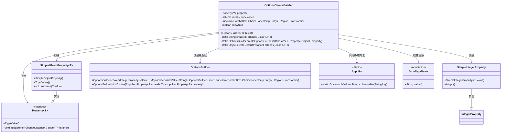
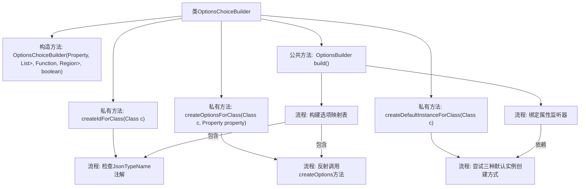
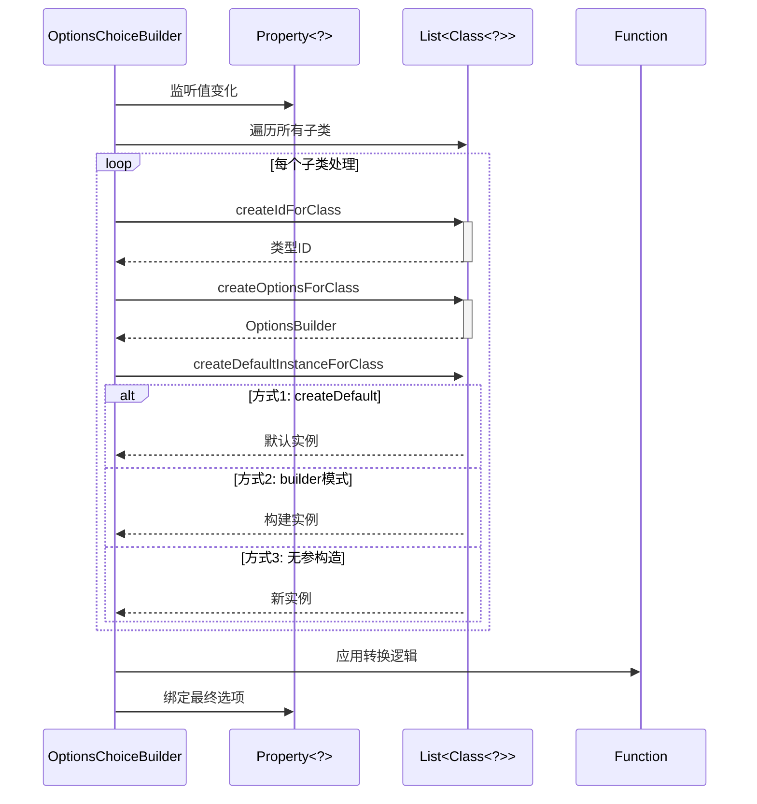

# 基础信息

|      |      |
|------|------|
| 名称 | OptionsChoiceBuilder |
| 编码语言 | .java |
| 代码路径 | xpipe/app/src/main/java/io/xpipe/app/util/OptionsChoiceBuilder.java |
| 包名 | io.xpipe.app.util |
| 依赖项 | ['io.xpipe.app.comp.base.ChoicePaneComp', 'io.xpipe.app.core.AppI18n', 'javafx.beans.property.Property', 'javafx.beans.property.SimpleIntegerProperty', 'javafx.beans.property.SimpleObjectProperty', 'javafx.beans.value.ObservableValue', 'javafx.scene.control.ComboBox', 'javafx.scene.layout.Region', 'com.fasterxml.jackson.annotation.JsonTypeName', 'lombok.Builder', 'java.util.ArrayList', 'java.util.LinkedHashMap', 'java.util.List', 'java.util.function.Function'] |
| 概述说明 | OptionsChoiceBuilder类：通过反射处理子类选项，支持空值绑定与动态属性更新。 |

# 说明

OptionsChoiceBuilder类是一个用于构建选项选择器的工具类。它通过反射机制处理类实例创建和选项生成，支持多子类选择和空值选项。主要功能包括：根据JsonTypeName注解生成ID，通过反射调用类的createOptions方法创建选项，提供三种默认实例创建方式（createDefault方法、builder模式、默认构造器）。类内部维护属性、子类列表和转换函数，通过绑定选择索引与属性值实现动态更新。最终构建的OptionsBuilder支持选择绑定和选项转换。

# 类列表 Class Summary

| 名称   | 类型  | 说明 |
|-------|------|-------------|
| OptionsChoiceBuilder | class | OptionsChoiceBuilder类：通过反射创建选项和默认实例，支持子类选择和属性绑定，允许空值。 |

## 类 OptionsChoiceBuilder

|      |      |
|------|------|
| 访问范围 | @Builder;public |
| 类型 | class |
| 名称 | OptionsChoiceBuilder |
| 说明 | OptionsChoiceBuilder类：通过反射创建选项和默认实例，支持子类选择和属性绑定，允许空值。 |

### UML类图

这段代码展示了一个复杂的选项选择构建器(OptionsChoiceBuilder)类结构，主要用于动态创建和绑定可选择的选项配置。该类通过反射处理多种类型的子类，支持空值选项，并能将用户选择与属性绑定。核心功能包括：为类创建ID、为类创建选项构建器、创建默认实例，以及构建最终的选项配置。类图中清晰地展示了与属性系统、选项构建器和国际化组件的交互关系，体现了高度灵活的类型处理能力。

### 内部方法调用关系图

这段代码实现了一个可配置的类型选择构建器，主要功能包括：通过反射动态创建类实例、处理注解类型名称、构建选项映射关系以及实现属性值变更监听。流程图展示了类内部方法调用关系，时序图详细描述了build()方法的执行过程，包括对每个子类的三种实例化尝试和最终的选项绑定流程。该设计支持空值处理、动态选项生成和类型安全的属性绑定。

### 字段列表 Field List

| 名称  | 类型  | 说明 |
|-------|-------|------|
| subclasses | List<Class<?>> | 私有子类列表 |
| property | Property<?> | 私有属性property |
| transformer | Function<ComboBox<ChoicePaneComp.Entry>, Region> | 私有函数，将组合框转为区域组件。 |
| allowNull | boolean | 私有布尔变量allowNull，表示是否允许空值。 |

### 方法列表 Method List

| 名称  | 类型  | 说明 |
|-------|-------|------|
| createIdForClass | String | 为类生成ID，若有JsonTypeName注解则返回其值，否则返回null。 |
| createOptionsForClass | OptionsBuilder | 通过反射调用类的createOptions方法创建OptionsBuilder，失败则返回新实例。 |
| createDefaultInstanceForClass | Object | 通过反射创建类的默认实例，依次尝试调用createDefault方法、builder模式或默认构造函数，失败返回null。 |
| build | OptionsBuilder | 构建选项生成器，处理属性选择与绑定，支持空值和子类实例化。 |

