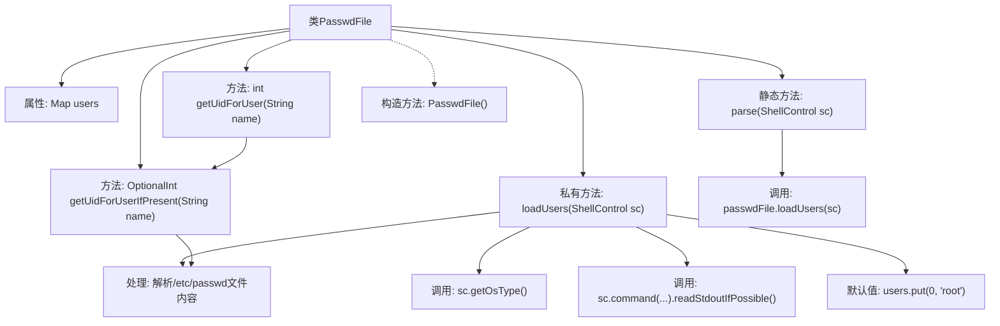

# 基础信息

|      |      |
|------|------|
| 名称 | PasswdFile |
| 编码语言 | .java |
| 代码路径 | xpipe/app/src/main/java/io/xpipe/app/util/PasswdFile.java |
| 包名 | io.xpipe.app.util |
| 依赖项 | ['io.xpipe.core.process.CommandBuilder', 'io.xpipe.core.process.OsType', 'io.xpipe.core.process.ShellControl', 'lombok.Getter', 'java.util.LinkedHashMap', 'java.util.Map', 'java.util.OptionalInt'] |
| 概述说明 | 解析PasswdFile类，加载用户信息并提供UID查询功能。 |

# 说明

这是一个名为PasswdFile的Java类，用于解析系统用户信息。它包含一个用户ID到用户名的映射表，提供通过用户名查找用户ID的功能。类中实现了两种查找方法：getUidForUserIfPresent返回OptionalInt，getUidForUser直接返回int。loadUsers方法通过ShellControl执行cat命令读取/etc/passwd文件，解析并存储用户信息。对于Windows和MacOS系统会跳过解析，若未找到用户则默认添加root用户。

# 类列表 Class Summary

| 名称   | 类型  | 说明 |
|-------|------|-------------|
| PasswdFile | class | 解析用户文件获取UID，支持Windows/Mac跳过，默认含root。 |


## 类 PasswdFile

|      |      |
|------|------|
| 访问范围 | @Getter;public |
| 类型 | class |
| 名称 | PasswdFile |
| 说明 | 解析用户文件获取UID，支持Windows/Mac跳过，默认含root。 |


### UML类图

```mermaid
classDiagram
    class PasswdFile {
        -Map~Integer, String~ users
        +static PasswdFile parse(ShellControl sc) throws Exception
        +OptionalInt getUidForUserIfPresent(String name)
        +int getUidForUser(String name)
        -void loadUsers(ShellControl sc) throws Exception
    }

    class ShellControl {
        <<Interface>>
        +OsType getOsType()
        +CommandResult command(CommandBuilder command)
    }

    class CommandBuilder {
        +static CommandBuilder of()
        +CommandBuilder add(String arg)
        +CommandBuilder addFile(String path)
    }

    class CommandResult {
        +Optional~String~ readStdoutIfPossible()
    }

    enum OsType {
        WINDOWS
        MACOS
        LINUX
    }

    PasswdFile --> ShellControl : 依赖
    PasswdFile --> CommandBuilder : 依赖
    ShellControl --> CommandBuilder : 依赖
    ShellControl --> CommandResult : 依赖
```

这段代码描述了一个PasswdFile类，用于解析Linux系统的/etc/passwd文件并管理用户ID(UID)与用户名的映射关系。该类通过ShellControl接口执行shell命令获取文件内容，使用CommandBuilder构建命令，并处理返回的CommandResult。主要功能包括解析passwd文件、查询用户UID，并针对不同操作系统(通过OsType枚举判断)进行兼容处理。当无法获取用户信息时，默认添加root用户(UID=0)。


### 内部方法调用关系图



这段代码流程图展示了PasswdFile类的核心结构和执行流程。该类主要用于解析Unix系统的/etc/passwd文件，建立用户ID与用户名的映射关系。流程从parse静态方法开始，通过loadUsers方法读取系统文件，处理不同操作系统的情况，解析文件内容填充users映射表。提供了两种查询用户ID的方法，其中getUidForUserIfPresent返回OptionalInt类型，而getUidForUser则直接返回int类型，默认值为0。当文件解析失败时会自动添加root用户作为默认值。

### 字段列表 Field List

| 名称  | 类型  | 说明 |
|-------|-------|------|
| users = new LinkedHashMap<>() | Map<Integer, String> | 私有映射存储用户ID和名称，保持插入顺序。 |

### 方法列表 Method List

| 名称  | 类型  | 说明 |
|-------|-------|------|
| getUidForUserIfPresent | OptionalInt | 查找用户名的UID，存在则返回OptionalInt，否则返回空。 |
| parse | PasswdFile | 解析密码文件并加载用户数据。 |
| getUidForUser | int | 方法根据用户名返回UID，不存在则返回0。 |
| loadUsers | void | 加载非Win/Mac系统的用户数据，默认添加root。 |


