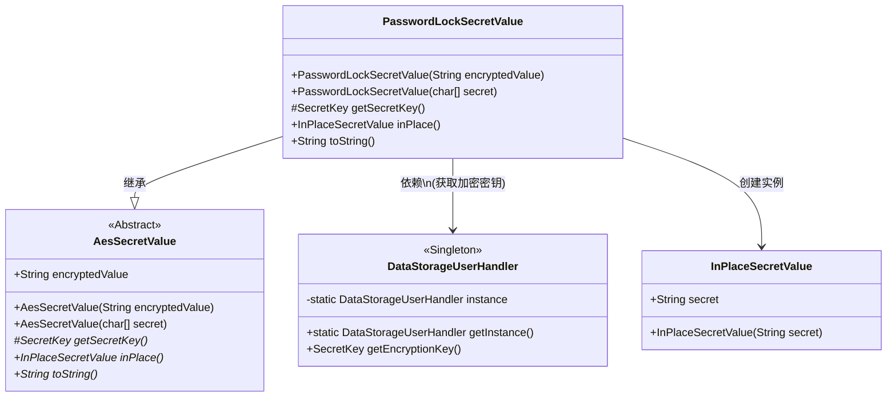
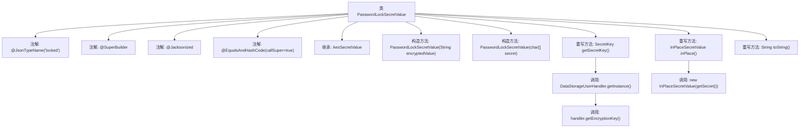

# 基础信息

|      |      |
|------|------|
| 名称 | PasswordLockSecretValue |
| 编码语言 | .java |
| 代码路径 | xpipe/app/src/main/java/io/xpipe/app/util/PasswordLockSecretValue.java |
| 包名 | io.xpipe.app.util |
| 依赖项 | ['io.xpipe.app.storage.DataStorageUserHandler', 'io.xpipe.core.util.AesSecretValue', 'io.xpipe.core.util.InPlaceSecretValue', 'com.fasterxml.jackson.annotation.JsonTypeName', 'lombok.EqualsAndHashCode', 'lombok.experimental.SuperBuilder', 'lombok.extern.jackson.Jacksonized', 'javax.crypto.SecretKey'] |
| 概述说明 | 密码锁密值类，继承AES加密，含构造器、密钥获取及字符串转换方法。 |

# 说明

PasswordLockSecretValue类继承自AesSecretValue，用于处理密码锁定的加密值。它通过@JsonTypeName等注解标记为JSON类型，支持构建器和Jackson序列化。提供两种构造方法：接收加密字符串或字符数组形式的密钥。重写getSecretKey方法从DataStorageUserHandler获取加密密钥，并实现inPlace方法返回InPlaceSecretValue实例。toString方法返回固定字符串表示密码锁定秘密。

# 类列表 Class Summary

| 名称   | 类型  | 说明 |
|-------|------|-------------|
| PasswordLockSecretValue | class | 密码锁密值类，继承AES加密，支持字符数组和加密值构造，重写密钥获取和字符串表示方法。 |

## 类 PasswordLockSecretValue

|      |      |
|------|------|
| 访问范围 | @JsonTypeName("locked");@SuperBuilder;@Jacksonized;@EqualsAndHashCode(callSuper = true);public |
| 类型 | class |
| 名称 | PasswordLockSecretValue |
| 说明 | 密码锁密值类，继承AES加密，支持字符数组和加密值构造，重写密钥获取和字符串表示方法。 |

### UML类图

这段类图展示了密码锁定秘密值(PasswordLockSecretValue)的继承关系和协作对象。该类继承自AesSecretValue抽象类，实现了加密值存储和密钥获取的核心功能。通过DataStorageUserHandler单例获取加密密钥，并能转换为InPlaceSecretValue实例。类图中清晰呈现了抽象基类、具体实现类、工具类和值对象之间的关系，体现了加密数据存储的层次结构和依赖关系。

### 内部方法调用关系图

该流程图展示了PasswordLockSecretValue类的结构，该类继承自AesSecretValue并带有多个注解（如@JsonTypeName和@SuperBuilder）。类中包含两个构造方法，分别接受加密字符串和字符数组作为参数。重写了三个方法：getSecretKey()通过DataStorageUserHandler获取加密密钥，inPlace()返回新的InPlaceSecretValue实例，toString()返回固定字符串。流程图清晰地呈现了类层次结构、方法调用关系和数据流向。

### 字段列表 Field List

| 名称  | 类型  | 说明 |
|-------|-------|------|

### 方法列表 Method List

| 名称  | 类型  | 说明 |
|-------|-------|------|
| getSecretKey | SecretKey | 重写方法获取存储处理器的加密密钥，无则返回空。 |
| inPlace | InPlaceSecretValue | 重写方法返回包含秘密值的InPlaceSecretValue对象。 |
| toString | String | 重写toString方法，返回密码锁密文。 |

