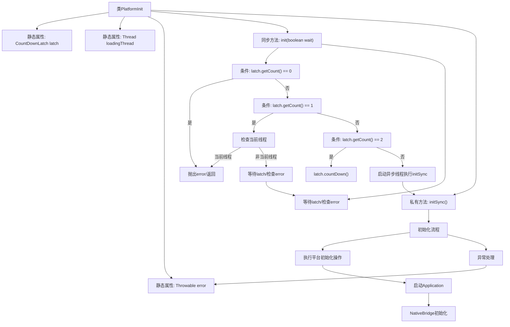
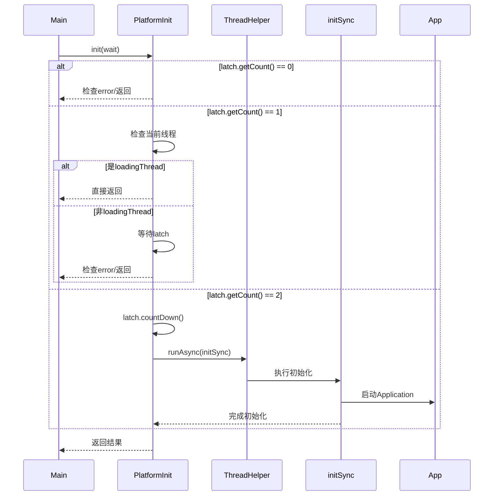

# 基础信息

|      |      |
|------|------|
| 名称 | PlatformInit |
| 编码语言 | .java |
| 代码路径 | xpipe/app/src/main/java/io/xpipe/app/util/PlatformInit.java |
| 包名 | io.xpipe.app.util |
| 依赖项 | ['io.xpipe.app.core', 'io.xpipe.app.core.check.AppGpuCheck', 'io.xpipe.app.core.window.ModifiedStage', 'io.xpipe.app.issue.TrackEvent', 'io.xpipe.core.process.OsType', 'javafx.application.Application', 'lombok.Getter', 'lombok.SneakyThrows', 'java.util.concurrent.CountDownLatch'] |
| 概述说明 | 平台初始化类，同步异步加载，异常处理，多线程控制。 |

# 说明

PlatformInit类是一个用于平台初始化的工具类，采用单例模式确保线程安全。它使用CountDownLatch控制初始化流程，支持同步和异步两种初始化方式。主要功能包括检查初始化状态、处理多线程并发初始化、记录错误信息。具体初始化过程包含多个步骤：初始化平台状态、GPU检查、字体加载、样式主题设置、国际化支持、桌面集成等。最后会启动JavaFX应用并等待应用实例创建完成，同时处理初始化过程中的异常情况。

# 类列表 Class Summary

| 名称   | 类型  | 说明 |
|-------|------|-------------|
| PlatformInit | class | 平台初始化类，同步异步加载，异常处理，多线程控制。 |

## 类 PlatformInit

|      |      |
|------|------|
| 访问范围 | public |
| 类型 | class |
| 名称 | PlatformInit |
| 说明 | 平台初始化类，同步异步加载，异常处理，多线程控制。 |

### UML类图

```mermaid
classDiagram
    class PlatformInit {
        -CountDownLatch latch
        -Thread loadingThread
        -Throwable error
        +synchronized init(boolean wait) void
        -initSync() void
    }

    class CountDownLatch {
        <<JDK Class>>
    }

    class Thread {
        <<JDK Class>>
    }

    class Throwable {
        <<JDK Class>>
    }

    class ThreadHelper {
        <<Utility Class>>
        +runAsync(Runnable) void
        +createPlatformThread(String, boolean, Runnable) Thread
        +sleep(long) void
    }

    class AppProperties {
        <<Utility Class>>
        +isAotTrainMode() boolean
    }

    class OsType {
        <<Enumeration>>
        +getLocal() OsType
    }

    class TrackEvent {
        <<Utility Class>>
        +info(String) void
    }

    class ModifiedStage {
        <<Utility Class>>
        +init() void
    }

    class PlatformState {
        <<Utility Class>>
        +initPlatformOrThrow() void
    }

    class AppGpuCheck {
        <<Utility Class>>
        +check() void
    }

    class AppFont {
        <<Utility Class>>
        +init() void
    }

    class PlatformThread {
        <<Utility Class>>
        +runLaterIfNeededBlocking(Runnable) void
    }

    class AppStyle {
        <<Utility Class>>
        +init() void
    }

    class AppTheme {
        <<Utility Class>>
        +init() void
    }

    class AppI18n {
        <<Utility Class>>
        +init() void
    }

    class AppDesktopIntegration {
        <<Utility Class>>
        +init() void
    }

    class Application {
        <<JavaFX Class>>
        +launch(Class~?~) void
    }

    class App {
        +getApp() App
    }

    class NativeBridge {
        <<Utility Class>>
        +init() void
    }

    PlatformInit --> CountDownLatch : 使用
    PlatformInit --> Thread : 使用
    PlatformInit --> Throwable : 使用
    PlatformInit --> ThreadHelper : 调用
    PlatformInit --> AppProperties : 查询
    PlatformInit --> OsType : 查询
    PlatformInit --> TrackEvent : 调用
    PlatformInit --> ModifiedStage : 调用
    PlatformInit --> PlatformState : 调用
    PlatformInit --> AppGpuCheck : 调用
    PlatformInit --> AppFont : 调用
    PlatformInit --> PlatformThread : 调用
    PlatformInit --> AppStyle : 调用
    PlatformInit --> AppTheme : 调用
    PlatformInit --> AppI18n : 调用
    PlatformInit --> AppDesktopIntegration : 调用
    PlatformInit --> Application : 调用
    PlatformInit --> App : 查询
    PlatformInit --> NativeBridge : 调用
```

这段代码展示了一个平台初始化类PlatformInit，它使用CountDownLatch实现多线程同步初始化流程。该类通过静态方法init()控制初始化过程，确保线程安全，并处理可能的错误。初始化过程包括加载平台状态、GPU检查、字体、样式、主题、国际化等组件，最后启动JavaFX应用。代码通过ThreadHelper管理异步线程，使用TrackEvent记录日志，并通过latch协调多线程初始化顺序。整个设计体现了对并发控制和错误处理的细致考虑。

### 内部方法调用关系图

这段代码实现了一个平台初始化机制，使用CountDownLatch控制多线程下的初始化流程。主要功能包括：1) 确保初始化只执行一次；2) 支持同步/异步两种初始化模式；3) 包含完整的异常处理机制；4) 执行包括UI、GPU检测、国际化等在内的全套平台初始化操作。流程图展示了类结构和主要方法调用关系，时序图则详细描述了多线程环境下的初始化控制流程。

### 字段列表 Field List

| 名称  | 类型  | 说明 |
|-------|-------|------|
| error | Throwable | 私有静态异常变量error的Getter方法。 |
| loadingThread | Thread | 私有静态线程加载线程 |
| latch = new CountDownLatch(2) | CountDownLatch | 私有静态CountDownLatch初始化为2。 |

### 方法列表 Method List

| 名称  | 类型  | 说明 |
|-------|-------|------|
| initSync | void | 初始化平台同步任务，检查条件后执行组件初始化和启动应用，确保线程安全并处理异常。 |
| init | void | 同步初始化方法，处理多线程加载和错误检查。 |

