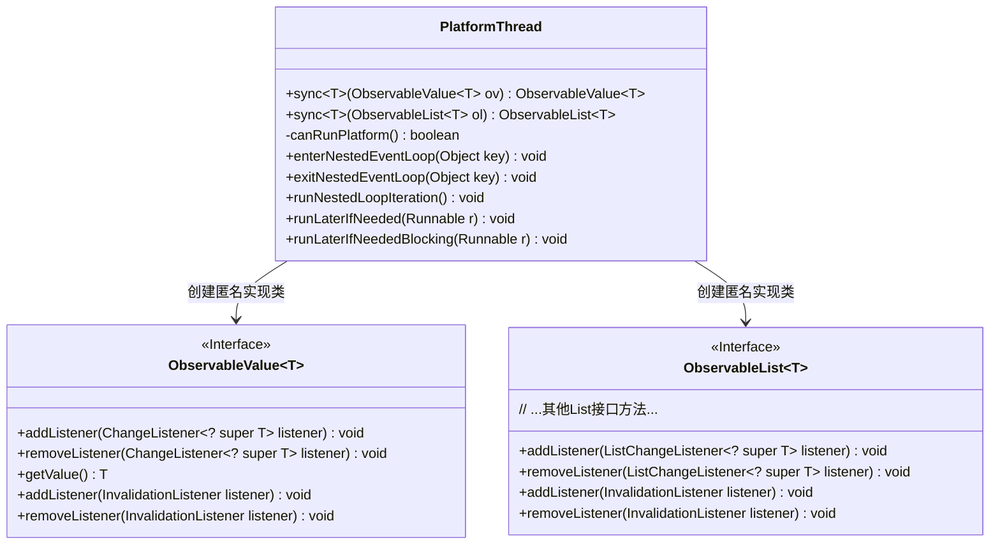
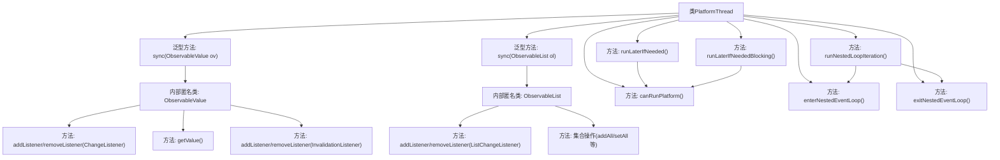

# 基础信息

|      |      |
|------|------|
| 名称 | PlatformThread |
| 编码语言 | .java |
| 代码路径 | xpipe/app/src/main/java/io/xpipe/app/util/PlatformThread.java |
| 包名 | io.xpipe.app.util |
| 依赖项 | ['io.xpipe.app.core.mode.OperationMode', 'io.xpipe.app.issue.ErrorEvent', 'javafx.application.Platform', 'javafx.beans.InvalidationListener', 'javafx.beans.value.ChangeListener', 'javafx.beans.value.ObservableValue', 'javafx.collections.ListChangeListener', 'javafx.collections.ObservableList', 'lombok.NonNull', 'java.util', 'java.util.concurrent.CountDownLatch'] |
| 概述说明 | PlatformThread类提供同步Observable值和列表的方法，确保线程安全并处理事件循环。 |

# 说明

PlatformThread类提供了线程同步工具，主要功能包括：1. 为ObservableValue和ObservableList创建同步代理，通过映射表管理监听器，确保跨线程事件在JavaFX应用线程执行；2. 提供嵌套事件循环的入口/出口控制方法，处理异常情况；3. 实现runLaterIfNeeded方法，自动检测当前线程并在必要时切换至JavaFX线程执行任务，含阻塞和非阻塞两种模式；4. 包含平台状态检查逻辑，防止在非运行状态或关闭阶段执行操作。所有方法均包含异常处理机制。

# 类列表 Class Summary

| 名称   | 类型  | 说明 |
|-------|------|-------------|
| PlatformThread | class | 同步监听器包装类，确保线程安全操作。 |

## 类 PlatformThread

|      |      |
|------|------|
| 访问范围 | @SuppressWarnings("unchecked");public |
| 类型 | class |
| 名称 | PlatformThread |
| 说明 | 同步监听器包装类，确保线程安全操作。 |

### UML类图

这段代码展示了一个JavaFX线程工具类PlatformThread，主要提供两类核心功能：1) 同步ObservableValue和ObservableList的监听器到JavaFX应用线程；2) 提供安全的嵌套事件循环操作。类图中包含PlatformThread与两个接口（ObservableValue和ObservableList）的关系，PlatformThread通过匿名内部类实现了这两个接口，在实现中添加了线程安全的监听器转发机制。所有UI更新操作都会通过runLaterIfNeeded方法确保在JavaFX应用线程执行，同时提供了阻塞和非阻塞两种执行方式。

### 内部方法调用关系图

这段代码是PlatformThread工具类，主要提供两种核心功能：1) 通过sync方法创建线程安全的ObservableValue和ObservableList包装器，自动将监听器调用切换到JavaFX应用线程；2) 提供嵌套事件循环管理和线程安全的任务执行方法(runLaterIfNeeded)。所有方法都包含完善的线程检查和异常处理机制，确保在JavaFX平台线程外的调用能安全地转发到正确线程执行。流程图清晰展示了类结构、方法关系和内部匿名类的实现细节。

### 字段列表 Field List

| 名称  | 类型  | 说明 |
|-------|-------|------|

### 方法列表 Method List

| 名称  | 类型  | 说明 |
|-------|-------|------|
| exitNestedEventLoop | void | 退出嵌套事件循环，处理无效键异常。 |
| sync | ObservableValue<T> | 同步ObservableValue，确保监听器在UI线程执行。 |
| enterNestedEventLoop | void | 静态方法enterNestedEventLoop尝试进入嵌套事件循环，失败时处理异常。 |
| canRunPlatform | boolean | 检查平台状态和操作模式，判断是否可运行。 |
| sync | ObservableList<T> | 同步ObservableList的包装方法，确保线程安全操作。 |
| runNestedLoopIteration | void | 静态方法检查平台支持后启动嵌套事件循环。 |
| runLaterIfNeeded | void | 检查平台线程，安全执行Runnable，异常处理。 |
| runLaterIfNeededBlocking | void | 检查线程安全执行Runnable，非FX线程用锁等待，异常处理。 |

