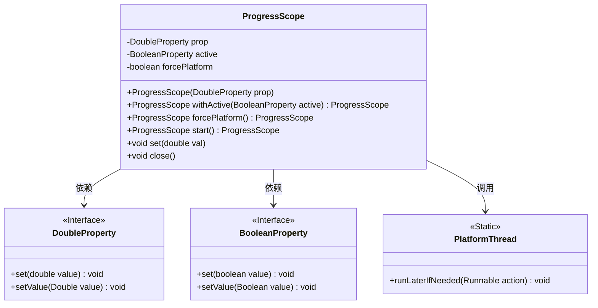
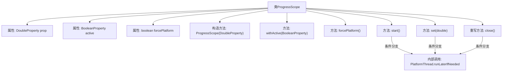

# 基础信息

|      |      |
|------|------|
| 名称 | ProgressScope |
| 编码语言 | .java |
| 代码路径 | xpipe/app/src/main/java/io/xpipe/app/util/ProgressScope.java |
| 包名 | io.xpipe.app.util |
| 依赖项 | ['javafx.beans.property.BooleanProperty', 'javafx.beans.property.DoubleProperty', 'javafx.beans.property.SimpleBooleanProperty'] |
| 概述说明 | ProgressScope类实现进度管理，支持平台线程强制更新和自动关闭。 |

# 说明

ProgressScope是一个实现AutoCloseable接口的类，用于管理进度属性和活动状态。它包含一个DoubleProperty属性prop，一个BooleanProperty属性active，以及一个布尔标志forcePlatform。构造函数接收一个DoubleProperty参数。提供withActive方法设置active属性，forcePlatform方法强制使用平台线程。start方法初始化进度和活动状态，set方法更新进度值，close方法重置进度并停用活动状态。根据forcePlatform标志决定是否在平台线程上执行操作。

# 类列表 Class Summary

| 名称   | 类型  | 说明 |
|-------|------|-------------|
| ProgressScope | class | ProgressScope类管理进度属性和活动状态，支持平台线程操作。 |

## 类 ProgressScope

|      |      |
|------|------|
| 访问范围 | public |
| 类型 | class |
| 名称 | ProgressScope |
| 说明 | ProgressScope类管理进度属性和活动状态，支持平台线程操作。 |

### UML类图

这段代码展示了一个`ProgressScope`类，用于管理进度条的状态控制。该类实现了`AutoCloseable`接口，通过`DoubleProperty`和`BooleanProperty`接口与外部属性绑定，支持平台线程安全操作。核心功能包括进度值设置(`set`)、启动(`start`)、关闭(`close`)等方法，并通过`forcePlatform`标志决定是否强制在UI线程执行操作。类图中清晰展示了与属性接口和平台线程工具的依赖关系。

### 内部方法调用关系图

流程图描述：该流程图展示了ProgressScope类的结构和方法调用关系。类包含三个属性（prop、active、forcePlatform）和五个核心方法。构造方法初始化prop属性，withActive()和forcePlatform()用于配置对象，start()、set()和close()为核心功能方法。关键特点是当forcePlatform为true时，这三个核心方法会通过PlatformThread.runLaterIfNeeded进行平台线程安全调用，形成条件分支逻辑。所有方法最终都会操作prop和active属性，实现进度控制功能。

### 字段列表 Field List

| 名称  | 类型  | 说明 |
|-------|-------|------|
| active = new SimpleBooleanProperty() | BooleanProperty | 布尔属性active初始化为SimpleBooleanProperty |
| forcePlatform | boolean | 强制使用平台模式 |
| prop | DoubleProperty | 私有双精度属性prop |

### 方法列表 Method List

| 名称  | 类型  | 说明 |
|-------|-------|------|
| close | void | 重写close方法，根据forcePlatform决定是否在平台线程中设置prop和active的值。 |
| forcePlatform | ProgressScope | 强制设置平台属性并返回当前对象。 |
| withActive | ProgressScope | 公开方法设置激活状态并返回当前对象。 |
| start | ProgressScope | 启动进度范围，根据forcePlatform决定线程执行方式，初始化prop和active值。 |
| set | void | 设置属性值，强制平台线程执行时使用PlatformThread.runLaterIfNeeded。 |

