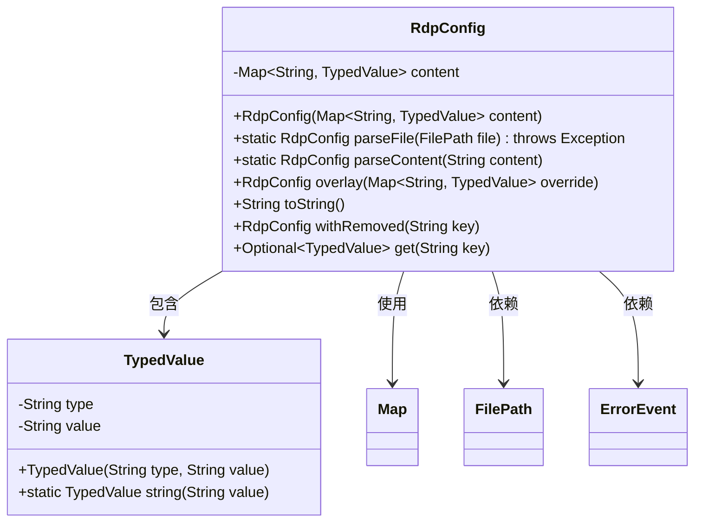
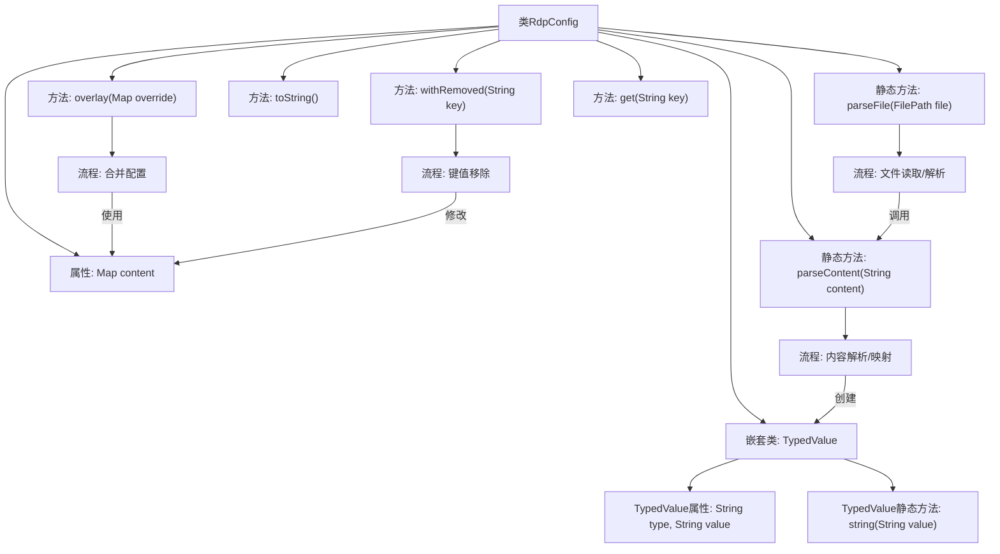

# 基础信息

|      |      |
|------|------|
| 名称 | RdpConfig |
| 编码语言 | .java |
| 代码路径 | xpipe/app/src/main/java/io/xpipe/app/util/RdpConfig.java |
| 包名 | io.xpipe.app.util |
| 依赖项 | ['io.xpipe.app.issue.ErrorEvent', 'io.xpipe.core.store.FilePath', 'io.xpipe.core.util.StreamCharset', 'lombok.Value', 'java.io.BufferedInputStream', 'java.io.BufferedReader', 'java.nio.file.Files', 'java.nio.file.NoSuchFileException', 'java.nio.file.Path', 'java.util.LinkedHashMap', 'java.util.Map', 'java.util.Optional', 'java.util.stream.Collectors'] |
| 概述说明 | RdpConfig类解析文件内容并存储键值对，支持覆盖、删除和查询操作。 |

# 说明

RdpConfig类用于解析和管理键值对配置数据。它包含一个Map类型字段content存储TypedValue对象。提供parseFile方法从文件读取配置，parseContent解析字符串为配置。支持配置覆盖、移除键值、获取键值等操作。TypedValue内部类表示带类型的值，支持字符串类型。toString方法将配置格式化为字符串。

# 类列表 Class Summary

| 名称   | 类型  | 说明 |
|-------|------|-------------|
| RdpConfig | class | RdpConfig类解析文件内容为键值映射，支持覆盖、删除和查询操作。 |

## 类 RdpConfig

|      |      |
|------|------|
| 访问范围 | @Value;public |
| 类型 | class |
| 名称 | RdpConfig |
| 说明 | RdpConfig类解析文件内容为键值映射，支持覆盖、删除和查询操作。 |

### UML类图

这段代码展示了一个配置解析类RdpConfig及其内部值类型TypedValue的结构。RdpConfig通过静态方法parseFile和parseContent从文件或字符串内容解析配置，支持配置覆盖(overlay)、键值删除(withRemoved)和查询(get)等操作。TypedValue作为配置值的载体，包含类型和实际值两个字段，并提供了字符串类型的快捷构造方法。类图中清晰呈现了核心类的关系和主要方法，体现了配置解析、合并和查询的核心功能。

### 内部方法调用关系图

该流程图展示了RdpConfig类的完整结构，包含核心文件解析方法parseFile和parseContent，以及配置操作相关方法overlay、withRemoved等。重点突出了嵌套类TypedValue的结构，并清晰标注了文件读取→内容解析→映射构建的处理流程，同时展示了配置合并和键值移除的操作路径。类方法间的调用关系通过箭头连接，体现了从文件输入到内存对象转换的全过程。

### 字段列表 Field List

| 名称  | 类型  | 说明 |
|-------|-------|------|
| content | Map<String, TypedValue> | 键值对映射，键为字符串，值为类型化值。 |

### 方法列表 Method List

| 名称  | 类型  | 说明 |
|-------|-------|------|
| parseFile | RdpConfig | 解析文件内容生成RdpConfig，处理文件不存在异常。 |
| overlay | RdpConfig | 方法overlay用override更新content，返回新RdpConfig实例。 |
| parseContent | RdpConfig | 解析字符串内容生成RdpConfig对象，处理键值对映射。 |
| toString | String | Java方法：流式处理Map内容，格式为键:类型:值，换行分隔。 |
| withRemoved | RdpConfig | 移除指定键值并返回新配置实例。 |
| get | Optional<TypedValue> | 获取键对应的值，可能为空。 |

