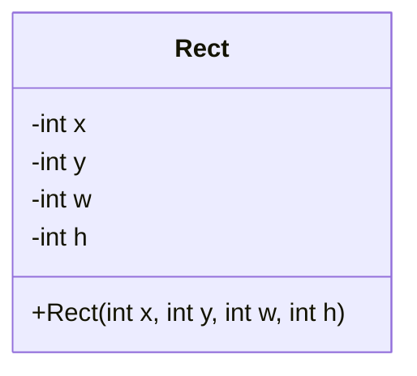
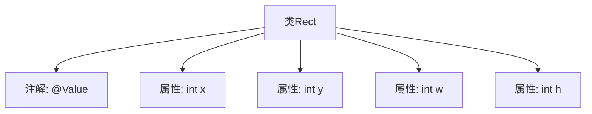

# 基础信息

|      |      |
|------|------|
| 名称 | Rect |
| 编码语言 | .java |
| 代码路径 | xpipe/app/src/main/java/io/xpipe/app/util/Rect.java |
| 包名 | io.xpipe.app.util |
| 依赖项 | ['lombok.Value'] |
| 概述说明 | 值类Rect定义，含坐标x,y和宽高w,h。 |

# 说明

这是一个名为Rect的公开类，使用@Value注解标记。类中包含四个整型成员变量：x和y表示坐标位置，w和h分别表示宽度和高度。该结构常用于表示二维平面中的矩形区域。

# 类列表 Class Summary

| 名称   | 类型  | 说明 |
|-------|------|-------------|
| Rect | class | 值类Rect含坐标(x,y)和宽高(w,h)。 |

## 类 Rect

|      |      |
|------|------|
| 访问范围 | @Value;public |
| 类型 | class |
| 名称 | Rect |
| 说明 | 值类Rect含坐标(x,y)和宽高(w,h)。 |

### UML类图

这段代码定义了一个简单的`Rect`类，用于表示矩形区域。该类包含四个私有整型字段：`x`和`y`表示矩形左上角的坐标，`w`和`h`分别表示矩形的宽度和高度。通过构造函数可以初始化这些字段的值。这是一个基础的数据结构类，常用于图形处理或界面布局等场景，可以存储和操作矩形的位置和尺寸信息。

### 内部方法调用关系图

这段流程图描述了Rect类的结构，它是一个带有@Value注解的简单数据类，包含四个整型属性：x和y表示位置坐标，w和h表示宽度和高度。@Value注解通常用于标记不可变类，表明所有字段都是final且通过构造函数初始化。该图清晰展示了类与属性之间的从属关系，省略了方法部分因为原始代码未显示任何方法定义。

### 字段列表 Field List

| 名称  | 类型  | 说明 |
|-------|-------|------|
| y | int | 声明整型变量x和y |
| h | int | 声明整型变量w和h。 |

### 方法列表 Method List

| 名称  | 类型  | 说明 |
|-------|-------|------|

