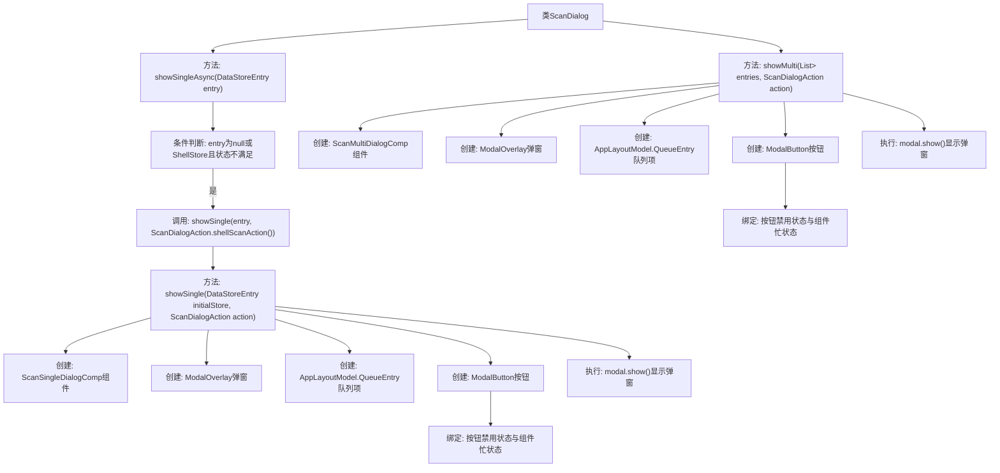

# 基础信息

|      |      |
|------|------|
| 名称 | ScanDialog |
| 编码语言 | .java |
| 代码路径 | xpipe/app/src/main/java/io/xpipe/app/util/ScanDialog.java |
| 包名 | io.xpipe.app.util |
| 依赖项 | ['io.xpipe.app.comp.base.ModalButton', 'io.xpipe.app.comp.base.ModalOverlay', 'io.xpipe.app.core.AppI18n', 'io.xpipe.app.core.AppLayoutModel', 'io.xpipe.app.ext.ShellStore', 'io.xpipe.app.storage.DataStoreEntry', 'io.xpipe.app.storage.DataStoreEntryRef', 'io.xpipe.core.process.ShellTtyState', 'io.xpipe.core.process.SystemState', 'java.util.List'] |
| 概述说明 | 扫描对话框类，支持单条和多条数据扫描，含异步处理和模态窗口交互。 |

# 说明

ScanDialog类提供了两种扫描对话框的静态方法。showSingleAsync方法根据DataStoreEntry状态决定是否显示单连接扫描对话框，若满足条件则调用showSingle方法创建对话框。showSingle方法构建包含初始存储和扫描操作的对话框组件，添加队列条目和确认按钮，按钮状态与组件忙碌状态绑定。showMulti方法类似，但处理多个ShellStore引用的列表。两者均使用ModalOverlay显示对话框，并在确认时异步完成操作并更新队列。

# 类列表 Class Summary

| 名称   | 类型  | 说明 |
|-------|------|-------------|
| ScanDialog | class | ScanDialog类提供单/多连接扫描对话框功能，包含异步显示和模态交互逻辑。 |


## 类 ScanDialog

|      |      |
|------|------|
| 访问范围 | public |
| 类型 | class |
| 名称 | ScanDialog |
| 说明 | ScanDialog类提供单/多连接扫描对话框功能，包含异步显示和模态交互逻辑。 |


### UML类图

```mermaid
classDiagram
    class ScanDialog {
        +showSingleAsync(DataStoreEntry entry) void
        -showSingle(DataStoreEntry initialStore, ScanDialogAction action) void
        +showMulti(List~DataStoreEntryRef~ShellStore~~ entries, ScanDialogAction action) void
    }

    class DataStoreEntry {
        <<Interface>>
        +getStore() Store
        +getStorePersistentState() StorePersistentState
        +ref() DataStoreEntryRef~T~
    }

    class ShellStore {
        // ShellStore实现Store接口
    }

    class Store {
        <<Interface>>
    }

    class StorePersistentState {
        <<Interface>>
    }

    class SystemState {
        +getTtyState() ShellTtyState
    }

    class ShellTtyState {
        <<Enumeration>>
        NONE
        // 其他枚举值
    }

    class ScanDialogAction {
        <<Interface>>
        +shellScanAction() ScanDialogAction
    }

    class ScanSingleDialogComp {
        +ScanSingleDialogComp(DataStoreEntryRef~T~ initialStore, ScanDialogAction action)
        +finish() void
        +getBusy() ObservableBooleanValue
    }

    class ScanMultiDialogComp {
        +ScanMultiDialogComp(List~DataStoreEntryRef~ShellStore~~ entries, ScanDialogAction action)
        +finish() void
        +getBusy() ObservableBooleanValue
    }

    class ModalOverlay {
        +of(String titleKey, Node content) ModalOverlay
        +addButton(ModalButton button) void
        +show() void
    }

    class ModalButton {
        +ModalButton(String textKey, Runnable action, boolean primary, boolean defaultButton)
        +augment(Consumer~Button~ augmenter) void
    }

    class AppLayoutModel {
        +get() AppLayoutModel
        +getQueueEntries() ObservableList~QueueEntry~
    }

    class AppLayoutModel$QueueEntry {
        +QueueEntry(StringObservable title, LabelGraphic graphic, Runnable action)
    }

    class LabelGraphic {
        <<Interface>>
    }

    class IconGraphic {
        +IconGraphic(String iconCode)
    }

    class PlatformThread {
        +sync(ObservableBooleanValue property) BooleanBinding
    }

    class ThreadHelper {
        +runAsync(Runnable task) void
    }

    // 关系定义
    DataStoreEntry --> Store : 依赖
    DataStoreEntry --> StorePersistentState : 依赖
    ShellStore ..|> Store : 实现
    SystemState ..|> StorePersistentState : 实现
    ScanDialog --> DataStoreEntry : 依赖
    ScanDialog --> ScanDialogAction : 依赖
    ScanDialog --> ScanSingleDialogComp : 创建
    ScanDialog --> ScanMultiDialogComp : 创建
    ScanDialog --> ModalOverlay : 创建
    ScanDialog --> ModalButton : 创建
    ScanDialog --> AppLayoutModel : 依赖
    ScanDialog --> PlatformThread : 依赖
    ScanDialog --> ThreadHelper : 依赖
    ModalOverlay --> ModalButton : 包含
    AppLayoutModel --> AppLayoutModel$QueueEntry : 包含
    IconGraphic ..|> LabelGraphic : 实现
```

这段代码描述了一个扫描对话框系统，主要包含ScanDialog类及其相关组件。ScanDialog提供了两种显示方式：showSingleAsync用于显示单个条目扫描对话框，showMulti用于显示多个条目扫描对话框。系统通过ModalOverlay实现模态对话框，使用ScanSingleDialogComp和ScanMultiDialogComp作为对话框内容组件，并配合AppLayoutModel进行任务队列管理。代码涉及多个接口和实现类，包括数据存储条目、存储状态、对话框动作等，形成了一个完整的对话框交互体系。


### 内部方法调用关系图



这段代码实现了一个扫描对话框工具类，包含单条记录扫描和多条记录扫描两种模式。核心流程是通过条件判断决定是否显示对话框，创建对应的对话框组件（ScanSingleDialogComp/ScanMultiDialogComp），构建模态弹窗并添加带状态绑定的确认按钮。两个主要方法都遵循相似的弹窗构建逻辑：初始化组件→创建弹窗→配置队列项→设置异步完成回调→绑定按钮状态→显示弹窗，其中按钮状态会实时响应组件的忙闲状态变化。

### 字段列表 Field List

| 名称  | 类型  | 说明 |
|-------|-------|------|

### 方法列表 Method List

| 名称  | 类型  | 说明 |
|-------|-------|------|
| showSingle | void | 私有方法显示扫描对话框，创建单次扫描组件和模态窗口，添加确认按钮并绑定禁用状态，异步完成操作后移除队列条目。 |
| showSingleAsync | void | 静态方法检查数据存储条目，若为空或特定条件则调用显示方法。 |
| showMulti | void | 静态方法显示多选扫描对话框，创建模态窗口和队列条目，绑定按钮状态并异步处理完成操作。 |


