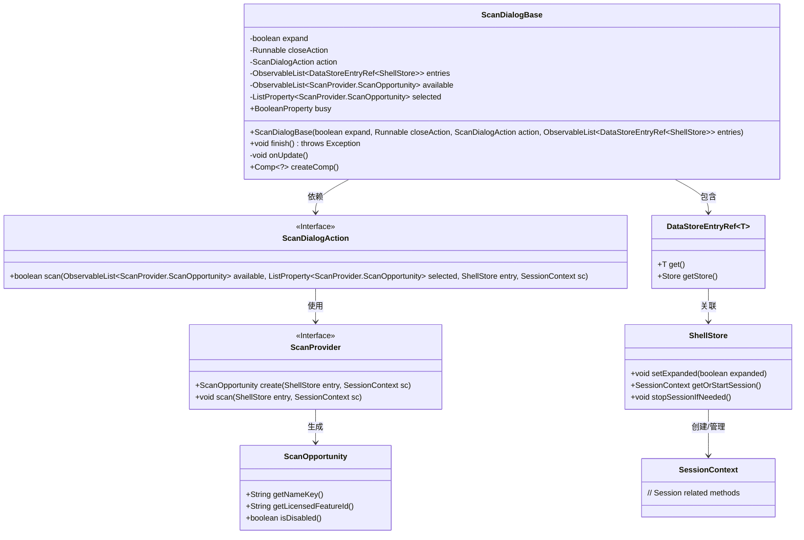
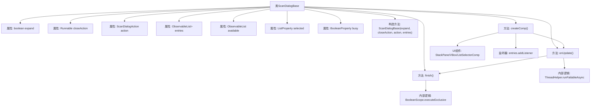

# 基础信息

|      |      |
|------|------|
| 名称 | ScanDialogBase |
| 编码语言 | .java |
| 代码路径 | xpipe/app/src/main/java/io/xpipe/app/util/ScanDialogBase.java |
| 包名 | io.xpipe.app.util |
| 依赖项 | ['io.xpipe.app.comp.Comp', 'io.xpipe.app.comp.base.ListSelectorComp', 'io.xpipe.app.comp.base.LoadingOverlayComp', 'io.xpipe.app.core.AppI18n', 'io.xpipe.app.ext.ScanProvider', 'io.xpipe.app.ext.ShellStore', 'io.xpipe.app.issue.ErrorEvent', 'io.xpipe.app.storage.DataStorage', 'io.xpipe.app.storage.DataStoreEntryRef', 'javafx.beans.property', 'javafx.collections.FXCollections', 'javafx.collections.ListChangeListener', 'javafx.collections.ObservableList', 'javafx.scene.layout.StackPane', 'javafx.scene.layout.VBox', 'lombok.Getter', 'java.util.ArrayList', 'java.util.function.Function', 'javafx.scene.layout.Priority.ALWAYS'] |
| 概述说明 | 扫描对话框基类，含展开选项、关闭操作、扫描动作及数据存储条目处理。 |

# 说明

ScanDialogBase是一个用于扫描操作的对话框基类，包含多个关键属性和方法。主要属性包括expand标志、closeAction关闭回调、action扫描动作、entries数据存储条目列表、available可用扫描机会列表和selected已选扫描机会列表。finish方法执行扫描操作，处理多选兼容性检查，并在完成后调用关闭回调。onUpdate方法异步更新可用和已选扫描机会列表。createComp方法创建界面组件，包含列表选择器和加载遮罩，支持多语言显示和许可证特性后缀。该类通过监听entries变化动态更新界面，确保线程安全并处理异常情况。

# 类列表 Class Summary

| 名称   | 类型  | 说明 |
|-------|------|-------------|
| ScanDialogBase | class | 扫描对话框基类，含展开、关闭操作、扫描动作及数据存储条目管理功能。 |

## 类 ScanDialogBase

|      |      |
|------|------|
| 访问范围 | public |
| 类型 | class |
| 名称 | ScanDialogBase |
| 说明 | 扫描对话框基类，含展开、关闭操作、扫描动作及数据存储条目管理功能。 |

### UML类图

这段类图描述了`ScanDialogBase`的核心结构和依赖关系。该类是一个扫描对话框基础实现，主要管理扫描条目(`DataStoreEntryRef<ShellStore>`)、可用扫描机会(`ScanOpportunity`)和选中项的状态同步。通过`ScanDialogAction`接口与具体扫描逻辑解耦，依赖`ShellStore`和`SessionContext`进行会话管理，使用观察者模式监听条目变化。整个设计体现了职责分离原则，通过泛型和接口实现高度可扩展性，同时采用JavaFX属性绑定实现响应式UI更新。

### 内部方法调用关系图

这段代码是ScanDialogBase类的实现，主要处理扫描对话框的基础逻辑。流程图展示了类结构、属性关系和方法调用链。核心功能包括：通过finish()执行扫描操作，使用onUpdate()异步更新可用选项，createComp()构建包含列表选择器和加载动画的UI组件。关键特性是线程安全的集合操作、异步任务处理和UI状态同步，通过BooleanScope保证原子性操作，entries监听器实现数据变化时的自动更新。

### 字段列表 Field List

| 名称  | 类型  | 说明 |
|-------|-------|------|
| available =            FXCollections.synchronizedObservableList(FXCollections.observableArrayList()) | ObservableList<ScanProvider.ScanOpportunity> | 私有同步可观察列表存储扫描机会。 |
| busy = new SimpleBooleanProperty() | BooleanProperty | 定义私有布尔属性busy，使用Getter注解。 |
| action | ScanDialogAction | 私有扫描对话框动作实例。 |
| selected =            new SimpleListProperty<>(FXCollections.synchronizedObservableList(FXCollections.observableArrayList())) | ListProperty<ScanProvider.ScanOpportunity> | 私有列表属性，存储同步可观察的扫描机会集合。 |
| entries | ObservableList<DataStoreEntryRef<ShellStore>> | 私有可观察列表，存储ShellStore的DataStoreEntryRef对象。 |
| closeAction | Runnable | 私有Runnable关闭操作 |
| expand | boolean | 私有布尔变量expand |

### 方法列表 Method List

| 名称  | 类型  | 说明 |
|-------|-------|------|
| onUpdate | void | 方法onUpdate清空available和selected集合，非空时异步扫描entries，处理异常和结果。 |
| finish | void | 方法finish处理条目扫描：检查空条目后执行关闭；非空时遍历条目，处理选中项，支持多选兼容检查，异常捕获后关闭。 |
| createComp | Comp<?> | 创建组件方法：生成带列表选择器的堆叠面板，支持名称处理和禁用状态，监听更新并加载覆盖层。 |

