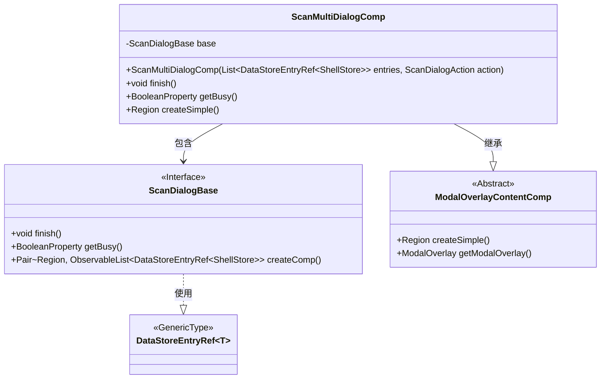
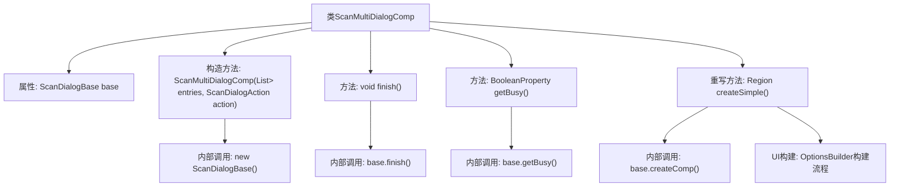

# 基础信息

|      |      |
|------|------|
| 名称 | ScanMultiDialogComp |
| 编码语言 | .java |
| 代码路径 | xpipe/app/src/main/java/io/xpipe/app/util/ScanMultiDialogComp.java |
| 包名 | io.xpipe.app.util |
| 依赖项 | ['io.xpipe.app.comp.base.ModalOverlayContentComp', 'io.xpipe.app.ext.ShellStore', 'io.xpipe.app.issue.ErrorEvent', 'io.xpipe.app.storage.DataStoreEntryRef', 'javafx.beans.property.BooleanProperty', 'javafx.collections.FXCollections', 'javafx.collections.ObservableList', 'javafx.scene.layout.Region', 'javafx.scene.layout.VBox', 'java.util.List', 'javafx.scene.layout.Priority.ALWAYS'] |
| 概述说明 | ScanMultiDialogComp继承ModalOverlayContentComp，包含扫描对话框基础功能，支持完成操作和状态管理。 |

# 说明

ScanMultiDialogComp是一个继承自ModalOverlayContentComp的Java类，用于创建多条目扫描对话框。构造函数接收ShellStore数据条目列表和扫描动作参数，初始化时创建可观察列表并构建ScanDialogBase基础组件。类提供finish方法处理扫描完成逻辑，包含异常捕获机制；getBusy方法返回忙碌状态属性。界面构建通过createSimple方法实现，使用OptionsBuilder创建宽500高680的对话框区域，包含可扩展列表组件，并设置垂直增长策略。整体设计封装了模态对话框的核心交互与布局逻辑。

# 类列表 Class Summary

| 名称   | 类型  | 说明 |
|-------|------|-------------|
| ScanMultiDialogComp | class | ScanMultiDialogComp类继承ModalOverlayContentComp，包含扫描对话框基础功能，支持完成操作和状态管理。 |

## 类 ScanMultiDialogComp

|      |      |
|------|------|
| 访问范围 | None |
| 类型 | class |
| 名称 | ScanMultiDialogComp |
| 说明 | ScanMultiDialogComp类继承ModalOverlayContentComp，包含扫描对话框基础功能，支持完成操作和状态管理。 |

### UML类图

这段代码展示了一个JavaFX组件`ScanMultiDialogComp`，它继承自抽象类`ModalOverlayContentComp`并包含一个`ScanDialogBase`接口实现。主要功能是创建可扫描多个数据存储条目的对话框界面，包含完成操作、忙碌状态获取和简单区域创建等方法。类图中清晰地展示了继承关系、泛型参数(`DataStoreEntryRef~ShellStore~`)以及组件间的依赖关系，体现了对话框组件的分层设计结构。

### 内部方法调用关系图

这段代码流程图展示了ScanMultiDialogComp类的完整结构，该类继承自ModalOverlayContentComp。核心功能包括：1) 通过构造方法初始化ScanDialogBase实例；2) 提供finish()方法处理扫描完成逻辑；3) 通过getBusy()暴露忙碌状态；4) 重写createSimple()方法构建包含可滚动列表的复杂UI界面。异常处理机制内嵌在finish()方法中，UI构建过程涉及OptionsBuilder的多步配置，最终生成固定尺寸的对话框区域。

### 字段列表 Field List

| 名称  | 类型  | 说明 |
|-------|-------|------|
| base | ScanDialogBase | 私有ScanDialogBase实例base。 |

### 方法列表 Method List

| 名称  | 类型  | 说明 |
|-------|-------|------|
| getBusy | BooleanProperty | 方法getBusy返回base的busy状态。 |
| finish | void | 方法finish调用base.finish()，捕获异常并处理。 |
| createSimple | Region | 重写方法创建简单区域，构建选项并设置宽高，返回生成区域。 |

