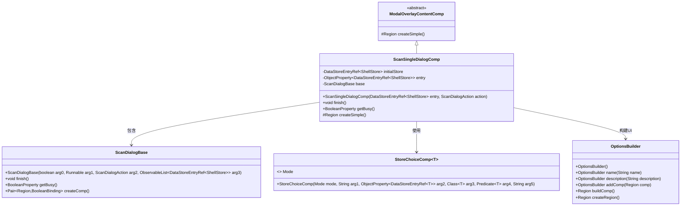
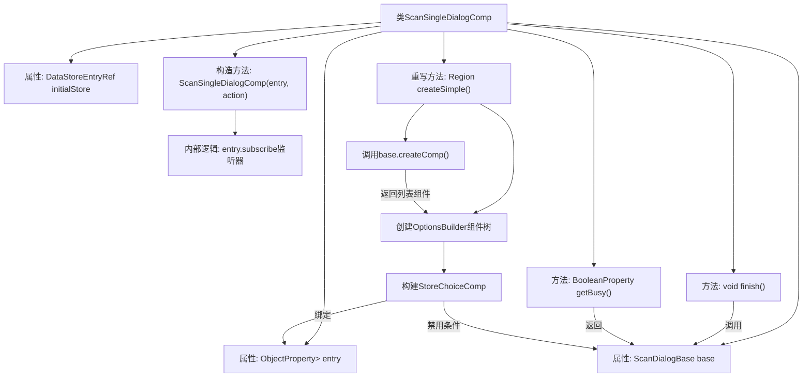

# 基础信息

|      |      |
|------|------|
| 名称 | ScanSingleDialogComp |
| 编码语言 | .java |
| 代码路径 | xpipe/app/src/main/java/io/xpipe/app/util/ScanSingleDialogComp.java |
| 包名 | io.xpipe.app.util |
| 依赖项 | ['io.xpipe.app.comp.base.ModalOverlayContentComp', 'io.xpipe.app.comp.store.StoreChoiceComp', 'io.xpipe.app.comp.store.StoreViewState', 'io.xpipe.app.ext.ShellStore', 'io.xpipe.app.issue.ErrorEvent', 'io.xpipe.app.storage.DataStoreEntryRef', 'javafx.beans.property', 'javafx.collections.FXCollections', 'javafx.collections.ObservableList', 'javafx.scene.layout.Region'] |
| 概述说明 | 扫描对话框组件，继承ModalOverlayContentComp，包含初始存储、属性绑定和基础操作。 |

# 说明

ScanSingleDialogComp是一个继承自ModalOverlayContentComp的类，用于创建扫描对话框组件。它包含初始存储引用initialStore、可观察属性entry和基础对话框base。构造函数接收存储引用和扫描动作，初始化属性并设置列表监听。finish方法处理完成操作，getBusy返回忙碌状态。createSimple方法构建对话框界面，包含存储选择组件和列表组件，设置宽度高度为500x680。异常通过ErrorEvent处理。

# 类列表 Class Summary

| 名称   | 类型  | 说明 |
|-------|------|-------------|
| ScanSingleDialogComp | class | 扫描对话框组件，继承自ModalOverlayContentComp，包含存储引用和基础扫描功能。 |

## 类 ScanSingleDialogComp

|      |      |
|------|------|
| 访问范围 | None |
| 类型 | class |
| 名称 | ScanSingleDialogComp |
| 说明 | 扫描对话框组件，继承自ModalOverlayContentComp，包含存储引用和基础扫描功能。 |

### UML类图

该类图展示了扫描对话框组件`ScanSingleDialogComp`的继承关系和主要协作类。作为`ModalOverlayContentComp`的子类，它通过`ScanDialogBase`处理核心扫描逻辑，使用泛型类`StoreChoiceComp`实现存储选择功能，并借助`OptionsBuilder`构建复杂UI布局。组件通过`ObjectProperty`管理状态，包含异常处理和异步操作支持，体现了响应式编程的设计理念。

### 内部方法调用关系图

该流程图展示了ScanSingleDialogComp类的完整结构，包含3个核心属性和4个主要方法。构造方法初始化存储引用并设置监听器，createSimple()构建了包含StoreChoiceComp和扫描列表的复杂UI布局，finish()委托给base对象处理完成逻辑。箭头清晰表示了属性依赖和方法调用关系，特别是createSimple()内部构建的组件层级和条件绑定关系。

### 字段列表 Field List

| 名称  | 类型  | 说明 |
|-------|-------|------|
| initialStore | DataStoreEntryRef<ShellStore> | 私有ShellStore初始存储引用。 |
| base | ScanDialogBase | 私有ScanDialogBase实例base |
| entry | ObjectProperty<DataStoreEntryRef<ShellStore>> | 私有对象属性，存储ShellStore的DataStoreEntryRef引用。 |

### 方法列表 Method List

| 名称  | 类型  | 说明 |
|-------|-------|------|
| getBusy | BooleanProperty | 获取忙碌状态的方法，返回基础类的忙碌属性。 |
| finish | void | 方法finish调用base.finish()，捕获异常并处理。 |
| createSimple | Region | 创建扫描警报界面，包含选项构建、存储选择和尺寸设置。 |

