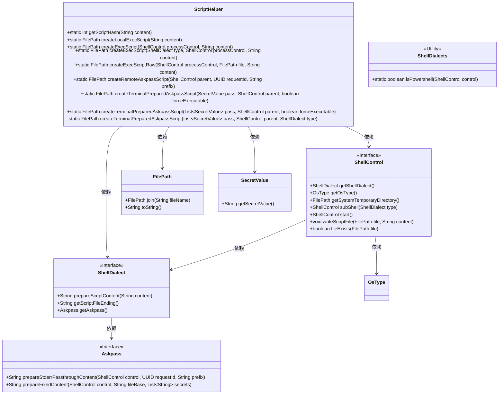
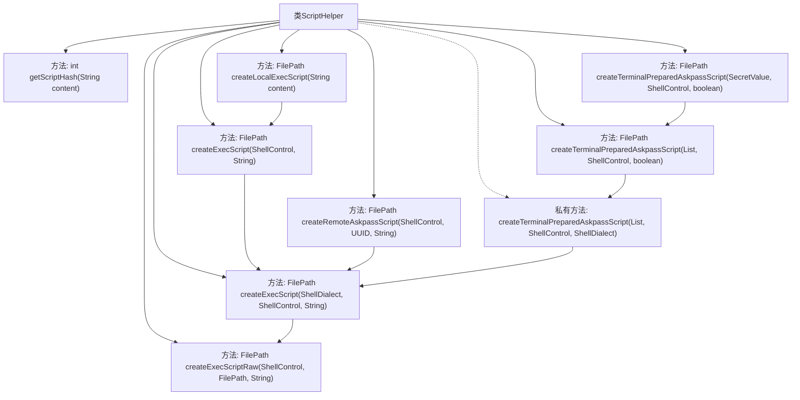

# 基础信息

|      |      |
|------|------|
| 名称 | ScriptHelper |
| 编码语言 | .java |
| 代码路径 | xpipe/app/src/main/java/io/xpipe/app/util/ScriptHelper.java |
| 包名 | io.xpipe.app.util |
| 依赖项 | ['io.xpipe.app.issue.TrackEvent', 'io.xpipe.core.process', 'io.xpipe.core.store.FilePath', 'io.xpipe.core.util.SecretValue', 'lombok.SneakyThrows', 'java.util.List', 'java.util.Random', 'java.util.UUID'] |
| 概述说明 | ScriptHelper类提供脚本处理功能，包括生成脚本哈希、创建本地/远程可执行脚本及终端密码脚本。 |

# 说明

该代码定义了一个ScriptHelper类，提供多种创建和执行脚本的方法。主要功能包括：通过字符串内容生成脚本哈希值；创建本地可执行脚本文件；支持不同Shell方言处理脚本内容；检查文件存在性避免重复创建；跟踪脚本写入事件；处理远程askpass脚本的特殊情况（如PowerShell权限问题）；支持终端预配置的askpass脚本生成，可处理密码等敏感信息。所有方法均支持异常处理，并会根据不同操作系统和Shell类型自动适配处理逻辑。

# 类列表 Class Summary

| 名称   | 类型  | 说明 |
|-------|------|-------------|
| ScriptHelper | class | ScriptHelper类提供脚本处理功能，包括生成脚本哈希、创建本地/远程执行脚本及处理密码脚本。 |

## 类 ScriptHelper

|      |      |
|------|------|
| 访问范围 | public |
| 类型 | class |
| 名称 | ScriptHelper |
| 说明 | ScriptHelper类提供脚本处理功能，包括生成脚本哈希、创建本地/远程执行脚本及处理密码脚本。 |

### UML类图

这段代码描述了一个脚本辅助工具类ScriptHelper，主要用于创建和执行各种类型的脚本文件。它提供了多种静态方法来处理脚本内容哈希计算、本地/远程脚本创建、以及终端密码输入脚本生成等功能。类图中展示了ScriptHelper与ShellControl、ShellDialect、Askpass等接口的依赖关系，这些接口定义了脚本控制、方言处理和密码输入等核心功能。FilePath和SecretValue作为辅助类用于处理文件路径和敏感数据。整体设计采用接口隔离原则，通过ShellDialect支持多种脚本方言，并通过ShellControl提供统一的脚本操作接口。

### 内部方法调用关系图

这段代码流程图展示了ScriptHelper类的核心方法调用关系。该类主要用于创建和执行脚本文件，包含哈希计算、本地/远程脚本创建、终端密码处理等功能。主要流程从createLocalExecScript开始，通过多级方法调用最终执行createExecScriptRaw写入脚本文件。特殊处理包括对PowerShell的兼容性调整和密码脚本的安全生成，体现了完整的脚本生命周期管理（创建-准备-写入-执行）。

### 字段列表 Field List

| 名称  | 类型  | 说明 |
|-------|-------|------|

### 方法列表 Method List

| 名称  | 类型  | 说明 |
|-------|-------|------|
| getScriptHash | int | 静态方法计算字符串哈希绝对值 |
| createExecScript | FilePath | 创建执行脚本方法：准备内容、生成文件名、指定临时目录、拼接路径并调用原始创建方法。 |
| createTerminalPreparedAskpassScript | FilePath | 创建终端askpass脚本，支持密码、父控件和可执行权限设置。 |
| createTerminalPreparedAskpassScript | FilePath | 创建终端askpass脚本，处理PowerShell权限问题，支持多Shell类型。 |
| createExecScript | FilePath | 创建执行脚本方法，接收进程控制和内容参数，调用内部方法生成文件路径。 |
| createLocalExecScript | FilePath | 创建本地执行脚本，包含内容并返回文件路径。 |
| createTerminalPreparedAskpassScript | FilePath | 创建临时脚本处理密码，根据Shell类型生成内容并返回可执行脚本。 |
| createRemoteAskpassScript | FilePath | 创建远程askpass脚本，处理不同shell类型权限问题。 |
| createExecScriptRaw | FilePath | 创建执行脚本文件，存在则返回，否则写入内容并返回文件路径。 |

