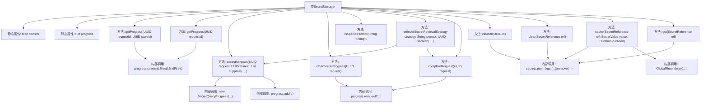

# 基础信息

|      |      |
|------|------|
| 名称 | SecretManager |
| 编码语言 | .java |
| 代码路径 | xpipe/app/src/main/java/io/xpipe/app/util/SecretManager.java |
| 包名 | io.xpipe.app.util |
| 依赖项 | ['io.xpipe.app.issue.TrackEvent', 'io.xpipe.core.process.CountDown', 'io.xpipe.core.util.SecretReference', 'io.xpipe.core.util.SecretValue', 'java.time.Duration', 'java.util'] |
| 概述说明 | SecretManager类管理密钥查询进度和缓存，提供查询、清理和缓存功能，支持交互式处理和特殊提示识别。 |

# 说明

SecretManager是一个管理密钥和查询进度的工具类。它使用静态Map存储密钥引用和值，并通过HashSet跟踪查询进度。提供方法获取、清除和缓存密钥，支持按请求ID或存储ID查询进度。包含特殊提示识别功能，如双因素认证和SSH主机密钥验证。密钥可设置缓存时长，超时自动清除。查询进度支持交互式处理，完成时触发跟踪事件。所有操作均通过同步方法保证线程安全。

# 类列表 Class Summary

| 名称   | 类型  | 说明 |
|-------|------|-------------|
| SecretManager | class | SecretManager类管理密钥查询进度和缓存，提供查询、清理和缓存功能，支持交互式提示和特殊提示识别。 |

## 类 SecretManager

|      |      |
|------|------|
| 访问范围 | public |
| 类型 | class |
| 名称 | SecretManager |
| 说明 | SecretManager类管理密钥查询进度和缓存，提供查询、清理和缓存功能，支持交互式提示和特殊提示识别。 |

### UML类图

```mermaid
classDiagram
    class SecretManager {
        -Map~SecretReference, SecretValue~ secrets
        -Set~SecretQueryProgress~ progress
        +Optional~SecretQueryProgress~ getProgress(UUID requestId, UUID storeId)
        +Optional~SecretQueryProgress~ getProgress(UUID requestId)
        +SecretQueryProgress expectAskpass(UUID request, UUID storeId, List~SecretQuery~ suppliers, SecretQuery fallback, List~SecretQueryFilter~ filters, List~SecretQueryFormatter~ formatters, CountDown countDown, boolean interactive)
        +void clearSecretProgress(UUID request)
        +boolean isSpecialPrompt(String prompt)
        +SecretValue retrieve(SecretRetrievalStrategy strategy, String prompt, UUID secretId, int sub, boolean interactive)
        +void completeRequest(UUID request)
        +void clearAll(UUID id)
        +void clear(SecretReference ref)
        +void cache(SecretReference ref, SecretValue value, Duration duration)
        +Optional~SecretValue~ get(SecretReference ref)
    }

    class SecretReference {
        <<Interface>>
        +UUID getSecretId()
    }

    class SecretValue {
        <<Interface>>
    }

    class SecretQueryProgress {
        <<Interface>>
        +UUID getRequestId()
        +UUID getStoreId()
        +void preAdvance(int sub)
        +SecretValue process(String prompt)
    }

    class SecretRetrievalStrategy {
        <<Interface>>
        +boolean expectsQuery()
        +SecretQuery query()
    }

    class SecretQuery {
        <<Interface>>
        +static SecretQuery prompt(boolean b)
    }

    class SecretQueryFilter {
        <<Interface>>
    }

    class SecretQueryFormatter {
        <<Interface>>
    }

    class CountDown {
        <<Interface>>
        +static CountDown of()
    }

    class GlobalTimer {
        <<Interface>>
        +static void delay(Runnable action, Duration duration)
    }

    class TrackEvent {
        <<Interface>>
        +static TrackEvent withTrace(String message)
        +TrackEvent tag(String key, Object value)
        +void handle()
    }

    SecretManager --> SecretReference : 使用
    SecretManager --> SecretValue : 使用
    SecretManager --> SecretQueryProgress : 管理
    SecretManager --> SecretRetrievalStrategy : 使用
    SecretManager --> SecretQuery : 使用
    SecretManager --> SecretQueryFilter : 使用
    SecretManager --> SecretQueryFormatter : 使用
    SecretManager --> CountDown : 使用
    SecretManager --> GlobalTimer : 使用
    SecretManager --> TrackEvent : 使用
```

这段代码描述了一个密钥管理器(SecretManager)的核心功能，它通过静态方法提供密钥的存储、检索和生命周期管理。类图展示了SecretManager与多个接口的交互关系，包括密钥引用(SecretReference)、密钥值(SecretValue)、查询进度(SecretQueryProgress)等。SecretManager使用HashMap缓存密钥，通过UUID跟踪查询进度，并支持定时自动清理机制。它还处理特殊提示识别、异步查询完成通知等功能，通过TrackEvent接口记录操作日志。整个设计采用静态同步方法确保线程安全，并通过策略模式(SecretRetrievalStrategy)支持不同的密钥获取方式。

### 内部方法调用关系图

该流程图展示了SecretManager类的完整结构，包含2个静态集合属性和12个核心方法。关键流程包括：通过双UUID或单UUID查询进度(getProgress)、创建并管理密码查询会话(expectAskpass/completeRequest)、特殊提示检测(isSpecialPrompt)、密码检索策略处理(retrieve)以及缓存管理(clear/cache/get)等。方法间存在多层调用关系，如retrieve方法会调用expectAskpass和completeRequest，缓存操作会触发定时清理任务。所有方法均采用同步机制保证线程安全。

### 字段列表 Field List

| 名称  | 类型  | 说明 |
|-------|-------|------|
| secrets = new HashMap<>() | Map<SecretReference, SecretValue> | 私有静态常量Map存储密钥引用与值 |
| progress = new HashSet<>() | Set<SecretQueryProgress> | 私有静态最终集合存储SecretQueryProgress对象。 |

### 方法列表 Method List

| 名称  | 类型  | 说明 |
|-------|-------|------|
| completeRequest | void | 静态同步方法completeRequest移除匹配UUID的请求并记录完成事件。 |
| getProgress | Optional<SecretQueryProgress> | 同步方法通过ID查询匹配的进度对象。 |
| getProgress | Optional<SecretQueryProgress> | 静态同步方法，通过请求ID查询进度，返回首个匹配项。 |
| clearAll | void | 清除指定ID的所有密钥记录。 |
| isSpecialPrompt | boolean | 检查输入是否为特殊提示：包含验证码或主机认证关键词则返回真。 |
| retrieve | SecretValue | 静态方法根据策略检索密钥值，检查策略需查询后生成UUID并处理请求，返回结果。 |
| expectAskpass | SecretQueryProgress | 静态同步方法创建并返回带过滤和格式的密钥查询进度对象。 |
| clearSecretProgress | void | 同步方法清除指定请求的密钥进度 |
| clear | void | 清除指定密钥引用。 |
| cache | void | 静态同步方法缓存密钥，超时自动移除。 |
| get | Optional<SecretValue> | 静态同步方法，获取可选密钥值。 |

