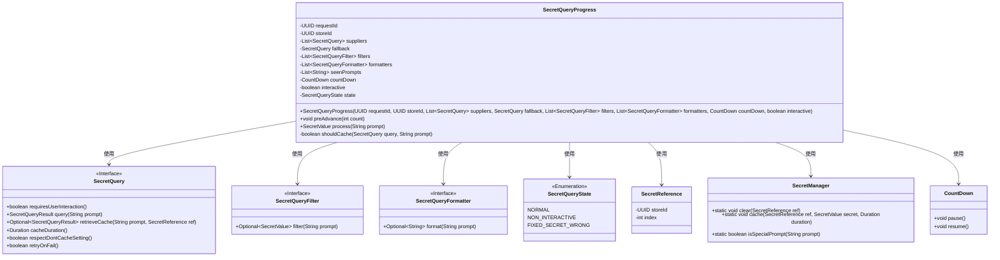
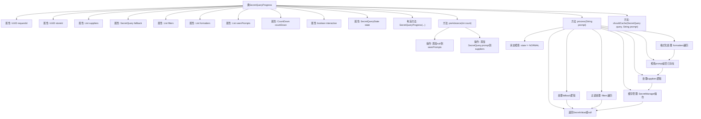

# 基础信息

|      |      |
|------|------|
| 名称 | SecretQueryProgress |
| 编码语言 | .java |
| 代码路径 | xpipe/app/src/main/java/io/xpipe/app/util/SecretQueryProgress.java |
| 包名 | io.xpipe.app.util |
| 依赖项 | ['io.xpipe.app.prefs.AppPrefs', 'io.xpipe.core.process.CountDown', 'io.xpipe.core.util.SecretReference', 'io.xpipe.core.util.SecretValue', 'lombok.Getter', 'lombok.NonNull', 'java.util.ArrayList', 'java.util.List', 'java.util.UUID'] |
| 概述说明 | SecretQueryProgress类处理秘密查询进度，包含请求ID、存储ID、供应商列表、回退查询、过滤器和格式化器，支持交互式操作和状态管理。 |

# 说明

SecretQueryProgress类用于管理秘密查询的进度和状态。它包含请求ID、存储ID、供应商列表、回退查询、过滤器、格式化器、已见提示列表、倒计时器和交互标志等关键属性。类提供了preAdvance方法预填充提示和供应商，process方法处理提示查询。处理流程包括过滤、格式化、检查重复提示、处理交互限制、缓存管理和状态更新。类还包含私有方法shouldCache用于判断是否应缓存查询结果。整个过程涉及状态管理、错误处理和用户交互控制。

# 类列表 Class Summary

| 名称   | 类型  | 说明 |
|-------|------|-------------|
| SecretQueryProgress | class | SecretQueryProgress类处理密钥查询进度，包含请求ID、存储ID、供应商列表、回退查询、过滤器和格式化器，支持交互式操作和状态管理。 |

## 类 SecretQueryProgress

|      |      |
|------|------|
| 访问范围 | @Getter;public |
| 类型 | class |
| 名称 | SecretQueryProgress |
| 说明 | SecretQueryProgress类处理密钥查询进度，包含请求ID、存储ID、供应商列表、回退查询、过滤器和格式化器，支持交互式操作和状态管理。 |

### UML类图

该代码实现了一个秘密查询进度管理器，主要功能包括：1) 通过预填充提示和供应商列表初始化查询流程；2) 处理用户输入的提示，依次进行过滤、格式化、去重检查；3) 根据交互模式、缓存策略和查询状态决定返回结果或终止流程。核心类SecretQueryProgress依赖多个接口处理不同阶段的逻辑，并通过SecretManager管理缓存，CountDown控制超时机制。整体设计注重状态管理和异常处理，支持可配置的过滤/格式化扩展。

### 内部方法调用关系图

该流程图展示了SecretQueryProgress类的完整结构和工作流程。类包含10个核心属性和4个主要方法，其中process方法是核心处理逻辑，涉及状态检查、过滤处理、格式化转换、重复提示检测、后备查询处理、缓存管理和结果返回等关键步骤。流程图清晰呈现了从输入prompt到输出SecretValue/null的完整决策路径，包括对interactive模式、缓存策略和错误状态的特殊处理逻辑。

### 字段列表 Field List

| 名称  | 类型  | 说明 |
|-------|-------|------|
| interactive | boolean | 私有布尔变量interactive |
| suppliers | List<SecretQuery> | 私有最终SecretQuery列表suppliers |
| requestId | UUID | 私有唯一请求ID |
| filters | List<SecretQueryFilter> | 私有SecretQueryFilter列表filters |
| seenPrompts | List<String> | 私有字符串列表seenPrompts |
| fallback | SecretQuery | 私有最终备用查询 |
| storeId | UUID | 私有UUID类型变量storeId |
| countDown | CountDown | 私有倒计时对象countDown |
| formatters | List<SecretQueryFormatter> | 私有最终SecretQueryFormatter列表formatters。 |
| state = SecretQueryState.NORMAL | SecretQueryState | 私有状态变量state初始化为NORMAL。 |

### 方法列表 Method List

| 名称  | 类型  | 说明 |
|-------|-------|------|
| shouldCache | boolean | 检查查询是否可缓存：缓存时长有效、非特殊提示且未禁用缓存设置。 |
| preAdvance | void | 预填充提示队列，添加指定数量的空提示和查询。 |
| process | SecretValue | 处理字符串提示，检查状态、过滤、格式化，查询或缓存结果，处理交互和错误状态。 |

