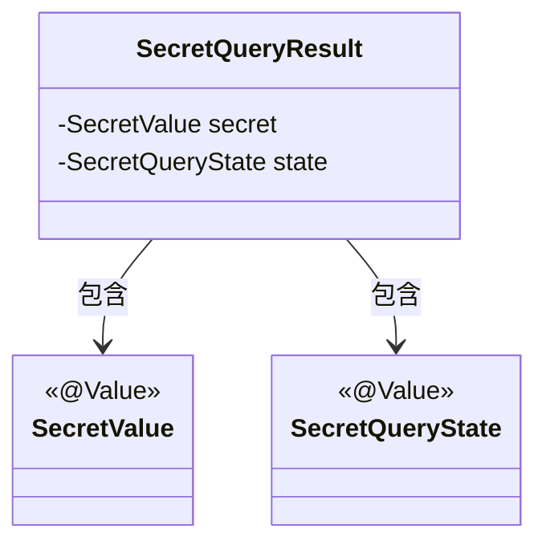
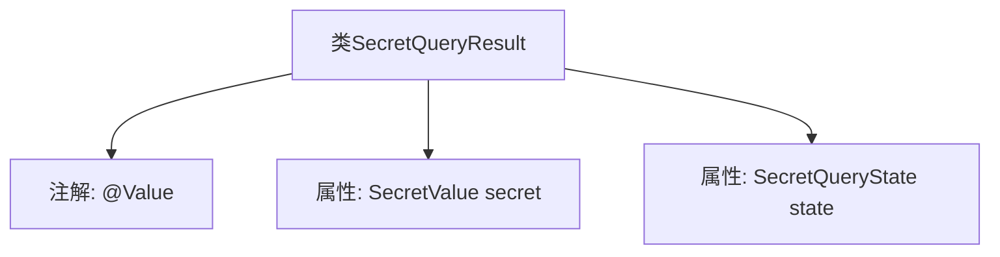

# 基础信息

|      |      |
|------|------|
| 名称 | SecretQueryResult |
| 编码语言 | .java |
| 代码路径 | xpipe/app/src/main/java/io/xpipe/app/util/SecretQueryResult.java |
| 包名 | io.xpipe.app.util |
| 依赖项 | ['io.xpipe.core.util.SecretValue', 'lombok.Value'] |
| 概述说明 | SecretQueryResult包含secret和state两个字段。 |

# 说明

SecretQueryResult是一个包含两个关键字段的公开类。secret字段存储SecretValue类型的机密值，state字段存储SecretQueryState类型的查询状态。该类用于封装机密查询的结果信息。

# 类列表 Class Summary

| 名称   | 类型  | 说明 |
|-------|------|-------------|
| SecretQueryResult | class | 类SecretQueryResult包含secret和state两个属性。 |

## 类 SecretQueryResult

|      |      |
|------|------|
| 访问范围 | @Value;public |
| 类型 | class |
| 名称 | SecretQueryResult |
| 说明 | 类SecretQueryResult包含secret和state两个属性。 |

### UML类图

这段类图展示了一个Spring `@Value`对象`SecretQueryResult`的结构，它包含两个核心组件：`SecretValue`和`SecretQueryState`，两者都被标注为值对象。`SecretQueryResult`通过组合关系持有这两个不可变对象，典型应用于安全相关的查询结果封装场景，其中`secret`存储机密数据，`state`表示查询状态，整体设计符合值对象的不可变性和封装特性。

### 内部方法调用关系图

这段流程图描述了SecretQueryResult类的结构。该类使用了@Value注解，表明它是一个不可变的值对象。类中包含两个属性：secret（类型为SecretValue）和state（类型为SecretQueryState）。流程图清晰地展示了类与属性之间的从属关系，以及类级别的注解应用情况。整个结构简洁明了，符合值对象的设计模式。

### 字段列表 Field List

| 名称  | 类型  | 说明 |
|-------|-------|------|
| secret | SecretValue | 声明一个SecretValue类型的secret变量。 |
| state | SecretQueryState | 声明SecretQueryState类型的变量state。 |

### 方法列表 Method List

| 名称  | 类型  | 说明 |
|-------|-------|------|

