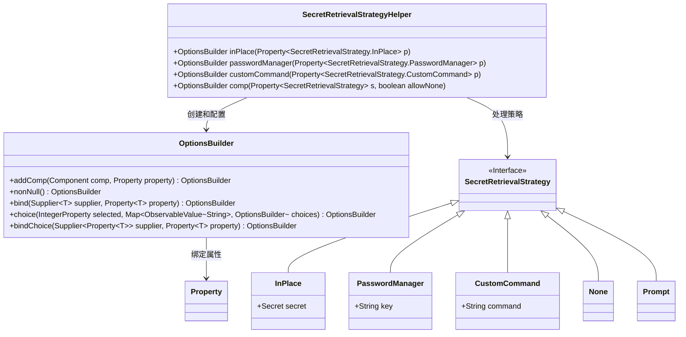
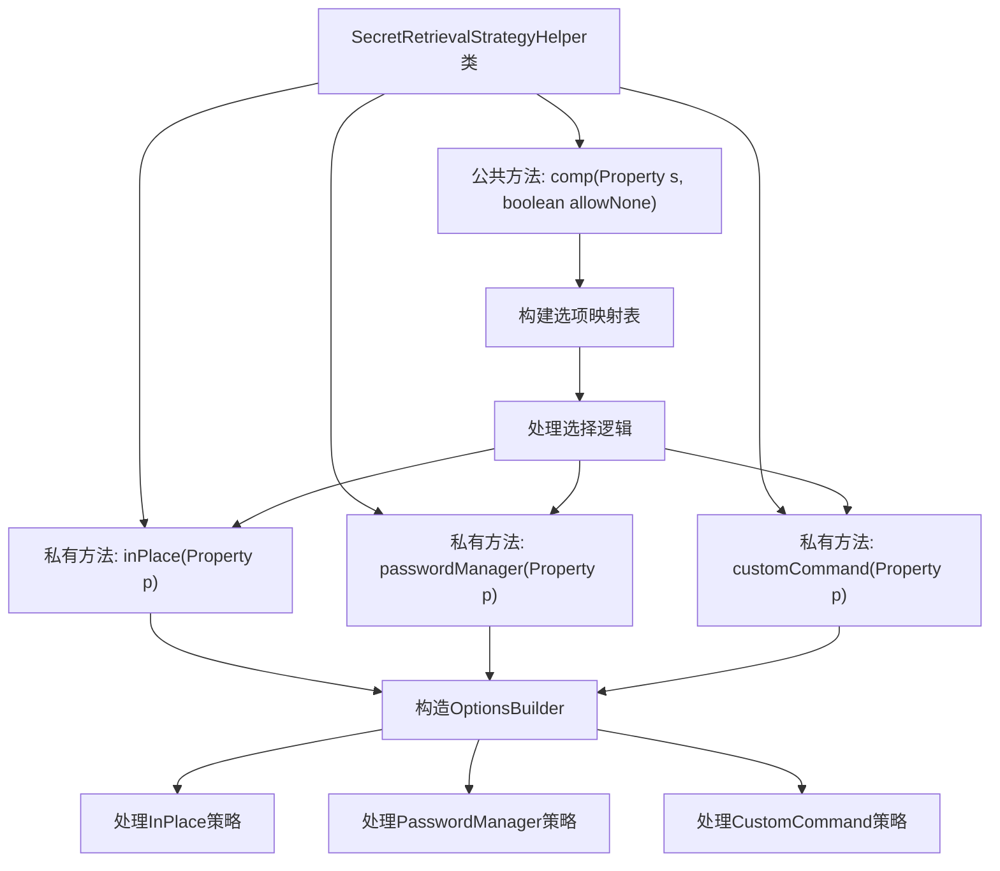
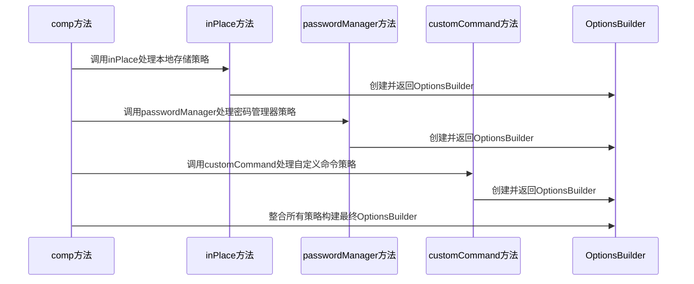

# 基础信息

|      |      |
|------|------|
| 名称 | SecretRetrievalStrategyHelper |
| 编码语言 | .java |
| 代码路径 | xpipe/app/src/main/java/io/xpipe/app/util/SecretRetrievalStrategyHelper.java |
| 包名 | io.xpipe.app.util |
| 依赖项 | ['io.xpipe.app.comp.base.ButtonComp', 'io.xpipe.app.comp.base.HorizontalComp', 'io.xpipe.app.comp.base.SecretFieldComp', 'io.xpipe.app.comp.base.TextFieldComp', 'io.xpipe.app.core.App', 'io.xpipe.app.core.AppI18n', 'io.xpipe.app.prefs.AppPrefs', 'javafx.beans.binding.Bindings', 'javafx.beans.property.Property', 'javafx.beans.property.SimpleIntegerProperty', 'javafx.beans.property.SimpleObjectProperty', 'javafx.beans.value.ObservableValue', 'org.kordamp.ikonli.javafx.FontIcon', 'java.util.Arrays', 'java.util.LinkedHashMap', 'java.util.List'] |
| 概述说明 | SecretRetrievalStrategyHelper类提供三种密码策略：本地存储、密码管理器、自定义命令，并支持策略选择和绑定。 |

# 说明

该代码定义了一个SecretRetrievalStrategyHelper类，用于构建和管理秘密检索策略选项。包含三种具体策略实现：InPlace（本地存储）、PasswordManager（外部密码管理器）和CustomCommand（自定义命令）。通过OptionsBuilder构建选项界面，支持策略切换和值绑定。comp方法整合所有策略，允许通过下拉选择切换不同策略类型，并处理策略间的数据绑定和状态同步。代码结构清晰，采用属性绑定机制实现数据与UI的实时同步。

# 类列表 Class Summary

| 名称   | 类型  | 说明 |
|-------|------|-------------|
| SecretRetrievalStrategyHelper | class | SecretRetrievalStrategyHelper类提供三种密码策略：本地存储、密码管理器、自定义命令，支持策略选择和绑定。 |

## 类 SecretRetrievalStrategyHelper

|      |      |
|------|------|
| 访问范围 | public |
| 类型 | class |
| 名称 | SecretRetrievalStrategyHelper |
| 说明 | SecretRetrievalStrategyHelper类提供三种密码策略：本地存储、密码管理器、自定义命令，支持策略选择和绑定。 |

### UML类图

这段代码描述了一个用于管理秘密检索策略的工具类`SecretRetrievalStrategyHelper`，它提供了四种策略实现（就地存储、密码管理器、自定义命令、无/提示）的构建方法。类图展示了核心类之间的关系：Helper类通过OptionsBuilder动态构建策略选项，策略类实现统一的接口，支持类型安全的属性绑定和UI组件管理。该设计实现了策略模式的灵活组合，通过属性绑定机制将UI状态与业务逻辑解耦。

### 内部方法调用关系图

该流程图展示了SecretRetrievalStrategyHelper类的核心结构，包含三个私有策略处理方法和一个公共组合方法。类通过OptionsBuilder构建不同的秘密检索策略选项，包括本地存储(inPlace)、密码管理器(passwordManager)和自定义命令(customCommand)。时序图则详细描述了comp方法如何协调调用各策略处理方法，并最终整合生成完整的策略选项构建器。整个设计实现了灵活的秘密检索策略配置机制，支持多种实现方式的选择与组合。

### 字段列表 Field List

| 名称  | 类型  | 说明 |
|-------|-------|------|

### 方法列表 Method List

| 名称  | 类型  | 说明 |
|-------|-------|------|
| inPlace | OptionsBuilder | 静态方法`inPlace`创建选项构建器，绑定属性`p`到秘密字段组件，处理值变更并返回新策略实例。 |
| passwordManager | OptionsBuilder | 创建密码管理器选项，包含输入框和设置按钮，绑定属性并处理焦点事件。 |
| customCommand | OptionsBuilder | 自定义命令选项构建器：绑定文本输入框与属性，生成带命令的策略对象。 |
| comp | OptionsBuilder | 构建选项方法，根据策略类型映射选项并绑定选择结果。 |

