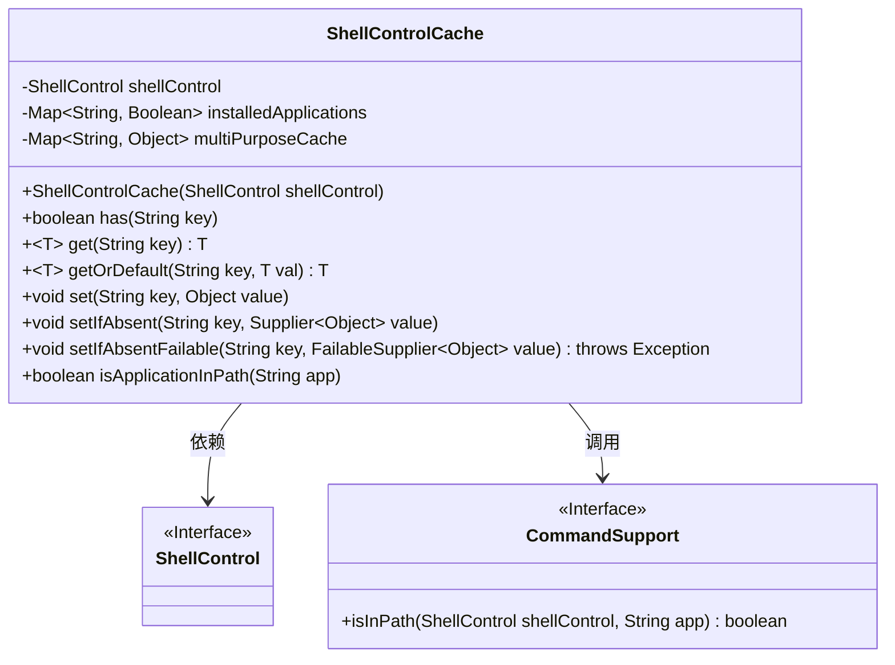
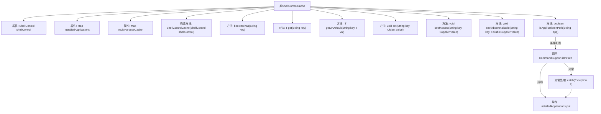

# 基础信息

|      |      |
|------|------|
| 名称 | ShellControlCache |
| 编码语言 | .java |
| 代码路径 | xpipe/app/src/main/java/io/xpipe/app/util/ShellControlCache.java |
| 包名 | io.xpipe.app.util |
| 依赖项 | ['io.xpipe.core.process.ShellControl', 'io.xpipe.core.util.FailableSupplier', 'lombok.Getter', 'java.util.HashMap', 'java.util.Map', 'java.util.function.Supplier'] |
| 概述说明 | ShellControlCache类，含ShellControl和两个Map，提供缓存操作和路径应用检查功能。 |

# 说明

ShellControlCache类是一个缓存工具，用于存储ShellControl实例和多用途数据。它包含两个Map：installedApplications记录应用是否安装，multiPurposeCache存储通用数据。提供has、get、getOrDefault等方法操作multiPurposeCache，支持设置值和条件设置。isApplicationInPath方法检查应用是否在系统路径中，首次检查会缓存结果。通过异常处理和Supplier接口增强灵活性。

# 类列表 Class Summary

| 名称   | 类型  | 说明 |
|-------|------|-------------|
| ShellControlCache | class | ShellControlCache类，含ShellControl和两个Map，提供缓存操作和路径检查功能。 |

## 类 ShellControlCache

|      |      |
|------|------|
| 访问范围 | @Getter;public |
| 类型 | class |
| 名称 | ShellControlCache |
| 说明 | ShellControlCache类，含ShellControl和两个Map，提供缓存操作和路径检查功能。 |

### UML类图

类图描述：
ShellControlCache是一个缓存管理类，包含两个核心Map结构：installedApplications记录应用安装状态，multiPurposeCache作为通用键值存储。它通过ShellControl接口执行底层操作，并依赖CommandSupport接口检查应用路径。类提供了丰富的缓存操作方法，包括类型安全的泛型存取(get/getOrDefault)、条件写入(setIfAbsent)和异常处理机制(setIfAbsentFailable)。isApplicationInPath方法实现了带缓存的路径检查功能，体现了完善的错误处理逻辑。

### 内部方法调用关系图

流程图描述了ShellControlCache类的结构和主要方法调用关系。该类通过两个Map分别管理应用程序安装状态和多用途缓存数据，核心方法包括缓存查询/设置（has/get/set系列）和路径检查（isApplicationInPath）。其中isApplicationInPath方法通过CommandSupport.isInPath检测应用路径，并采用异常处理机制更新缓存状态，其他方法主要对multiPurposeCache进行泛型操作。所有方法围绕两个Map属性展开数据读写，形成完整的缓存控制逻辑。

### 字段列表 Field List

| 名称  | 类型  | 说明 |
|-------|-------|------|
| shellControl | ShellControl | 私有ShellControl实例shellControl |
| multiPurposeCache = new HashMap<>() | Map<String, Object> | 私有哈希映射缓存，键为字符串，值为对象。 |
| installedApplications = new HashMap<>() | Map<String, Boolean> | 私有映射表存储应用安装状态。 |

### 方法列表 Method List

| 名称  | 类型  | 说明 |
|-------|-------|------|
| has | boolean | 检查缓存中是否存在指定键。 |
| getOrDefault | T | 从缓存获取指定键的值，不存在则返回默认值。 |
| set | void | 方法set将键值对存入multiPurposeCache。 |
| setIfAbsentFailable | void | 方法setIfAbsentFailable在缓存中无key时存入value.get()结果，可能抛出异常。 |
| get | T | 从缓存获取指定键的值并强制转换类型。 |
| setIfAbsent | void | Java方法：若键不存在则设置值，使用Supplier提供默认值。 |
| isApplicationInPath | boolean | 检查应用是否在系统路径中，若未缓存则查询并存储结果。 |

